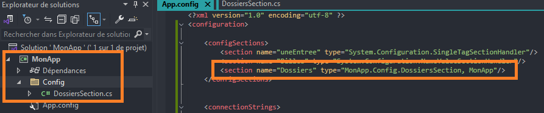
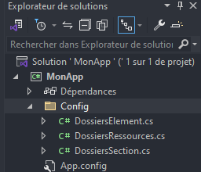

# App config

Le 20-08-2024

Fichier de configuration pour un programme.

## Présentation

On peut mettre en place un **fichier de configuration d'application**. Ces données de configuration seront alors accessibles depuis l'extérieur de l'application, permettant ainsi le paramétrage sans avoir à recompiler le programme. Le fichier de configuration de la solution s'appelle par défaut `App.config`. Dans le programme compilé, il change de nom ; si le programme s'appelle `MonApp`, alors le fichier en sortie est nommé `MonApp.dll.config`.

Sources : 
- [Microsoft *Learn* : *connection strings and configuration files*](https://learn.microsoft.com/en-us/dotnet/framework/data/adonet/connection-strings-and-configuration-files _blank)
- [Microsoft *Learn* : *how to add app config file*](https://learn.microsoft.com/en-us/visualstudio/ide/how-to-add-app-config-file _blank)
- [Microsoft *Learn* : *connection string builders*](https://learn.microsoft.com/en-us/dotnet/framework/data/adonet/connection-string-builders _blank)
- [Microsoft *Learn* : *ConnectionStringSettings class*](https://learn.microsoft.com/en-us/dotnet/api/system.configuration.connectionstringsettings _blank)

## Créer le fichier

Pour créer le fichier de configuration, ouvrir la fenêtre d'**Explorateur de solutions**. Faire un **clic droit sur le nom du projet** puis choisir `Ajouter > Nouvel élément`. Une nouvelle fenêtre apparaît. Sélectionner l'entrée nommée `Fichier de configuration de l'application`. Par défaut, c'est un fichier `App.config` au format XML qui sera généré à la racine du projet. Voici son contenu :

```xml
<?xml version="1.0" encoding="utf-8" ?>
<configuration>
</configuration>
```

## Ajouter une configuration de connexion à une BDD

Maintenant qu'on dispose d'un fichier de configuration, on va ajouter la configuration des chaînes de connexion aux bases de données.

On peut très bien renseigner toutes les données dans le fichier, mais si le programme s'enrichit, il se peut alors que le fichier de configuration contienne de plus en plus de lignes. Pour conserver des fichiers légers et faciliter la maintenance, on choisira plutôt de créer un **fichier de configuration spécifique des chaînes de connexion que l'on déclarera dans le fichier de configuration de l'application**. 

Pour cela, modifions le fichier. On pose que notre futur fichier de configuration spécifique se trouve au chemin indiqué :

```xml
<?xml version="1.0" encoding="utf-8" ?>
<configuration>
	<connectionStrings configSource="Config/BDDConfig.xml"/>
</configuration>
```

Créons maintenant ce fichier de configuration spécifique au chemin indiqué et renseignons-y les données nécessaires :
- `name` : le nom de la configuration, par lequel on va chercher les données,
- `providerName` : c'est le nom du *namespace* utilisé (et non pas le nom du *package*) de l'API qui fournit le moyen de se connecter,
- `connectionString` : la chaîne de connexion complète.

Exemple avec Oracle et le *namespace* du *package* `Oracle.ManagedDataAccess.Core` :

```xml
<?xml version="1.0" encoding="utf-8" ?>
<connectionStrings>
	<add name="LaBase"
		providerName="Oracle.ManagedDataAccess.Client"
		connectionString="User Id=....;Password=....;Data Source=000.000.000.000:9999/instance;" />
</connectionStrings>
```

Les chaînes de connexion sont diverses et dépendent des technologies utilisées. Voici des exemple pour Oracle : [CSharpCorner](https://www.c-sharpcorner.com/UploadFile/nipuntomar/connection-strings-for-oracle _blank).

Si on veut ajouter une autre entrée pour se connecter à une autre base, il suffit d'ajouter un nœud `<add.../>` avec les informations requises. 

## Utiliser les données de configuration

Maintenant que le programme dispose de fichiers de configuration, utilisons-les.

On va passer par le type `ConnectionStringSettings` qui s'occupe de lire le fichier de configuration et l'explorer selon nos besoins. Voici par exemple le code proposé par Microsoft pour récupérer la configuration par son nom, adapté à l'exemple précédent :

```C#
private string ChaineConnexionString()
{
	// Valeur de retour définie en erreur par défaut
	string returnValue = null;
	
	// Chercher le nom dans la liste des connectionStrings
	ConnectionStringSettings settings = ConfigurationManager.ConnectionStrings["LaBase"];
	
	// Si le nom est trouvé, alors renvoyer la chaîne de connexion
	if(settings != null)
	{
		returnValue = settings.ConnectionString;
	}
	
	return returnValue;
}
```

## Chiffrer les données

Maintenant, comment chiffrer les données de ce fichier ? [Microsoft *Learn*](https://learn.microsoft.com/en-us/dotnet/framework/data/adonet/connection-strings-and-configuration-files#encrypting-configuration-file-sections-using-protected-configuration _blank)

## Personnalisation

[Source](https://mac-blog.org.ua/c-custom-app-config-sections _blank)

Personnaliser le fichier est tout à fait possible : il s'agit d'ajouter des **sections** au fichier. D'abord, il peut être nécessaire de déclarer le nom et le type de section ajoutée. Ensuite et ensuite seulement ajouter les sections dont `connectionStrings`. Les exemples qui suivent illustrent le fonctionnement ; il conviendra de compléter avec les contrôles nécessaires de pointeur `null`, les conversions de données dans les types utiles (*parsing*), etc.

Côté C#, on utilise les espaces de nom suivants pour .NET 5 par exemple. En .NET 8, Visual Studio propose d'installer le *package* **System.Configuration.ConfigurationManager**.

```C#
using System.Collections.Specialized;
using System.Configuration;
```

## Entrée personnalisée

Une simple entrée sur une ligne et sa récupération. Ceci nécessite une déclaration dans `configSections`.

```XML
<?xml version="1.0" encoding="utf-8" ?>
<configuration>

	<configSections>
		<section name="uneEntree" type="System.Configuration.SingleTagSectionHandler"/>
	</configSections>
	
	<connectionStrings>
		<add name="LaBase"
			providerName="Oracle.ManagedDataAccess.Client"
			connectionString="User Id=....;Password=....;Data Source=000.000.000.000:9999/instance;" />
	</connectionStrings>

	<uneEntree prenom="Toto" nom="Zéro" />

</configuration>
```

```C#
public string UneEntree()
{
	IDictionary uneEntree = (IDictionary) ConfigurationManager.GetSection("uneEntree");
	string prenom = (string) uneEntree["prenom"];
	string nom = (string) uneEntree["nom"];
	return $"Prénom : {prenom}. Nom : {nom}";
}
```

## Section par défaut

On veut une entrée générale qui contienne plusieurs sous-entrées de type paire clé-valeur. Cette section ne propose de personnalisable que le contenu des attributs. Noter que si l'entrée est introuvable, il n'y a pas de levée d'exception. Cette section s'appelle `appSettings` et ne nécessite pas d'entrée sous `configSections`.

```XML
<?xml version="1.0" encoding="utf-8" ?>
<configuration>

	<configSections>
		<section name="uneEntree" type="System.Configuration.SingleTagSectionHandler"/>
	</configSections>
	
	<connectionStrings>
		<add name="LaBase"
			providerName="Oracle.ManagedDataAccess.Client"
			connectionString="User Id=....;Password=....;Data Source=000.000.000.000:9999/instance;" />
	</connectionStrings>

	<uneEntree prenom="Toto" nom="Zéro" />

	<appSettings>
		<add key="a" value="aa"/>
		<add key="b" value="bb"/>
	</appSettings>

</configuration>
```

```C#
public static string AppSettingsEntree(string nom)
{
	return ConfigurationManager.AppSettings[nom]; // ou bien : ConfigurationManager.AppSettings.Get(nom);
}
```

## Section par défaut nommée

Il est possible de créer la section précédente avec un nom personnalisé. Ceci impose d'ajouter une entrée dans `configSections`, ici `Billes`.

```XML
<?xml version="1.0" encoding="utf-8" ?>
<configuration>
	
	<configSections>
		<section name="uneEntree" type="System.Configuration.SingleTagSectionHandler"/>
		<section name="Billes" type="System.Configuration.NameValueSectionHandler"/>
	</configSections>
	
	<connectionStrings>
		<add name="LaBase"
			providerName="Oracle.ManagedDataAccess.Client"
			connectionString="User Id=....;Password=....;Data Source=000.000.000.000:9999/instance;" />
	</connectionStrings>
	
	<uneEntree prenom="Toto" nom="Zéro" />
	
	<appSettings>
		<add key="a" value="aa"/>
		<add key="b" value="bb"/>
	</appSettings>
	
	<Billes>
		<add key="Charon" value="terre"/>
		<add key="Aqua" value="eau bleue"/>
	</Billes>
	
</configuration>
```

```C#
public static Dictionary<string, string> Billes()
{
	NameValueCollection billes = (NameValueCollection)ConfigurationManager.GetSection("Billes");
	
	Dictionary<string, string> entrees = new();
	foreach (string? item in billes.AllKeys)
	{
		entrees.Add(item, billes[item]);
	}
	
	return entrees;
}
```

## Section personnalisée

On souhaite créer une section générale contenant des entrées personnalisées ayant la même structure. Plus complexe mais possible. Ici, on va imaginer traiter des chemins de dossier.

D'abord, regardons `configSection`. On y déclare le nom de la section et le type. Pour notre section, le type ne peut pas être celui fourni par Microsoft comme auparavant, mais celui que nous devons créer pour utiliser les données. Donc, je crée dans mon projet une classe représentant la section et je renseigne le type complètement qualifié dans le XML suivi du *namespace* du projet lui-même.



Continuons l'édition du fichier XML. Créons notre section `Dossiers`. Une fois fait, nous sommes obligés d'ajouter un enfant qui représente une collection et c'est cette collection qui contiendra nos entrées. Ajoutons ces entrées ; dans notre exemple de chemins de dossier, on imagine manipuler des attributs obligatoires et optionnels.

```XML
<?xml version="1.0" encoding="utf-8" ?>
<configuration>
	
	<configSections>
		<section name="Dossiers" type="MonApp.Config.DossiersSection, MonApp"/>
	</configSections>
	
	<Dossiers>
		<Ressources>
			<add nom="test" chemin="C:\..."/>
			<add nom="bureau" chemin="D:\..." utilisateur="" passe="" domaine=""/>
			<add nom="sftp" chemin="\\xxx.xxx.xxx.xxx\dossier" utilisateur="user" passe="pass" domaine="dom"/>
		</Ressources>
	</Dossiers>
	
</configuration>
```

Créons nos classes correspondantes.



Parfait. Maintenant, nous pouvons coder nos classes. Pour ce faire, on peut coder de l'élément le plus bas de la hiérarchie vers l'élément le plus haut. On commence donc par l'élément qui représente une ligne `add` de notre XML. On n'a besoin que de propriétés. 

```C#
internal class DossiersElement : ConfigurationElement
{
	[ConfigurationProperty("nom", DefaultValue = "", IsKey = true, IsRequired = true)]
	public string Nom // propriété obligatoire
	{
		get { return (string)base["nom"]; }
		set { base["nom"] = value; }
	}
	
	[ConfigurationProperty("chemin", DefaultValue = "", IsKey = true, IsRequired = true)]
	public string Chemin // propriété obligatoire
	{
		get { return (string)base["chemin"]; }
		set { base["chemin"] = value; }
	}
	
	[ConfigurationProperty("utilisateur", DefaultValue = "", IsKey = true, IsRequired = false)]
	public string Utilisateur// propriété optionnelle
	{
		get { return (string)base["utilisateur"]; }
		set { base["utilisateur"] = value; }
	}
	
	[ConfigurationProperty("passe", DefaultValue = "", IsKey = true, IsRequired = false)]
	public string Passe // propriété optionnelle
	{
		get { return (string)base["passe"]; }
		set { base["passe"] = value; }
	}
	
	[ConfigurationProperty("domaine", DefaultValue = "", IsKey = true, IsRequired = false)]
	public string Domaine // propriété optionnelle
	{
		get { return (string)base["domaine"]; }
		set { base["domaine"] = value; }
	}
}
```

On passe à présent à la classe représentant la collection d'éléments :

```C#
[ConfigurationCollection(typeof(DossiersElement))]
internal class DossiersRessources : ConfigurationElementCollection
{
	protected override ConfigurationElement CreateNewElement()
	{
		return new DossiersElement();
	}
	
	protected override object GetElementKey(ConfigurationElement element)
	{
		return ((DossiersElement) element).Nom;
	}
	
	public DossiersElement this[int index]
	{
		get { return (DossiersElement)BaseGet(index); }
	}
}
```

Enfin, codons la classe représentant la section :

```C#
internal class DossiersSection : ConfigurationSection
{
	[ConfigurationProperty("Ressources")]
	public DossiersRessources Ressources
	{
		get { return (DossiersRessources)base["Ressources"]; }
	}
	
	public DossiersElement Test(string nom)
	{
		foreach (DossiersElement item in Ressources)
		{
			if(string.Equals(nom, item.Nom))
			{
				return item;
			}
		}
		
		return null;
	}
}
```

Nous avons fini la configuration des classes et du XML (désagréable... ?). Maintenant, des utilisations :

```C#
DossiersSection section = (DossiersSection)ConfigurationManager.GetSection("Dossiers");
foreach (DossiersElement item in section.Ressources)
{
    Console.WriteLine($"{item.Nom} {item.Chemin} {item.Utilisateur} {item.Passe} {item.Domaine}");
}
```

```C#
DossiersSection section = (DossiersSection)ConfigurationManager.GetSection("Dossiers");
string x = section.Test("sftp");
Console.WriteLine($"{x.Nom} {x.Chemin} {x.Utilisateur} {x.Passe} {x.Domaine}");
```
