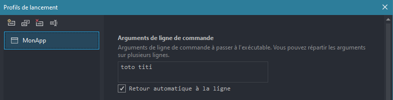

# Console

Le 27-08-2024

Quelques éléments de travail pour les applications Console.

## Texte

Référence : [Microsoft *Learn*](https://learn.microsoft.com/fr-fr/visualstudio/get-started/csharp/tutorial-console _blank)

**Afficher une chaîne** de caractères.

```c#
Console.Write("...");
```

**Afficher une chaîne** de caractères terminée par un **retour ligne automatique**.

```c#
Console.WriteLine("...");
```

**Lire un caractère** à partir du flux standard d'entrée (le retour ligne, la tabulation... sont aussi des caractères).

```c#
char caractere = (char) Console.Read();
```

**Lire une chaîne** en tant qu'elle est une ligne.

```c#
string prenom = Console.ReadLine();
```

**Echapper l'antislash avec un antislash**. On peut utiliser le préfixe `@` pour indiquer au compilateur que l'on veut échapper les antislashs de toute la chaîne.

```c#
string chemin = "c:\\repertoire\\fichier.cs";
```

```c#
string chemin = @"c:\repertoire\fichier.cs";
```

**Echapper les guillemets avec un antislash**.

```c#
string phrase = "Je m'appelle \"Toto\".";
```

**Caractères spéciaux**
- `\t` : tabulation
- `\n` : retour ligne, *Carriage Return (CR)*, Unix
- `\r` : retour ligne, *Line Feed (LF)*, Max OS
- `\n\r` : retour ligne, *CR* + *LF*, Windows

Pour le retour ligne, préférer utiliser `Environment.NewLine` qui fournit le caractère selon l'environnement dans lequel le programme est exécuté. [Microsoft](https://learn.microsoft.com/fr-fr/dotnet/api/system.environment.newline _blank) : 

```c#
Console.WriteLine("Bonjour ! " + Environment.NewLine);
```

Pour avoir le signe « € » et autres non ASCII, ajouter ceci en démarrage de programme :

```csharp
Console.OutputEncoding = System.Text.Encoding.UTF8;
```

L'instruction consistant à écrire une ligne en sortie de console étant si courante, Visual Studio propose un raccourci clavier : saisir `cw` puis presser la touche `TAB` pour écrire `Console.WriteLine()`.

## Couleurs

Afficher du texte en couleur avec `Console.ForegroundColor` ou `Console.BackgroundColor`.

```C#
Console.ForegroundColor = ConsoleColor.DarkGray;
Console.WriteLine("Je suis un texte gris foncé.");
Console.ResetColor();
```

Consulter mes *repositories* à ce sujet :
- [*Colored Console*](https://github.com/AlexandreVenet/ColoredConsole _blank)
- [*Colored Console Shortcuts*](https://github.com/AlexandreVenet/ColoredConsoleShortcuts _blank)

## IHM

Mon *repository* [Console Menu](https://github.com/AlexandreVenet/ConsoleMenu _blank) présente un programme proposant une interface homme machine (IHM) contrôlée par touches clavier.
 
## Programe de base 1

Un programme simple avec traitement d'entrée et code de sortie. Source [Microsoft *Learn*](https://learn.microsoft.com/en-us/dotnet/csharp/fundamentals/program-structure/main-command-line _blank)

```C#
class Program
{
	static void Main(string[] args)
	{
		// Début du programme
		
		Console.OutputEncoding = System.Text.Encoding.UTF8;
		string titre = typeof(Program).Namespace;
		Console.Title = titre;
		
		// Programme
		
		Console.WriteLine(titre + Environment.NewLine); 
		
		if (args != null && args.Length > 0)
		{
			foreach (string arg in args)
			{
				Console.WriteLine(arg);
			}
		}
		
		// Fin du programme
		
		Console.WriteLine(Environment.NewLine + "Fin de programme"); 
#if DEBUG
		Console.ReadLine();
#endif
		Environment.Exit(0);
	}
}
```

## Lancer dans le terminal

Dans l'**Invite de commande**, dite encore **Interpréteur de commande**, ***Command Prompt Program (CMD)***, **Console**, entrer le nom du programme suivi de ses paramètres. Si un paramètre présente des espaces, écrire le paramètre entre guillemets.

```
MonApp.exe toto prout
```

Dans le **terminal PowerShell** :

```
Start-Process MonApp.exe -ArgumentList "toto prout"
```

## Tester paramètres d'entrée

Le programme peut être débogué avec des arguments d'entrée directement dans Visual Studio. Par exemple, admettons un projet de programme nommé **MonApp**.
- Menu `Déboguer`, choisir `Propriétés de débogage de MonApp`. Ou bien, clic droit sur projet puis choisir `Propriétés`, cliquer sur l’onglet `Déboguer`, cliquer sur `Profils de lancement de débogage`.
- La fenêtre **Profils de lancement** s'affiche.
- Dans le champ `Arguments de ligne de commande`, saisir les textes d'entrée.
- Ceci génère la première fois un dossier `Properties` contenant le fichier `launchSettings.json`. On peut par la suite éditer ce fichier et remplacer la valeur de la propriété `commandLineargs`.



!- Dans Visual Studio, la fenêtre **Profils de lancement**, le champ de saisie pour arguments d'entrée.

## Afficher ou masquer

Il est possible d'afficher ou de masquer la console à l'écran, ceci par exemple pour éviter les apparitions intempestives de fenêtres de terminal lorsque des programmes sont déclenchés automatiquement. Voir mon *repository* [Afficher Masquer Console](https://github.com/AlexandreVenet/AfficherMasquerConsole _blank).

## Programme de base 2

Ce programme génère un fichier `.txt` horodaté dans le répertoire du programme. Il peut être utile pour tester un environnement, par exemple une **Tâche planifiée Windows**.

```C#
class Program
{
	static void Main(string[] args)
	{
		DateTime maintenant = DateTime.Now;
		string nomFichier = "toto" + maintenant.ToString("yyyy-MM-dd-hhmmss") + ".txt";
		string chemin = Path.Combine(AppDomain.CurrentDomain.BaseDirectory, nomFichier);
		EcrireDansFichier(chemin, "Démarrage...\n");
		EcrireDansFichier(chemin, "...Fin du service");
	}
	
	private static void EcrireDansFichier(string chemin, string message)
	{
		// v.1 
		// FileStream fs = new(chemin, FileMode.OpenOrCreate, FileAccess.Write);
		// StreamWriter sm = new(fs);
		// sm.BaseStream.Seek(0, SeekOrigin.End);
		// sm.Write(message);
		// sm.Flush();
		// sm.Close();
		// v.2
		using (StreamWriter sm = new(chemin, append: true))
		{
			sm.Write(message);
		}
	}
}
```

## Code de sortie

Admettons un programme qui renvoie un code. On souhaite utiliser ce code depuis un script **Batch**. Sources :
- [ss64.com](https://ss64.com/nt _blank)
- [tutorialspoint](https://www.tutorialspoint.com/batch_script/batch_script_commands.htm _blank)
- [.BAT chez Wikipédia](https://fr.wikipedia.org/wiki/.bat _blank)

```
:: But : tester la récupération du code de sortie de MonApp.exe

:: Désactiver l'affichage des commandes
@echo off 

:: Encodage UTF-8 des caractères et ne pas afficher le message de sortie
chcp 65001 >nul

:: Le script hérite des variables d'environnement ou de session
:: endlocal en fin de programme pour rétablir ces variables dans leur état précédant l'exécution de setlocal
setlocal 

:: Changer le titre de la fenêtre d'invite, youpi
title Mon lanceur de MonApp.exe

:: Variables utiles
set temps_attente_en_secondes=7

:: Affichons du texte, sautons des lignes...
echo Début
echo.

:lancement_programme
:: On veut appeler le programme. Pour cela, on a besoin du nom du lecteur, du chemin du fichier actuel, que l'on va combiner avec une route vers l'application à lancer.
:: echo %0 
:: Retourne le nom du présent fichier
:: echo %~p0
:: Retourne le chemin absolu vers ce fichier, sans le nom de lecteur ni le nom du fichier
:: echo %~d0
:: Retourne le nom du lecteur
:: Tout cela pris ensemble pour démarrer le programme :
%~dp0patati\patata\MonApp.exe

:: Le code de sortie de la dernière commande exécutée (la précédente) fait l'objet d'une variable d'environnement. 0 : succès, autre que 0 : état spécifique.
:: Stocker cette valeur pour traitement
set codeSortie=%errorlevel%

:: Tester le code de sortie puis agir conformément
if %codeSortie% equ 0 (
	goto fin_succes
) else (
	goto fin_autre
)

:fin_succes
echo Fin succès
timeout /t %temps_attente_en_secondes% /nobreak
endlocal
exit 0

:fin_autre
echo Fin autre : %codeSortie%
timeout /t %temps_attente_en_secondes% /nobreak
endlocal
exit %codeSortie%
```