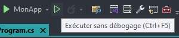

# Premier programme

Le 14-08-2024

La Console, le programme C# le plus simple à réaliser.

## Présentation

Source : [Microsoft *Learn*](https://learn.microsoft.com/fr-fr/dotnet/core/tutorials/with-visual-studio _blank)

Le programme Console est un type d'application très simple qui prend (ou pas) des données en **entrées** (*input*), effectue des opérations, affiche (ou pas) des données en **sortie** (*output*), à savoir du texte, puis retourne (ou pas) un **code de sortie**.

Ce type de programme est exécuté avec le terminal, dit autrement l'invite de commande, la console, le *Windows command prompt*.

## Créer le projet

Pour réaliser un programme Console, il faut d'abord installer dans **Visual Studio Installer** la **charge de travail** nommée **Développement .NET Desktop**.

Ensuite, on lance **Visual Studio** proprement dit. 
- Choisir **Créer un nouveau projet**.
- Parmi les modèles d'application, choisir le type **Application Console** et le langage **C#**. 
- Dans l'écran de configuration, entrer un nom (par exemple « MonApp »), choisir un chemin où enregistrer la solution. Laisser le reste inchangé.
- Dans les informations supplémentaires, sélectionner la **version cible de .NET**, puis Sélectionner **Ne pas utiliser les instructions de niveau supérieur**. Ceci pour expliciter la structure du script principal du programme. Laisser le reste inchangé.
- Et voilà !

## Program.cs

Le modèle a créé une application qui affiche un « Hello, World! ». Deux choses essentielles : 
- la fenêtre du script principal **Program.cs** : c'est le code de ce programme Console,
- la fenêtre nommée **Explorateur de solutions**. Elle donne une représentation de la solution ; oui, c'est une représentation de la solution et non pas des fichiers physiques sur le disque car on peut exclure des fichiers (ce que Visual Studio fait par exemple avec les dossiers **bin** et **obj**, ils sont générés mais non représentés - ceci peut se changer dans le menu `Projet` puis `Afficher tous les fichiers`).


!- Explorateur de solutions et fichier Program.cs une fois la solution de programme Console générée.

Posons un peu de vocabulaire à l'aide d'une image :


!- Quelques termes de vocabulaire pour ce script.

## Compiler

Pour voir notre programme en action, il faut **compiler**. Pour cela, utiliser le raccourci `CTRL F5` ou bien appuyer sur le bouton « *Play* vert vide », ce qui lance le programme en mode sans débogage. 



!- Le bouton « *Play* vert vide » dans la barre de navigation principale de Visual Studio.

## *Debug* et *Release*

Si on souhaite compiler en mode *Debug*, on utilise le bouton « *Play* vert plein ». Le nom du projet apparaît à côté du bouton (menu déroulant permettant de choisir le projet à tester parmi ceux que la solution contient). Dans le mode *Debug*, Visual Studio propose des outils de diagnostic, d'analyse du programme pendant son exécution.

Par défaut, la fenêtre se ferme à la fin de la procédure. Or, on souhaite garder la fenêtre à l'écran une fois le programme terminé. Pour cela, on peut simplement attendre une action de l'utilisateur ou de l'utilisatrice du programme. Par exemple, `Console.ReadKey()` pour saisir une lettre ou bien `Console.ReadLine()` pour saisir une ligne.

```C#
namespace MonApp
{
	internal class Program
	{
		static void Main(string[] args)
		{
			Console.WriteLine("Hello, World!");
			Console.ReadKey();
		}
	}
}
```

Mais ceci nous oblige à modifier notre programme. On préfèrerait ne pas. Alors, Visual Studio propose un paramètre pour garder la fenêtre ouverte en fin de procédure. Aller dans le menu `Outils`, choisir `Options...` puis chercher « console » puis décocher la case **Fermer automatiquement la console à l'arrêt du débogage**.


!- Le paramètre pour garder ou non la fenêtre de la Console affichée après débogage.

Enfin, on peut encore utiliser les [directives de préprocesseur](https://learn.microsoft.com/fr-fr/dotnet/csharp/language-reference/preprocessor-directives _blank). Il s'agit ici de compiler certaines portions du code selon une condition, en ce qui nos occupe si on est en mode *Debug*. Ceci conduit alors à penser un autre mode : le mode *Release*, c'est-à-dire une version achevée du programme, une version à déployer. Donc, dans notre exemple, en *Debug*, une action de l'utilisateur ou de l'utilisatrice est requise ; en *Release*, cette instruction n'existe pas. Le changement de mode s'effectue dans la barre d'outils principale, au moyen d'un menu déroulant. Les versions du programme sont compilées dans le sous-répertoire **bin** du projet.

```C#
namespace MonApp
{
	internal class Program
	{
		static void Main(string[] args)
		{
			Console.WriteLine("Hello, World!");
#if DEBUG
			Console.ReadKey();
#endif
		}
	}
}
```

## Valeur de sortie

Pour que le programme Console renvoie une valeur de sortie, il faut ajouter des instructions. D'abord, la valeur de sortie ne peut être qu'un nombre entier, ce qui prend la forme du type correspondant (dont l'alias est) `int`. Par exemple, le code de sortie signifiant le succès tel qu'utilisé par une tâche planifiée en **Planificateur de tâches Windows** est `0`. Ensuite, cette valeur peut être renseignée directement comme valeur de retour. Enfin, puisque la méthode retourne maintenant une donnée et qu'une donnée est typée, alors il faut remplacer `void` par `int` dans la **signature de méthode**.

```C#
namespace MonApp
{
	internal class Program
	{
		static int Main(string[] args)
		{
			Console.WriteLine("Hello, World!");
			return 0;
		}
	}
}
```

D'une autre manière, on peut utiliser une méthode dédiée :

```C#
namespace MonApp
{
	internal class Program
	{
		static void Main(string[] args)
		{
			Console.WriteLine("Hello, World!");
			Environment.Exit(0);
		}
	}
}
```

## Sync, async

La méthode `Main()` est par défaut **synchrone** : le code est exécuté de façon séquentielle, chaque étape étant complétée avant la suivante.

Cette méthode peut être définie **asynchrone** : les tâche sont exécutées en parallèle, sans attendre que chacune soit terminée.

```C#
namespace MonApp
{
	class Program
	{
		static async Task<int> Main(string[] args)
		{
			// Attendre pendant l'exécution de la méthode (sync)
			return await MaFonctionAsync();
		}

		private static async Task<int> MaFonctionAsync()
		{
			// ...opérations (sync, async)...
			return 0; 
		}
	}
}
```

Source : [Microsoft *Learn*](https://learn.microsoft.com/fr-fr/dotnet/csharp/fundamentals/program-structure/main-command-line _blank)

## Using

À mesure que nous codons le script, nous aurons besoin d'utiliser des entités de .NET ou celles que nous coderons nous-mêmes. Par défaut, ces entités ne sont pas référencées car notre programme ne le utilise pas. Cette référence à une entité s'effectue en début de script avec la **directive** `using`.Par exemple :

```C#
using System.Text;

// ...namespace, class...
```

Source : [*Microsoft Learn*](https://learn.microsoft.com/fr-fr/dotnet/csharp/fundamentals/program-structure/top-level-statements _blank)

## Commentaires

Il est possible d'écrire des notes dans le script et qui sont exclues de l'exécution.

**Ligne de commentaire**

```
// mon commentaire...
```

**Bloc de commentaire**

```
/*
	Mon commentaire
	sur
	plusieurs lignes...
*/
```

**Code auto-documenté** : entrer `///` au-dessus d'une fonction, classe ou propriété puis presser la touche `Entrée` pour ajouter un bloc d'information technique dont le contenu est pris en charge par l'**IntelliSense** (bulle d'aide au développement lorsque le curseur de la souris survole un terme, auto-complétion...). 


!- Exemple de code auto-documenté avec survol de l'entité par le curseur de la souris pour montrer la bulle d'aide.
