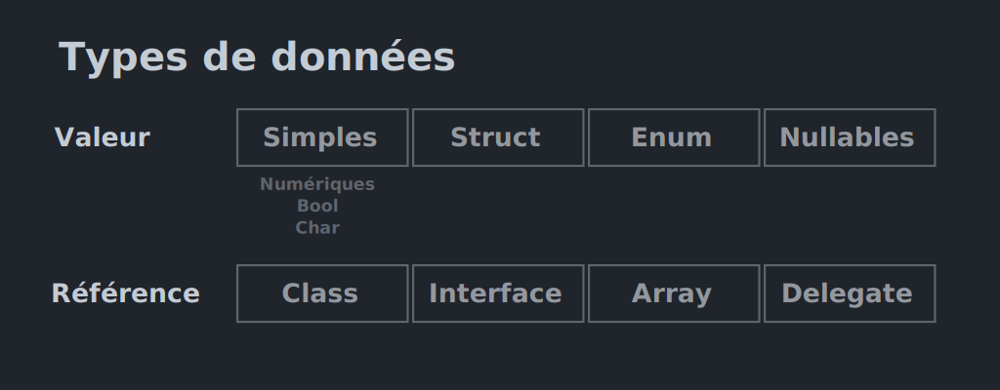

# Types

Le 15/08/2024

En C#, une valeur est typée. [Source](https://learn.microsoft.com/fr-fr/dotnet/csharp/fundamentals/types/ _blank)

## Introduction

C# est un langage dit **fortement typé** : une variable possède un **type de donnée**. Le type indique quelle sorte de valeur est stockée en RAM (nombre entier, chaîne de caractères...) et permet ainsi à la machine de déterminer **comment représenter une donnée**. 

Les types sont des constructions logiques, des unités logiques. On dit que les types encapsulent des **attributs** (champs, propriétés) et des **actions ou opérations** (méthodes). Attributs et actions forment les **membres** du type.

Les **types intégrés** désignent des types fournis par .NET. Ils font l'objet d'**alias** implémentés pour le confort du développeur. Le *namespace* est `System`. [Liste complète](https://learn.microsoft.com/fr-fr/dotnet/csharp/language-reference/builtin-types/built-in-types _blank)

```C#
System.Int32 i = 5; 
int j = 5; // alias
```

## *CTS*

Le premier type C# est `Object`. Cette classe est la classe parente de toutes les classes .NET. 

On dit qu'un type **dérive** d'un autre, appelé **type de base**, et que le type dérivé est en relation d'**héritage** avec son type de base (il hérite de ses membres). Un type s'inscrit donc dans une  **hiérarchie d'héritage** nommée ***Common Type System*** (*CTS*).

Dérivant de `Object`, les types sont ensuite définis par `class` ou `struct` et organisés en arborescence. `class` et `struct` forment deux grandes catégories de types : les **valeur** et **référence**. La différence réside dans les mode et emplacement de stockage de la valeur en RAM au moment de l’exécution du programme. ‒ Attention, ne pas confondre la « valeur d'une variable » (la donnée affectée à la variable) avec le « type valeur » (la nature d'un type). 

Le **type valeur** (héritant de `System.ValueType`) :
- type **contenant une valeur**,
- effet de l'affectation : **copie la valeur**,
- valeur par défaut : selon le type (affectation possible avec le mot-clé `default`),
- il représente des **données simples**, **acccessibles immédiatement**, dont la **taille est déjà fixée** (types simples, énumérations, structures, nullables).

Le **type référence** : 
- type **contenant une référence vers leur valeur**,
- effet de l'affectation : **copie la référence (adresse mémoire)** mais l'objet est unique,
- valeur par défaut : `null`,
- il représente des **données plus complexes**, **accessibles plus lentement**, dont la **taille est déterminée dynamiquement** (classe, tableau, chaîne, délégué, interface).

On désigne par **types simples** les types numériques, le booléen et le caractère. 



!- Organisation des types C#

## Zones mémoire

La ***Stack*** (**pile**) :
- mémoire **rapide**,
- utilisée pour l'**exécution du code**, le stockage de **données temporaires** et de **variables locales**,
- organisée en **pile** de **blocs** qui représentent chacun une **portée** (*scope*) (exemple : bloc `if`, code entre `{}`, appel de fonction, paramètres...),
- en **fin** de portée, le bloc correspondant est **immédiatement supprimé de la mémoire**, 
- contient les **variables**, la **valeur des types valeur**, les **références/adresses** des objets (qui sont en *Heap*),
- exemple : un `int`.

Le ***Heap*** (**tas**) :
- mémoire **plus lente**,
- utilisée pour le **stockage des données accessibles globalement**, sur de plus **longues périodes** voire tout au long de la vie de l'application,
- organisée par **blocs** qui sont **accessibles par une adresse** à tout moment,
- la **taille** d'une donnée stockée en *Heap* est **allouée dynamiquement** à l'exécution (exemple : on doit toujours fournir la taille d'un `array` à son initialisation),
- pour accéder à une donnée en *Heap*, on utilise un pointeur (ou référence) vers l'adresse correspondante ; pointeur qui, lui, est une **valeur** stockée en *Stack*,
- contient les **objets**, les **valeurs globales** et **statiques**,
- exemple : un `StringBuilder`.

C# utilise un ***garbage collector*** (ramasse-miettes) : processus qui supprime automatiquement un objet en *Heap* lorsque plus aucune variable ne référence cet objet. Ce processus de désallocation mémoire est appelé **finalisation**, du nom de la méthode `Finalize()` de la classe `Object` (dans d'autres langages, elle peut être nommée destructeur).

## Types intégrés

Sources : 
- [MSDN *Built-int types*](https://docs.microsoft.com/fr-fr/dotnet/csharp/language-reference/builtin-types/built-in-types _blank) 
- [TutorialTeacher *Data types*](https://www.tutorialsteacher.com/csharp/csharp-data-types _blank)
- [MSDN Introduction au langage C#](https://docs.microsoft.com/fr-fr/dotnet/csharp/language-reference/language-specification/introduction _blank)

La donnée occupe un **espace de mémoire vive** et cette **taille** dépend du type utilisé :
- valeur : taille fixe,
- référence : taille dépendant du contenu de la donnée.

On utilise des **unités de mesure** qui dérivent du code binaire :
- **bit** (*binary digit*) : nombre soit de valeur 0 soit de valeur 1 (2 états),
- **byte** ou **octet** : composé de 8 bits. Exemple : 2 bytes = 16 bits = 2 × 2 × 2 × 2 bits.


-! Types intégrés de C#

**Le type limite la valeur**. Ainsi, notamment avec les nombres, on choisira un type selon les besoins et en gardant à l'esprit de ne pas encombrer la mémoire inutilement. Par exemple, le type `int` ne conserve d'un nombre à virgule que la partie entière (c'est non un arrondi mais une troncature). Les **types numériques à virgule flottante** présentent la caractéristique de **précision**. 

```C#
int num = 1 / 2 ; 
// 0 (et non pas 0.5)
```

Avec les nombres, le suffixe (`l` ou `d`...) définit que le nombre est bien du type défini. Si on omet ce suffixe, alors **le compilateur opère une conversion**.

```C#
double d1 = 3; // entier converti en double
double d2 = 3d; // pas de conversion
double d3 = 3.2; // ?
```


!- Plages de valeur, suffixes et précision.

Bonus : [Mémo types intégrés](../../../media/.net/structure/types_memo.svg _blank)

## Type valeur

Tous les **types valeur** sont des `struct` (héritage de C) ou `enum`. 

Une donnée de type `struct` existe en *Stack* ; idem pour les valeurs qui la composent.

On **alloue l'espace mémoire** pour une `struct` avec le mot-clé `new` (appel de constructeur de la classe), ce qui a pour effet d'**initialiser** la variable. Cela vaut aussi pour les sous-types :

```C#
int x = new int(); 
// valeur : 0 par défaut
```

À ne pas confondre avec la **déclaration** qui alloue la mémoire en *Stack* mais **sans** affectation de valeur explicite ; c'est la valeur par défaut qui est utilisée.

```C#
int x;
```

Les types valeur sont *sealed*, c'est-à-dire qu'il est impossible de créer un type qui en hérite.

## Type référence

Tous les **types référence** sont des `class`.

Une donnée de type `class` existe en *Heap* ; idem pour les valeurs qui la composent.

On **alloue l'espace mémoire** pour une donnée de type `class` en **instanciant la classe** avec le mot-clé `new`. Cela crée un **nouvel objet** en *Heap* et l'adresse mémoire est stockée dans la variable qui, elle, est en *Stack*.

Une donnée de type référence est soit une référence à une instance de classe, soit la valeur `null`.

Les types référence peuvent être dérivés.

## Méthodes de type

Les types présentent des **méthodes** spécifiques : 

```C#
int num = int.MaxValue; 
// La valeur maximale d'un int
```

```C#
int i = monString.IndexOf("a"); 
// Une fonction de la classe string
```

Ceci semble aller de soi pour les **types référence**. Mais si les **types valeur** ne contiennent qu'une valeur, alors comment peuvent-ils disposer de méthodes ? Ceci est rendu possible par une conversion de valeur à référence que le *CLR* effectue au cours d'un processus nommé ***boxing*** : création d'un **objet** en *Heap* qui contient et la **valeur** et les **méthodes de sa classe**. 

Les deux exemples précédents montrent un *boxing* **implicite**. Le *boxing* **explicite** s'effectue en déclarant un objet :

```C#
int i = 1;
object o = i; // boxing
```

On peut réaliser de l'***unboxing*** : convertir référence en valeur. Ceci consiste à copier un type valeur qui se situe dans l'objet dans un type valeur. Voir le chapitre sur les conversions (*cast*).

```C#
int i = 1;
object o = i; // boxing
int j = (int) o; // unboxing
```

*Boxing* et *unboxing* sont des **processus lourds en calcul**.

## Compilation & exécution

Lors de la rédaction d'un script, de façon ordinaire et générale, l'auteur ou l'autrice déclare une variable et son type. Ce type est contrôlé par Visual Studio. Ce type dans le code source est celui qui est considéré au moment de la compilation. On parle alors de **type à la compilation**. Ce type à la compilation ne doit pas être confondu avec le **type à l'exécution** qui concerne l'instance référencée par la variable.

Pourquoi faire cette distinction ? Pour anticiper les erreurs éventuelles. Par exemple, je peux écrire une chaîne de caractères, donc un type `string`, comme valeur d'un type `object` mais à l'exécution c'est bien un type `object` qui sera utilisé ; par conséquent, je dois bien identifier l'action qui s'applique à cette donnée en tant qu'`object` à ce moment du programme (et non pas en tant que `string`).

## Muable, immuable

Un type est dit **immuable** (*immutable*) lorsque les données de ses membres **ne peuvent pas changer**  après l'instanciation. C'est le cas de `String` : on ne modifie pas une chaîne (ce que l'on pense faire en écrivant le code, par exemple une concaténation) mais on crée un nouvel espace mémoire à chaque intervention sur la donnée existante.

Un type est dit **muable** (*mutable*) lorsque les données de ses membres **peuvent changer** après l'instanciation. C'est le cas de `StringBuilder` : une fois l'objet créé, les manipulations successivent sur les données ne produisent pas de nouvelle instance.

[Source](https://medium.com/@jepozdemir/understanding-mutable-and-immutable-types-in-c-2c609fd75a12 _blank)
