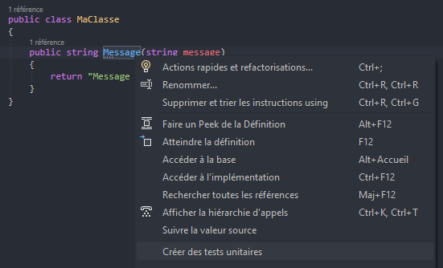
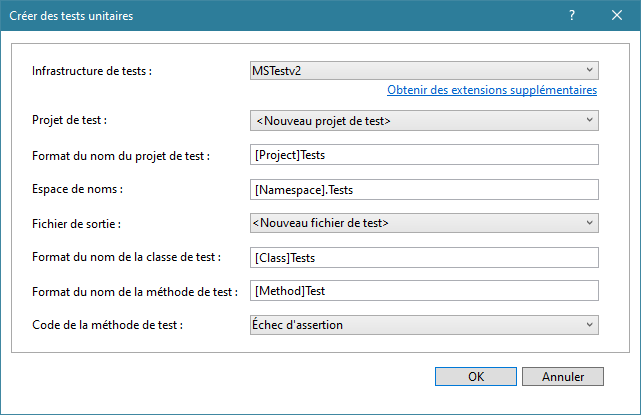
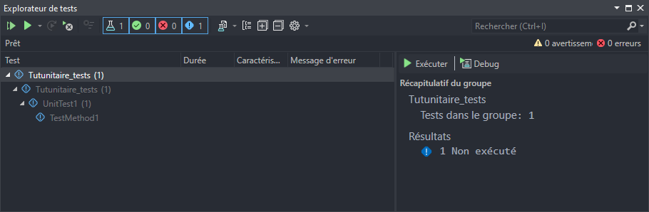
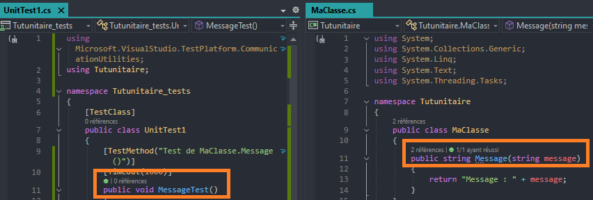
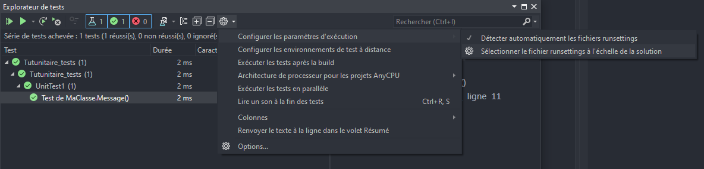
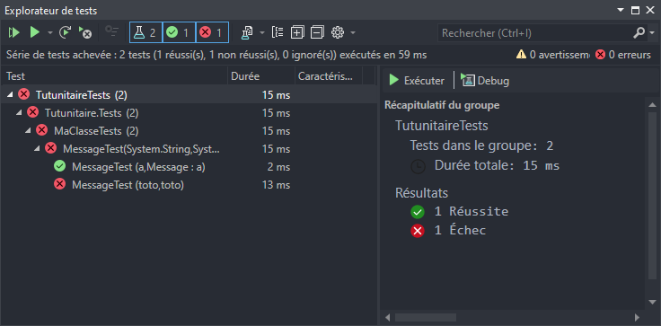

# Projet de tests

Le 05-09-2024

Vérifier qu'une méthode renvoie le résultat attendu.

## Introduction

Les tests unitaires utilisent un modèle de test dit ***AAA : Arrange, Act, Assert***.
- ***Arrange*** : initialiser les objets, définir les valeurs des données transmises à la méthode testée.
- ***Act*** : appeler la méthode testée avec les paramètres fournis.
- ***Assert*** : vérifier que la méthode testée se comporte comme attendu.

Sources 
- [Microsoft *Learn* Tests unitaires Fondamentaux](https://learn.microsoft.com/fr-fr/visualstudio/test/unit-test-basics _blank)
- [Microsoft *Learn* Visual Studio Tests unitaires](https://learn.microsoft.com/fr-fr/visualstudio/test/getting-started-with-unit-testing _blank)
- [Microsoft *Learn* Visual Studio Tests unitaires Pas à pas ](https://learn.microsoft.com/fr-fr/visualstudio/test/walkthrough-creating-and-running-unit-tests-for-managed-code _blank)

## Projet 

Je crée un projet de programme C# Console nommé `Tutunitaire` avec Visual Studio 2022. C'est le produit, le programme de production. Ce programme contient :
- la classe personnelle `MaClasse`, exposant une méthode publique `Message()` retournant la chaîne de caractères qu'elle prend en entrée concaténée avec un préfixe,
- `Program.cs` qui instancie la classe précédente et en utilise la méthode.

On souhaite tester la méthode `MaClasse.Message()`. Or, le test unitaire va prendre la forme d'une classe d'un projet spécifique aux tests, dans la solution. Donc, `MaClasse` et `Message()` doivent être de visibilité `public`.

```C#
public class MaClasse
{
	public static string Message(string message)
	{
		return "Message : " + message;
	}
}
```

```C#
internal class Program
{
	static void Main(string[] args)
	{
		new MaClasse().Message("Coucou !");
		Console.Read();
	}
}
```

## Projet de tests pour C#

Lorsque le projet à tester est en langage C#, Visual Studio propose un raccourci pour générer le projet de tests et les méthodes de tests. Dans une classe, faire un clic droit puis choisir `Créer des tests unitaires`.



!- Clic droit dans le code puis choisir l'entrée `Créer des tests unitaires`.

Ceci ouvre cette fenêtre de configuration :



!- Fenêtre de configuration du projet de tests.

Appuyer sur `OK` pour générer un projet de tests unitaires pour toutes les méthodes de la classe choisie. 

Une fois le projet créé, dans l'`Explorateur de solutions`, faire un clic droit sur le dossier `Dépendances` ou `Références` du projet de test puis choisir `Ajouter une référence de projet...`. Dans la nouvelle fenêtre, sélectionner le nom du programme à référencer. Le projet de test est dorénavant en relation avec notre programme principal.

Il n'y a plus qu'à rédiger le corps de la méthode de test. 

## Projet de tests manuel

Créons un nouveau projet dans la solution, nommé `Tutunitaire_tests`. Ce projet va contenir le nécessaire pour tester notre programme. La méthode suivie ici vaut pour tout projet réalisé avec Visual Studio. Attention, le nom des entités est différent de celui proposé par Visual Studio lors de l'utilisation du raccourci vu précédemment.

.NET fournit de nombreux types de projets de tests. Je choisis ici le type **MSTest**, qui convient au langage C#. Une fois le projet créé, dans l'`Explorateur de solutions`, faire un clic droit sur le dossier `Dépendances` ou `Références` du projet de test puis choisir `Ajouter une référence de projet...`. Dans la nouvelle fenêtre, sélectionner le nom du programme à référencer. Le projet de test est dorénavant en relation avec notre programme principal.

## Tester

Maintenant, aller dans le menu `Test` puis choisir `Explorateur de tests`. Ceci ouvre la fenêtre idoine :



!- Fenêtre de l'`Explorateur de tests`.

Cette fenêtre affiche les entités disponibles. Il en existe déjà une. C'est une classe de test qui a été générée automatiquement à la création du projet de tests. Son contenu dépend de la méthode manuelle ou raccourci C# ; ici, je fais référence à l'entité créée en méthode manuelle.
- `[TestClass]` est un attribut obligatoire. Il définit que la classe contient des méthodes de test.
- `[TestMethod]` est un attribut obligatoire pour définir que la méthode à laquelle il s'applique est une méthode de test.
- `TestMethod1()` est la méthode de test proprement dite.

```C#
namespace Tutunitaire_tests
{
	[TestClass]
	public class UnitTest1
	{
		[TestMethod]
		public void TestMethod1()
		{
		}
	}
}
```

Maintenant, il s'agit de rédiger notre méthode de test. 
- Renommer la méthode ou bien personnaliser l'attribut de la méthode (ce qui offre plus de liberté). Dans les deux cas, le nom s'affiche dans la fenêtre d'`Explorateur de tests`.
- Ajouter d'autres attributs utiles, par exemple la durée maximum d'exécution avec `[Timeout]`.
- Suivre les trois règles de Microsoft : *Arrange*, *Act*, *Assert*. 
	- *Arrange* : poser le résultat attendu. Ici, je reconstruis ici de façon explicite la procédure de la méthode testée mais on pourrait se limiter au résultat.
	- *Act* : appeler la méthode avec ce qui a été réalisé en *Arrange*.
	- *Assert* : comparer l'attendu avec le résultat actuel.

```C#
namespace Tutunitaire_tests
{
	[TestClass]
	public class UnitTest1
	{
		[TestMethod("Test de MaClasse.Message()")]
		[Timeout(1000)]
		public void MessageTest()
		{
			// Arrange
			string message = "Moi être mai sage !";
			string prefixe = "Message : ";
			string attendu = prefixe + message;
			
			// Act
			string actuel = new MaClasse().Message(message);
			
			// Assert
			Assert.AreEqual(attendu, actuel);
		}
	}
}
```

Maintenant, générer la solution de test avec clic droit sur le projet puis `Générer` ou `Exécuter les tests` ou bien utiliser les boutons de la fenêtre `Explorateur de tests` ou bien encore utiliser les commandes du menu `Test`.

Le résultat est **KO** de couleur rouge ou **OK** de couleur verte. Ce résultat apparaît en `Explorateur de tests` et aussi au-dessus de chaque signature de méthode :



!- Icône de réussite ou d'échec au-dessus de la signature de méthode, indiquant la couverture de tests.

Les tests en échec font l'objet d'un enregistrement dans un dossier `TestResults`, au niveau de la solution. Ce dossier n'apparaît pas dans Visual Studio. Ce dossier contient un dossier par test échoué, nommé avec un tampon horaire (pas de fichier). Cette génération de dossiers d'échec ne peut pas être désactivée mais le chemin du dossier principal peut être modifié. Ceci s'effectue en créant et configurant un fichier XML nommé par exemple `test.runsettings` au niveau de la solution. Ce fichier peut accueillir de nombreux paramètres. Plus d'infos sur [Microsoft *Learn*](https://learn.microsoft.com/fr-fr/visualstudio/test/configure-unit-tests-by-using-a-dot-runsettings-file _blank) et [Stack Overflow](https://superuser.com/questions/1267698/how-to-disable-testresults-folder-in-visual-studio _blank). Exemple :

```XML
<?xml version="1.0" encoding="utf-8"?>
<RunSettings>
	<RunConfiguration>
		<!--<ResultsDirectory>.\TestResults</ResultsDirectory>-->
		<ResultsDirectory>%UserProfile%\Desktop\TestResults</ResultsDirectory>
	</RunConfiguration>
</RunSettings>
```

Ce fichier doit être référencé dans la fenêtre `Explorateur de tests`. Pour ce faire, choisir l'icône « rouage », puis `Configurer les paramètres d'exécution` puis `Sélectionner le fichier runsettings à l'échelle de la solution`.



!- Référencer le fichier `.runsettings` dans la fenêtre d'`Explorateur de tests`.


## Test piloté par les données

On peut utiliser les **tests pilotés par les données**, autrement appelés **test paramétré**, pour vérifier la fonction avec **une série de données différentes en entrée**. Ceci couvre l'étape *Arrange*. Source [Microsoft *Learn*](https://learn.microsoft.com/en-us/visualstudio/test/how-to-create-a-data-driven-unit-test _blank). Exemple avec l'attribut `[DataRow]` :

```C#
namespace Tutunitaire.Tests
{
	[TestClass]
	public class MaClasseTests
	{
		[TestMethod("Test de MaClasse.Message()")]
		[Timeout(1000)]
		[DataRow("a", "Message : a")]
		[DataRow("toto", "toto")] // KO
		public void MessageTest(string message, string attendu)
		{
			// Act
			string actuel = new MaClasse().Message(message);
			
			// Assert
			Assert.AreEqual(attendu, actuel);
		}
	}
}
```



!- Résultat du test piloté par les données.


##  Assertions

Les **assertions** servent à déterminer si le test réussit ou échoue. Elles font l'objet de types : [Assert](https://learn.microsoft.com/en-us/dotnet/api/microsoft.visualstudio.testtools.unittesting.assert _blank), [StringAssert](https://learn.microsoft.com/en-us/dotnet/api/microsoft.visualstudio.testtools.unittesting.stringassert _blank) pour chaînes de caractères, [CollectionAssert](https://learn.microsoft.com/en-us/dotnet/api/microsoft.visualstudio.testtools.unittesting.collectionassert _blank) pour collections.

Garder à l'esprit que les tests peuvent échouer pour d'autres raisons que les seuls critères d'assertion, par exemple des exceptions non capturées ou le dépassement de la limite de temps du test. 

Une méthode de test peut contenir plusieurs assertions successives. Alors, il suffit d'une assertion en échec pour que le test de la méthode soit en échec. Le message affiché dans l'`Explorateur de tests` permet d'identifier le comportement problématique. Exemple :

```C#
Assert.AreEqual(attendu, actuel);
StringAssert.Contains(actuel.toString(), "Toto");
```

Ces assertions sont celles proposées par .NET mais il existe des *frameworks* dédiés, par exemple [Fluent Assertions](https://fluentassertions.com _blank) qui propose une syntaxe plus sémantique que technique.

```C#
[TestMethod]
public void CalculetteAdditionTest()
{
	var calculette = new();
	var actuel = calculette.Additionner(1, 2);
	
	actuel.Should().Be(2).And.NotBe(4012);
	
	// Non fluent
	Assert.AreEqual(actuel, 3);
	Assert.AreNotEqual(actuel, 4012);
}
```
