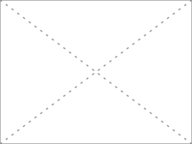

# Github // Alexandre Venet

Le 05-08-2024

Bienvenue dans mon espace GitHub Pages. 

## Présentation

Je publie ici des notes (cours, tests, projets...) sur différentes technologies.

Pour en savoir plus sur moi-même, consulter [Alhomepage.com](https://www.alhomepage.com "Alhomepage" _blank). Pour mes dépôts GitHub : [Github Alexandre Venet](https://github.com/AlexandreVenet "Github Alexandre Venet" _blank).

## Colophon

L'ergonomie du présent site est ***responsive***.

Les typographies sont **Montserrat** et **Roboto** et sont chargées à partir de **Google Fonts** ; les typographies pour le `code` sont à chasse fixe et font partie des standards (installées par défaut dans le système d'exploitation du terminal de consultation) : **Consolas**, **Lucida Console**, **Courier**.

Le site est en ce qu'on appelle « mode sombre » afin de réduire la consommation électrique (écran) et reposer les yeux. J'essaie de trouver un contraste de couleur satisfaisant entre le fond et le texte, d'un côté pour le confort de lecture, de l'autre pour réduire voire éviter l'effet de bandes horizontales en persistance rétinienne.

Pour les grandes largeurs d'écran, la fin d'une page présente un bloc vide haut : contrainte technique afin que le sommaire, affiché à droite de l'écran, soit correctement mis à jour.

Le présent site est herbergé sur **Github** et utilise la fonction **Github Pages**.

Du fait des limitations de Github (et aussi pour le plaisir), j'ai tenté de réaliser un **convertisseur personnel de Markdown en HTML côté client en Javascript**, ce qui me permet d'éditer les contenus de ce site seulement avec des fichiers `.md` (navigation et pages).

Les blocs de code sont présentés de la manière suivante. Si les lignes sont trop longues, le bloc est défilable horizontalement. 

```
entrée de code
		ligne indentée de 2 tabulations
```

```
entrée 
{
	Cette ligne est indentée et très longue pour afficher la barre de défilement horizontale. On peut naviguer avec SHIFT + molette souris...
	
	saut de ligne
	
	Exemple de code HTML : <button>
}
```

Les images sont centrées dans la page et suivies d'une légende. La largeur est limitée à la largeur de la page.



!- Exemple d'une image, ici SVG, de dimensions 320x240px, suivie de sa **légende** facultative. 

Les citations sont présentées comme suit et peuvent être accompagnées de leur source (auteur, ouvrage). 

> L'attention est la forme la plus rare et la plus pure de la générosité.

!> Simone Weil, --Lettre à Joë Bousquet--.

Les tableaux sont dimensionnés selon leur contenu, avec une largeur maximale de cellule. Ils sont défilables si trop longs, comme les blocs de code.

|1|2|3|4|5|
|-|-|-|-|-|
|Sed, tenetur! |😁|Lorem ipsum dolor sit amet consectetur adipisicing elit. Molestiae aperiam debitis qui impedit, iure, officia harum dicta nobis ipsam earum minus nulla, totam amet fuga. Tempore impedit facilis soluta sed!|***Lorem ipsum*** dolor sit amet consectetur adipisicing elit.|Voluptatem consequuntur quasi odio iusto, quos eveniet blanditiis quae autem optio? Deleniti nam eligendi unde quasi ullam iusto sapiente et odit voluptatem laborum sequi illo in consequuntur nisi impedit esse non, totam maxime voluptate quaerat pariatur repudiandae?|
|a|b|c|d|e|
