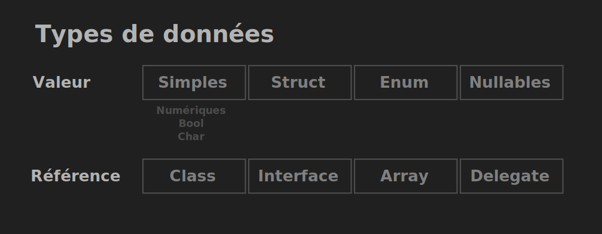
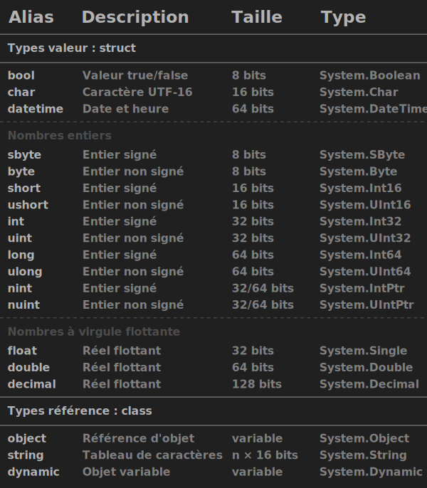
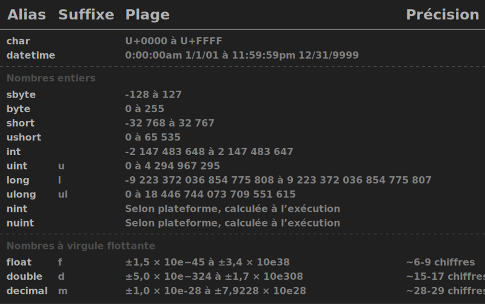

# Types de données

Le 13-05-2023

Dans C#, une valeur est typée.

## Introduction

**C#** est un langage dit **fortement typé** : une variable possède un **type de donnée**. Le type indique quelle sorte de valeur est stockée en RAM (nombre entier, chaîne de caractères...) et permet ainsi à la machine de déterminer **comment représenter une donnée**. 

Les **types de données** sont définis par des `class` ou `structs` et organisés en arborescence. 

Le premier type C# est `Object`. Tout type est donc un de ses dérivés, plus ou moins directement, et cette classe est la classe parente de toutes les classes .NET. Voir le chapitre sur Object.

Les **types intégrés** font l'objet d'**alias** implémentés pour le confort du développeur. Le *namespace* est `System`.
```
System.Int32 i = 5; 
int j = 5; // alias
```

## Catégories des types

Les **types de données** sont classés selon deux grandes catégories : **valeur** et **référence**. La différence réside dans les mode et emplacement de stockage de la valeur en RAM au moment de l’exécution du programme.

Le **type valeur** : 
- type **contenant une valeur**,
- effet de l'affectation : **copie la valeur**,
- valeur par défaut : selon le type (affectation possible avec le mot-clé `default`),
- il représente des **données simples**, **acccessibles immédiatement**, dont la **taille est déjà fixée** (type simples, énumérations, structures, nullables).

Le **type référence** : 
- type **contenant une référence vers leur valeur**,
- effet de l'affectation : **copie la référence (adresse mémoire)** mais l'objet est unique,
- valeur par défaut : `null`,
- il représente des **données plus complexes**, **accessibles plus lentement**, dont la **taille est déterminée dynamiquement** (classe, tableau, chaîne, délégué, interface).

On désigne par **types simples** les types numériques, le booléen et le caractère. 



Dans Unity, on peut désigner par **types complexes** toute combinaison de types simples et qui dérive de `struct` (exemples : `Vector2`, `Quaternion`...).

## Zones mémoire

La ***Stack*** (**pile**) :
- mémoire **rapide**,
- utilisée pour l'**exécution du code**, le stockage de **données temporaires** et de **variables locales**,
- organisée en **pile** de **blocs** qui représentent chacun une **portée** (*scope*) (exemple : bloc `if`, code entre `{}`, appel de fonction, paramètres...),
- en **fin** de portée, le bloc correspondant est **immédiatement supprimé de la mémoire**, 
- contient les **variables**, la **valeur des types valeur**, les **références/adresses** des objets (qui sont en *Heap*),
- exemple : un `int`.

Le ***Heap*** (**tas**) :
- mémoire **plus lente**,
- utilisée pour le **stockage des données accessibles globalement**, sur de plus **longues périodes** voire tout au long de la vie de l'application,
- organisée par **blocs** qui sont **accessibles par une adresse** à tout moment,
- la **taille** d'une donnée stockée en *Heap* est **allouée dynamiquement** à l'exécution (exemple : on doit toujours fournir la taille d'un `array` à son initialisation),
- pour accéder à une donnée en *Heap*, on utilise un pointeur (ou référence) vers l'adresse correspondante ; pointeur qui, lui, est une **valeur** stockée en *Stack*,
- contient les **objets**, les **valeurs globales** et **statiques**,
- exemple : un `gameObject` de la scène courante.

C# utilise un ***garbage collector*** (ramasse-miettes) : processus qui supprime automatiquement un objet en *Heap* lorsque plus aucune variable ne référence cet objet. Ce processus de désallocation mémoire est appelé **finalisation**, du nom de la méthode `Finalize()` de la classe `Object`. 

## Types intégrés

Sources : 
- [MSDN Built-int types](https://docs.microsoft.com/fr-fr/dotnet/csharp/language-reference/builtin-types/built-in-types "MSDN Built-int types") 
- [TutorialTeacher Data types](https://www.tutorialsteacher.com/csharp/csharp-data-types "TutorialTeacher Data types")
- [MSDN Introduction au langage C#](https://docs.microsoft.com/fr-fr/dotnet/csharp/language-reference/language-specification/introduction "MSDN Introduction au langage C#")

La donnée occupe un **espace de mémoire vive** et cette **taille** dépend du type utilisé :
- valeur : taille fixe,
- référence : taille dépendant du contenu de la donnée.

On utilise des **unités de mesure** qui dérivent du code binaire :
- **bit** (*binary digit*) : nombre soit de valeur 0 soit de valeur 1 (2 états),
- **byte** ou **octet** : composé de 8 bits. Exemple : 2 bytes = 16 bits = 2 × 2 × 2 × 2 bits.



**Le type limite la valeur**. Ainsi, notamment avec les nombres, on choisira un type selon les besoins et en gardant à l'esprit de ne pas encombrer la mémoire inutilement. 

Par exemple, le type `int` ne conserve d'un nombre à virgule que la partie entière (c'est non un arrondi mais une troncature). Les **types numériques à virgule flottante** présentent la caractéristique de **précision**. 
```
int num = 0 ;
num = 1 / 2 ; // 0
```

Avec les nombres, le suffixe (« l », ou « d »...) définit que le nombre est bien du type défini. Si on omet ce suffixe, alors **le compilateur opère une conversion**.
```
double d1 = 3; // entier converti en double
double d2 = 3d; // pas de conversion
double d3 = 3.2; // ?
```



Bonus : [Mémo types intégrés](https://alexandrevenet.github.io/media/csharp/types_memo.svg "Mémo types intégrés")

## Type valeur : struct ou enum

Tous les **types valeur** sont des `struct` (héritage de C) ou `enum`. 

Une donnée de type `struct` existe en *Stack* ; idem pour les valeurs qui la composent.

On **alloue l'espace mémoire** pour une `struct` avec le mot-clé `new` (appel de constructeur de la classe), ce qui a pour effet d'**initialiser** la variable. Cela vaut aussi pour les sous-types :
```
int x = new int(); // 0 comme valeur par défaut
```

À ne pas confondre avec la **déclaration** qui alloue la mémoire en *Stack* mais **sans** affectation de valeur (c'est la valeur par défaut qui est utilisée) :
```
int x;
```

## Type référence : class

Tous les **types référence** sont des `class`.

Une donnée de type `class` existe en *Heap* ; idem pour les valeurs qui la composent.

On **alloue l'espace mémoire** pour une donnée de type `class` en **instanciant la classe** avec le mot-clé `new`. Cela crée un **nouvel objet** en *Heap* et l'adresse mémoire est stockée dans la variable qui, elle, est en *Stack*.

Une donnée de type référence est soit une référence à une instance de classe, soit la valeur `null`.

## Var

Référence : [MSDN Tour C#](https://docs.microsoft.com/fr-fr/dotnet/csharp/tour-of-csharp/ "MSDN Tour C#")

Le (mal nommé) **type universel** `var` déclare un type **implicite** (non explicite) : le **compilateur** définira le type adéquat en calculant l'expression située à droite de l'opérateur d'assignation, ce qui augmente la charge de travail lors de la compilation (aucun effet sur le produit final). On est en fait en face d'un mot-clé plutôt que d'un nom de type. Caractéristiques : 
- une déclaration de variable de ce type requiert une assignation, 
- une déclaration en ligne ou multiligne est impossible,
- ce type peut servir dans les boucles,
- ce type ne peut pas servir comme type de retour d'une fonction.
```
int x = 1;
var y = i + 1; // le compilateur en fera un int

var str = "Bonjour !";
Debug.Log($"Le type de str est : {str.GetType()}.");
```

## Fonctions et propriétés de type

Les types de données présentent des **fonctions** et **propriétés** spécifiques : 
```
int num = int.MaxValue ; // la MaxValue de la classe int
int i = monString.IndexOf("a") ; // une fonction de la classe string
```

Ceci semble aller de soi pour les **types référence**. Mais si les **types valeur** ne contiennent qu'une valeur, alors comment peuvent-ils disposer de fonctions ? Ceci est rendu possible par une conversion de valeur à référence que le CLR effectue au cours d'un processus nommé ***boxing*** : création d'un **objet** en *Heap* qui contient et la **valeur** et les **méthodes de sa classe**. 

Les deux exemples précédents montrent un *boxing* **implicite**. Le *boxing* **explicite** s'effectue en déclarant un objet :
```
int i = 1;
object o = i; // boxing
```

On peut réaliser de l'***unboxing*** : convertir référence en valeur. Ceci consiste à copier un type valeur qui se situe dans l'objet dans un type valeur. Voir le chapitre sur les conversions (*cast*).
```
int i = 1;
object o = i; // boxing
int j = (int) o; // unboxing
```

*Boxing* et *unboxing* sont néanmoins des processus lourds en calcul.

## Type anonyme

Référence : [Microsoft Learn](https://learn.microsoft.com/fr-fr/dotnet/csharp/fundamentals/types/anonymous-types) 

Le **type anonyme** permet de définir des objets à la volée comprenant des **propriétés en lecture seule**. Pour l'initialisation, on utilise simplement `new {}` :
```
var x = new
{
	"Tete" = 0,
	"Corps" = "THX1138"
};
```

Maintenant, si notre **classe** utilise une **propriété** (voir chapitre sur la classe), alors il suffit d'écrire le nom de la propriété en tant que membre de l'objet de type anonyme. En effet, c'est le compilateur qui mettra les entités en relation. L'exemple suivant utilise la syntaxe d'**instruction lambda** (voir chapitre idoine) pour renvoyer un objet de type anonyme.
```
public class Chose
{
	private string Prop { get; set; }
	
	public object Test() => new
	{
		Prop,
		"Autre" = 0
	};
}
```
