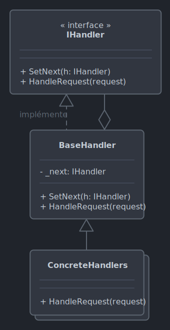

# *Chain of responsibility*

Le 30-09-2024

Plusieurs objets interviennent successivement sur une réponse de requête car l'une et l'autre sont découplées.

## Présentation

*Chain of responsibility* permet le transfert d'une demande, d'une requête, dans un ou plusieurs gestionnaires. Lorsqu'un de gestionnaire reçoit la requête, il peut la traiter ou bien, si elle ne le concerne pas, la transmettre à un autre gestionnaire. Les gestionnaires forment alors une chaîne de traitement, un *workflow*, chacun représentant un maillon qui peut ou non intervenir sur la demande. La demande traverse la chaîne jusqu'à ce qu'un ou plusieurs gestionnaires opèrent dessus.



!- Diagramme UML de classe du patron *Chain of responsibility* dans le cas d'une interface et d'une abstraction intermédiaire pour les gestionnaires concrets.

Dans le schéma précédent, la méthode `SetNext()` est définie dans l'interface ; elle peut aussi être définie dans la classe abstraite car l'interface peut ne relever que du concept de gestion (et non pas avoir pour responsabilité de passer d'un gestionnaire à un autre). `BaseHandler` est une entité facultative car on pourrait très bien n'utiliser qu'une seule entité regroupant les responsabilités de gestionnaire **ET** de passage au gestionnaire suivant. 

Il existe une variante : *tree of responsibility*. Chaque entité transmet la demande non pas à une seule autre mais à plusieurs autres. Par exemple, l'interpréteur de document XML.

## Implémentation C#

Voici un exemple pour programme Console. 

Posons une entité qui définit la chaîne de responsabilité. Une méthode permet de définir un gestionnaire suivant et de le retourner pour tout usage. Une autre méthode représente le traitement à effectuer sur la demande (ici, seulement le nom de la demande).

```C#
internal interface IGestionnaire
{
	IGestionnaire DefinirSuivant(IGestionnaire gestionnaire);
	void Agir(string demande);
}
```

Ensuite, créons un classe abstraite qui représente le concept de base pour des gestionnaires concrets. 

Cette classe contient une instance du prochain gestionnaire. 

Cette classe implémente le comportement par défaut : gérer l'existence du prochain gestionnaire, l'appeler pour lui déléguer la tâche. Ici la méthode est rendue `virtual` pour signifier qu'elle peut être réécrite par les classes concrètes dérivées.

```C#
internal abstract class GestionnaireBase : IGestionnaire
{
	private IGestionnaire _gestionnaireSuivant;
	
	public IGestionnaire DefinirSuivant(IGestionnaire gestionnaire)
	{
		_gestionnaireSuivant = gestionnaire;
		return gestionnaire;
	}
	
	public virtual void Agir(string demande)
	{
		if(_gestionnaireSuivant == null)
		{
			throw new NullReferenceException("Le gestionnaire suivant est null.");
		}
		
		_gestionnaireSuivant.Agir(demande);
	}
}
```

Maintenant, créons des gestionnaires concrets. Si la demande est d'un certain type (ici simplement le contenu du texte) alors l'action lui est spécifique ; sinon, le gestionnaire appelle le gestionnaire suivant. Ces entités sont autonomes et en général ne sont pas modifiées à l'exécution ; elles peuvent recevoir des données selon les opérations qu'elles doivent exécuter. Posons plusieurs cas d'usage.
- Un gestionnaire 1 opère sur une demande `Toto` puis interrompt la chaîne, ou bien passe au suivant.
- Un gestionnaire 2 opère sur une demande `Zaza` en rapport au nombre `999` mais qui peut varier selon le contexte puis interrompt la chaîne, ou bien opère sur une demande `Toto` puis interrompt la chaîne, ou bien passe au suivant.
- Un gestionnaire 3 opère sur une demande si elle est `Toto` ou `Zaza` et passe au suivant quelle que soit la demande.
- Un gestionnaire par défaut opère sur n'importe quelle demande puis interrompt la chaîne.

```C#
internal class Traitement1 : GestionnaireBase
{
	public override void Agir(string demande)
	{
		if (demande.Equals("Toto"))
		{
			Console.WriteLine("Traitement1 agit sur la demande [Toto].");
		}
		else
		{
			base.Agir(demande);
		}
	}
}
```

```C#
internal class Traitement2 : GestionnaireBase
{
	private int _valeur;
	
	public Traitement2(int valeurAUtiliser)
	{
		_valeur = valeurAUtiliser;    
	}

	public override void Agir(string demande)
	{
		if (demande.Equals("Zaza") && _valeur == 999)
		{
			Console.WriteLine($"Traitement2 sur la demande [Zaza], avec {_valeur}.");
		}
		else if (demande.Equals("Toto"))
		{
			Console.WriteLine($"Traitement2 opère spécifiquement sur la demande lorsque celle ci vaut [Toto].");
		}
		else
		{
			base.Agir(demande);
		}
	}
}
```

```C#
internal class Traitement3 : GestionnaireBase
{
	public override void Agir(string demande)
	{
		if (demande.Equals("Toto") || demande.Equals("Zaza"))
		{
			Console.Write("Traitement3 agit sur la demande si elle est [Toto] ou [Zaza]. ");
		}
	
		Console.WriteLine("Traitement3 passe au suivant.");
		base.Agir(demande);
	}
}
```

```C#
internal class TraitementDefaut : GestionnaireBase
{
	public override void Agir(string demande)
	{
		Console.WriteLine("Demande gérée par TraitementDefaut.");
	}
}
```

Enfin, le code client. Ici, la chaîne est créée de façon statique mais il est tout à fait possible d'établir une chaîne dynamiquement, selon le contexte, puisque les gestionnaires sont indépendants les uns des autres (en effet, le maillon suivant est défini dans le code client).

```C#
// Définition de la chaîne

Traitement1 traitement1 = new();
Traitement2 traitement2 = new(999);
Traitement3 traitement3 = new();
TraitementDefaut traitementDefaut = new();

traitement1.DefinirSuivant(traitement2).DefinirSuivant(traitement3).DefinirSuivant(traitementDefaut);

// Tests 

traitement1.Agir("Toto");
// Traitement1 agit sur la demande [Toto].

traitement1.Agir("Zaza");
// Traitement2 sur la demande [Zaza], avec 999.

traitement1.Agir("n'importe quoi");
// Demande gérée par TraitementDefaut.

traitement3.Agir("Zaza");
// Traitement3 agit sur la demande si elle est [Toto] ou [Zaza]. Traitement3 passe au suivant.
//Demande gérée par TraitementDefaut.

traitement3.Agir("n'importe quoi");
// Traitement3 passe au suivant.
// Demande gérée par TraitementDefaut.

```

Le code client montre que la chaîne peut être démarrée à partir de n'importe quel maillon (donc à l'exclusion de ceux qui le précèdent).

## Sources

- [Wikipédia](https://en.wikipedia.org/wiki/Chain-of-responsibility_pattern _blank)

