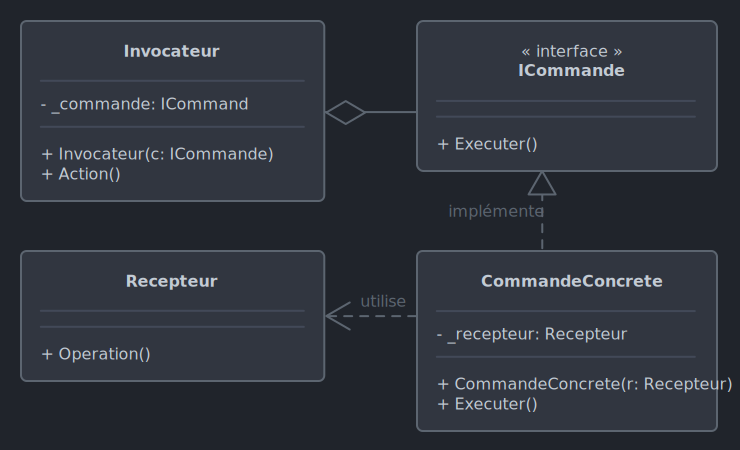

# *Command*

Le 01-10-2024

Une action, un comportement, en tant qu'entité autonome.

## Présentation

*Command* découple les demandes d'un certain contexte des méthodes d'un autre. Par exemple, la communication entre la GUI et la logique métier couple en général étroitement tel bouton à telle méthode ou classe définissant son comportement ; *Command* propose une entité intermédiaire qui reçoit les demandes et les gère les appels à la logique métier.

L'entité intermédiaire prend la forme d'une interface, en général ne possédant qu'une méthode d'exécution sans paramètres.

Cas d'usage
- Actions de l'utilisateur enregistrées par empilement de commandes. Il est possible de dépiler les commandes une à une avec une méthode `undo()`.
- Action d'annulation `rollback()` pour revenir en arrière au cours d'une transaction (ensemble de commandes).
- Si une commande possède une méthode d'estimation de durée, alors on peut représenter la progression à l'exécution de toutes les commandes en cours (barre de progression).
- Enregistrer une commande par action utilisateur pour ensuite pouvoir rejouer toute la séquence (principe de la macro, de la file d'attente).
- L'utilisateur cliquant sur un bouton *suivant* enregistre des actions, des valeurs. Le bouton *terminer* déclenche les actions.
- Interface utilisateur : une touche clavier, un texte, un bouton peuvent utiliser la même commande.

Si d'un point de vue métier on pense un objet exécutant une commande, d'un point de vue technique on pense :
- un objet concerné par l'action nommé ***receiver***,
- l'abstraction définissant une commande et des commandes concrètes correspondantes,
- un objet ***invocator*** qui sert à déclencher la commande. 




!- Diagramme UML de classe du patron *Command* dans le cas d'un invocateur prenant la commande par constructeur et d'une commande concrète prenant le récepteur par constructeur (on peut préférer dans les deux cas un *setter* dédié ou bien une méthode qui stocke la référence en plus de ses traitements).

## Implémentation C# : l'interrupteur

Voici un exemple pour programme Console. On souhaite réaliser un interrupteur qui est un dispositif à deux états opposés l'un à l'autre. Cet interrupteur sert à allumer ou éteindre une lampe.

Codons d'abord la lampe.

```C#
internal class Lampe
{
	public void Allumer()
	{
		Console.WriteLine("La lampe est allumée.");
	}
	
	public void Eteindre()
	{
		Console.WriteLine("La lampe est éteinte.");
	}
}
```

Maintenant, posons l'interface de commande.

```C#
internal interface ICommand
{
	void Executer();
}
```

Codons l'interrupteur. C'est l'invocateur : il utilise l'interface et en appelle la méthode dans une méthode dédiée. Ici, l'interrupteur a besoin de deux commandes pour fonctionner : appuyer vers le haut et vers le bas. Cet interrupteur n'a pas besoin de conserver son état ; il ne propose que les méthodes pour déclencher les actions.

```C#
internal class Interrupteur
{
	private ICommand _commandeHaut;
	private ICommand _commandeBas;
	
	public Interrupteur(ICommand commandeHaut, ICommand commandeBas)
	{
		_commandeHaut = commandeHaut;
		_commandeBas = commandeBas;
	}
	
	public void EnclencherVersLeHaut()
	{
		_commandeHaut.Executer();
	}
	
	public void EnclencherVersLeBas()
	{
		_commandeBas.Executer();
	}
}
```

Ensuite, définissons une classe concrète pour chaque commande. Elle implémente l'interface pour un certain type d'objet, ici la lampe. 

```C#
internal class CommandAllumer : ICommand
{
	private Lampe _lampe;
	
	public CommandAllumer(Lampe lampe)
	{
		_lampe = lampe;
	}
	
	public void Executer()
	{
		_lampe.Allumer();
	}
}
```

```C#
internal class CommandEteindre : ICommand
{
	private Lampe _lampe;
	
	public CommandEteindre(Lampe lampe)
	{
		_lampe = lampe;
	}
	
	public void Executer()
	{
		_lampe.Eteindre();
	}
}
```

Enfin, le code client :

```C#
Lampe lampe = new();

ICommand allumer = new CommandAllumer(lampe);
ICommand eteindre = new CommandEteindre(lampe);

Interrupteur interrupteur = new(allumer, eteindre);

interrupteur.EnclencherVersLeHaut();
// La lampe est allumée.

interrupteur.EnclencherVersLeBas();
// La lampe est éteinte.
```

Et si on voulait que l'interrupteur s'applique à un moteur ? Dans ce cas, il faudrait créer le moteur. Ensuite, peut-être subsumer la lampe et le moteur sous une abstraction (interface `IInterruptable` ou classe abstraite) de façon à ce que les commandes concrètes puissent gérer cette abstraction (plutôt que décliner autant de commandes par type d'objet pouvant être manipulé par interrupteur).

## Implémentation C# : exécuter et annuler

Voici un exemple pour programme Console. On souhaite effectuer l'ajout de texte, la suppression de texte et l'annulation.

Posons l'interface de commande.

```C#
internal interface ICommand
{
	void Execute();
	void Undo();
}
```

Maintenant, codons l'éditeur de texte (*receiver*). Cet éditeur contient le texte à éditer, une méthode d'ajout de texte, une méthode de suppression de texte par nombre de caractères.

```C#
internal class Editeur
{
	public string Texte { get; private set; } = "";
	
	public void AjouterTexte(string texte)
	{
		Texte += texte;
	}
	
	public void SupprimerTexte(int longueur)
	{
		if (longueur > Texte.Length) return;
		
		Texte = Texte.Substring(0, Texte.Length - longueur);
	}
	
	public override string ToString() => Texte;
}
```

Créons les commandes pour l'ajout et la suppression de texte.

```C#
internal class CommandAjouter : ICommand
{
	private Editeur _editeur;
	private string _texte;
	
	public CommandAjouter(Editeur editeur, string texte)
	{
		_editeur = editeur;
		_texte = texte;
	}
	
	public void Execute()
	{
		_editeur.AjouterTexte(_texte);
	}
	
	public void Undo()
	{
		_editeur.SupprimerTexte(_texte.Length); 
	}
}
```

```C#
internal class CommandSupprimer : ICommand
{
	private Editeur _editeur;
	private int _longueur;
	private string _motSupprime;
	
	public CommandSupprimer(Editeur editeur, int longueur)
	{
		_editeur = editeur;
		_longueur = longueur;
	}
	
	public void Execute()
	{
		_motSupprime = _editeur.Texte.Substring(_editeur.Texte.Length - _longueur);
	
		_editeur.SupprimerTexte(_longueur);
	}
	
	public void Undo()
	{
		_editeur.AjouterTexte(_motSupprime);
	}
}
```

Maintenant, codons un gestionnaire de commandes (*invocator*). Ici, pas de constructeur pour stocker la commande car stocker la commande et l'exécuter la commande peuvent être au sein d'une même méthode.

```C#
internal class GestionnaireDeCommand
{
	private Stack<ICommand> _commands = new();
	
	public void CommandExecuter(ICommand command)
	{
		command.Execute();
		_commands.Push(command);
	}
	
	public void CommandAnnuler()
	{
		if (_commands.Count == 0) return;
		
		ICommand command = _commands.Pop();
		command.Undo();
	}
}
```

Enfin, le code client :

```C#
Editeur editeur = new();
GestionnaireDeCommand gestionnaire = new();

gestionnaire.CommandExecuter(new CommandAjouter(editeur, "Bonjour, "));
gestionnaire.CommandExecuter(new CommandAjouter(editeur, "tout "));
gestionnaire.CommandExecuter(new CommandAjouter(editeur, "le "));
gestionnaire.CommandExecuter(new CommandAjouter(editeur, "monde "));
gestionnaire.CommandExecuter(new CommandAjouter(editeur, "!"));
Console.WriteLine(editeur);
// Bonjour, tout le monde !

gestionnaire.CommandExecuter(new CommandSupprimer(editeur, 7));
Console.WriteLine(editeur);
// Bonjour, tout le

gestionnaire.CommandAnnuler();
Console.WriteLine(editeur);
// Bonjour, tout le monde !

gestionnaire.CommandExecuter(new CommandSupprimer(editeur, 1));
gestionnaire.CommandExecuter(new CommandSupprimer(editeur, 6));
gestionnaire.CommandExecuter(new CommandSupprimer(editeur, 3));
gestionnaire.CommandExecuter(new CommandSupprimer(editeur, 5));
Console.WriteLine(editeur);
// Bonjour,

gestionnaire.CommandAnnuler();
Console.WriteLine(editeur);
// Bonjour, tout
gestionnaire.CommandAnnuler();
Console.WriteLine(editeur);
// Bonjour, tout le

gestionnaire.CommandExecuter(new CommandAjouter(editeur, "cosmos."));
Console.WriteLine(editeur);
// Bonjour, tout le cosmos.

gestionnaire.CommandAnnuler();
gestionnaire.CommandAnnuler();	
gestionnaire.CommandAnnuler();
Console.WriteLine(editeur);
// Bonjour, tout le monde !
```

## Sources

- [Wikipédia](https://en.wikipedia.org/wiki/Command_pattern _blank)
- [Refactoring Guru](https://refactoring.guru/fr/design-patterns/command _blank)

