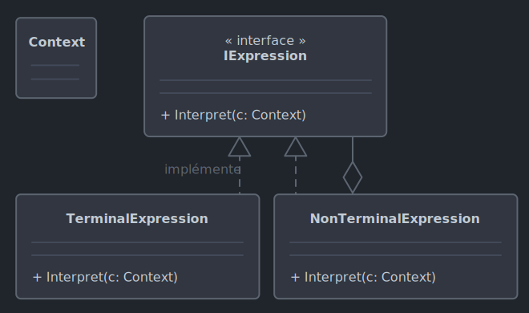

# *Interpreter*

Le 02-10-2024

Une grammaire et son interprète.

## Présentation

*Interpreter* sert à proposer un petit langage de programmation pour effectuer des opérations. Créer un tel petit langage est complexe et peut nécessiter d'implémenter d'autres patrons de conception (*Visitor*, *Composite*, *Command*...). Il s'agit de proposer une **grammaire** fondant le petit langage dont les **expressions ou phrases** peuvent être **interprétées** grâce à une **représentation de la grammaire qu'est l'arbre syntaxique abstrait**. Chaque type de règle de la grammaire est représenté par une classe afin de construire la représentation de la grammaire. 

Les ***Domain-Specific Langauges (DSL)*** sont des exemples de petits langages.
- Le langage SQL pour interroger des bases de données relationnelles : *DSL* externe.
- *Visual Basic for Applications* pour créer des macros dans une application de la suite Office de Microsoft : *DSL* interne.

Voyons l'arbre syntaxique abstrait, par exemple représentant la formule `1 + 2 - 3` :

```
    -
   / \
  +   3
 / \
1   2
```

L'**expression terminale** représente une **feuille** de l'arbre syntaxique abstrait. C'est un élément de la grammaire qui ne peut pas être décomposé. Exemple : l'expression `1 + 2 - 3` contient les expressions terminales `1`, `2` et `3` qui sont les nombres. 

L'**expression non terminale** représente un **nœud** de l'arbre syntaxique abstrait. C'est une règle de la grammaire qui combine d'autres expressions. Exemple : l'expression `1 + 2 - 3` contient les opérations `+` et `-` qui sont opérations binaires. Ces opérations sont analysées en termes de grammaire et arbre syntaxique : ce sont alors des expressions non terminales car elles combinent des sous-expressions. En effet, `1 + 2` est une combinaison de nombres, et `son résultat - 3` est une autre combinaison.



!- Diagramme UML de classe du patron *Interpreter*.

*Interpreter* utilise la notion de **contexte**. Le contexte est un ensemble d'informations (variables, définitions, règles...) qui sont utilisées pour évaluer les expressions du langage. Ce contexte peut ou non être une référence centralisée pour toutes les expressions. Exemples :
- prenons la formule `a + b` où `a` et `b` sont des variables. Le contexte peut servir à stocker la valeur de ces variables,
- les commandes `Deplacer(10)`, `Tourner(45)` peuvent retourner une position et une rotation que le contexte stocke.

## Implémentation C# - Sans contexte

Voici un exemple pour programme Console. On veut interpréter des expressions arithmétiques sur des nombres entiers, l'addition et la soustraction, par exemple `1 + 2 - 3`. On n'utilise pas ici de contexte.

Posons d'abord l'interface représentant une expression. Elle expose une méthode d'interprétation.

```C#
internal interface IExpression
{
	int Interpreter();
}
```

Maintenant, codons les classes d'expressions terminales (nombre) et non terminales (opérations). 

```C#
internal class ExpressionNombre : IExpression
{
	private readonly int _nombre;
	
	public ExpressionNombre(int nombre)
	{
		_nombre = nombre;
	}
	
	public int Interpreter() 
	{
		return _nombre;
	}
}
```

```C#
internal class ExpressionAddition : IExpression
{
	private readonly IExpression _expressionGauche;
	private readonly IExpression _expressionDroite;
	
	public ExpressionAddition(IExpression expressionGauche, IExpression expressionDroite)
	{
		_expressionGauche = expressionGauche;
		_expressionDroite = expressionDroite;
	}
	
	public int Interpreter()
	{
		return _expressionGauche.Interpreter() + _expressionDroite.Interpreter();
	}
}
```

```C#
internal class ExpressionSoustraction : IExpression
{
	private readonly IExpression _expressionGauche;
	private readonly IExpression _expressionDroite;
	
	public ExpressionSoustraction(IExpression expressionGauche, IExpression expressionDroite)
	{
		_expressionGauche = expressionGauche;
		_expressionDroite = expressionDroite;
	}
	
	public int Interpreter()
	{
		return _expressionGauche.Interpreter() - _expressionDroite.Interpreter();
	}
}
```

Enfin, le code client. Ici, on considère que les nombre sont déjà disponibles sous forme de type `int`, le *parsing* de la chaine `1 + 2 - 3` vient d'être réalisé. En ce qui concerne le contexte, on voit que le programme ne pose aucune entité de stockage ; en effet, les nombres (qui pourraient être stockés dans un contexte) sont ici simplement posés comme argument de constructeur des expressions terminales.

```C#
// Définir les nombres
IExpression un = new ExpressionNombre(1);
IExpression deux = new ExpressionNombre(2);
IExpression trois = new ExpressionNombre(3);

// Construire les opérations
IExpression addition = new ExpressionAddition(un, deux);
IExpression formuleComplete = new ExpressionSoustraction(addition, trois);

// Interpréter
int resultat = formuleComplete.Interpreter();

// Afficher le résultat
 Console.WriteLine(resultat); 
// 0
 ```

## Implémentation C# - Avec contexte

Voici un exemple pour programme Console. On veut interpréter des expressions arithmétiques sur des nombres entiers, l'addition et la soustraction, par exemple `1 + 2 - 3`. On souhaite une syntaxe moins verbeuse et plus claire que celle de l'exemple précédent.

L'interface représentant l'expression expose une méthode d'interprétation qui prend en paramètre un dictionnaire ayant pour clé un nom (par exemple `x`) et une valeur (par exemple `1`). Ce dictionnaire représente le contexte.

```C#
internal interface IExpression
{
	int Interpreter(Dictionary<string, int> contexte);
}
```

Codons maintenant les classes terminales et non terminales.

```C#
internal class Nombre : IExpression
{
	private readonly string _nom;
	
	public Nombre(string nom)
	{
		_nom = nom;
	}
	
	public int Interpreter(Dictionary<string, int> contexte)
	{
		return contexte[_nom];
	}
}
```

```C#
internal class Plus : IExpression
{
	private readonly IExpression _operandeGauche;
	private readonly IExpression _operandeDroite;
	
	public Plus(IExpression operandeGauche, IExpression operandeDroite)
	{
		_operandeGauche = operandeGauche;
		_operandeDroite = operandeDroite;
	}
	
	public int Interpreter(Dictionary<string, int> contexte)
	{
		return _operandeGauche.Interpreter(contexte) + _operandeDroite.Interpreter(contexte);
	}
}
```

```C#
internal class Moins : IExpression
{
	private readonly IExpression _operandeGauche;
	private readonly IExpression _operandeDroite;
	
	public Moins(IExpression operandeGauche, IExpression operandeDroite)
	{
		_operandeGauche = operandeGauche;
		_operandeDroite = operandeDroite;
	}
	
	public int Interpreter(Dictionary<string, int> contexte)
	{
		return _operandeGauche.Interpreter(contexte) - _operandeDroite.Interpreter(contexte);
	}
}
```

Enfin, le code client. Ici, on considère que les nombre sont déjà disponibles sous forme de type `int`, le *parsing* de la chaine `1 + 2 - 3` vient d'être réalisé. En ce qui concerne le contexte, on voit ici qu'une entité stocke les informations nécessaires à l'interprétation ; c'est un dictionnaire, type générique intégré au langage. 

```C#
// Contexte de données
Dictionary<string, int> contexte = new()
{
	{ "x", 1 },
	{ "y", 2 },
	{ "z", 3 },
};

// Formule
IExpression formule = new Moins(
	new Plus(new Nombre("x"), new Nombre("y")),
	new Nombre("z")
	);

// Interprétation
int resultat = formule.Interpreter(contexte);

// Affichage
Console.WriteLine(resultat); 
// 0
```

## Sources

- [Wikipédia : DSL](https://en.wikipedia.org/wiki/Domain-specific_language _blank)
- [Wikipédia : Interpreter](https://en.wikipedia.org/wiki/Interpreter_pattern _blank)

