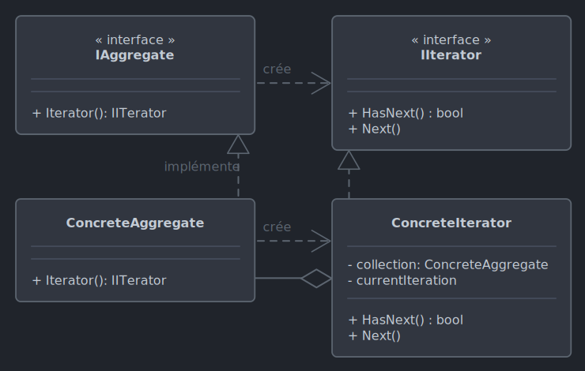

# *Iterator*

Le 04-10-2024

Parcourir les éléments contenus dans un objet (liste, arbre...).

## Présentation

*Iterator* propose de parcourir de façon séquentielle une collection encapsulée dans un objet, élément par élément : **accéder** à un élément, **se déplacer** vers l'élément suivant, déterminer que le contenu a été parcouru. *Iterator* permet d'itérer, c'est-à-dire d'effectuer une boucle, sur toute sorte de structure de données, par exemple des structures arborescentes. Sur ce fonctionnement de base, diverses fonctionnalités peuvent être ajoutée afin d'ajouter des contrôles pendant l'itération : sauter des éléments ou empêcher qu'un élément soit sauté, insérer de nouveaux éléments (avec un index c'eut été plus difficile car l'index lui-même changerait de valeur), forcer ou empêcher qu'un élément soit itéré plusieurs fois...



!- Diagramme UML de classe du patron *Iterator*.

L'objet dont le contenu est itéré est un *concrete aggregate* ; cet objet implémente une abstraction nommée *aggregate* (énumérable). Celle-ci expose une méthode de création d'un *iterator*. Cet *iterator* (énumérateur) est implémenté par un *concrete iterator*. Les *concrete aggregate* et *concrete iterator* s'appliquent à une entité utile, métier.

## Types intégrés C#

.NET fournit le type `IEnumerable`, interface dont la méthode `GetEnumerator()` renvoie un type `IEnumerator`. Ce dernier a une propriété `Current` et des méthodes `MoveNext()`, `Reset()`. 

Les collections C# se fondent sur `IEnumerable`. Pour cette raison, il est possible d'utiliser la boucle `foreach` qui est un raccourci pour utiliser l'énumérateur. On comprend pourquoi cette boucle utilise des itérations en lecture seule ; en effet, *Iterator* ne propose pas d'accès en écriture aux éléments de la collection. Comparer :

```C#
List<string> noms = new() { "Toto", "Tata", "Titi", "Tutu"};
foreach (var item in noms)
{
	Console.WriteLine(item);
}
 /*
	Toto
	Tata
	Titi
	Tutu
 */
```

```C#
List<string> noms = new() { "Toto", "Tata", "Titi", "Tutu"};

List<string>.Enumerator enumerator = noms.GetEnumerator();
// List<T>.Enumerator est de type System.Collections.Generic.IEnumerator<T>

while (enumerator.MoveNext())
{
	Console.WriteLine(enumerator.Current);
}
/*
	Toto
	Tata
	Titi
	Tutu
 */
```

## Itérateur implicite C#

L'**itérateur implicite** utilise l'instruction `yield return` dans un corps de méthode ou un `get`,  sans implémenter manuellement `IEnumerator`. L'itérateur implicite évite de déclarer des variables car on utilise une méthode qui renvoie une valeur par instruction. Ceci peut représenter une solution lorsqu'il est inutile de stocker la collection.

```C#
private IEnumerable<int> Nombres()
{
	yield return 1;
	yield return 2;
	yield return 3;
}
```

```C#
foreach(int nombre in Nombres())
{
    Console.Write(nombre + " ");
}
// 1 2 3 
```

Il reste toutefois possible de poser la variable. Alors, la méthode d'itération contient une boucle de `yield return` sur chaque élément de la collection (noter que ceci représente une complexité inutile puisqu'en C# une liste peut être directement itérée).

```C#
private IEnumerable<int> ObtenirNombres(List<int> nombres)
{
	foreach (int nombre in nombres)
	{
		yield return nombre;
	}
}
```

```C#
List<int> nombres = new() { 1, 2, 3 };

foreach(int n in ObtenirNombres(nombres))
{
	Console.Write(n + " ");
}
// 1 2 3
```

## Itérateur explicite C# simple

L'**itérateur explicite** est l'implémentation manuelle de `IEnumerator` ou de `IEnumerable`. Il est utile quand on souhaite un contrôle plus précis de l'itération (accès conditionnel, opérations supplémentaires...).

Voici un exemple pour un programme Console. Admettons un garage de robots. Voici le type de robot :

```C#
internal class Robot
{
	public string Nom { get; private set; }
	
	public Robot(string nom)
	{
		Nom = nom;
	}
}
```

Le garage contient par exemple un tableau de robots. Le garage est représenté par une classe qui implémente `IEnumerable` pour itérer le tableau. Ici, peu de choses à faire car `System.Array` implémente déjà `IEnumerator`, par conséquent il est inutile de coder un *concrete iterator*.

```C#
internal class Garage : IEnumerable
{
	private readonly Robot[] _robots = 
	{
		new Robot("R2-D2"),
		new Robot("Johnny 5"),
		new Robot("Roz"),
	};
	
	public IEnumerator GetEnumerator()
	{
		return _robots.GetEnumerator();
	}
}
```

Enfin, le code client. Cet exemple montre que l'état de l'itération est maintenu : en effet, une fois le premier élément renvoyé (`R2-D2`), la boucle `while` qui suit commence au second élément (`Johnny 5`). Pour recommencer l'itération, il faut réinitialiser l'énumérateur. 

```C#
Garage garage = new();
IEnumerator enumerateur = garage.GetEnumerator();

// Obtenir le premier élément
enumerateur.MoveNext();
Robot robot = (Robot)enumerateur.Current;
Console.WriteLine(robot.Nom);
// R2-D2

// L'énumérateur a gardé son état, ici l'index 0.
// Boucler à nouveau commence donc à l'index 1.
while(enumerateur.MoveNext())
{
	Robot r = (Robot)enumerateur.Current;
    Console.WriteLine(r.Nom);
}
/*
	Johnny 5
	Roz
 */

// Réinitialiser l'énumérateur pour itérer à nouveau le tableau
enumerateur.Reset();
while (enumerateur.MoveNext())
{
	Robot r = (Robot)enumerateur.Current;
	Console.WriteLine(r.Nom);
}
/*
	R2-D2
	Johnny 5
	Roz
 */
```

## Itérateur explicite C# complexe

Suite au code précédent, on peut avoir besoin d'ajouter des fonctionnalités, des contrôles lors de l'itération. Pour cela, il faut réaliser notre propre implémentation d'`IEnumerator`. Donc, on ne va plus utiliser l'implémentation par `System.Array` fournie par .NET. 

On crée un énumérateur de robots (implémentation de `IEnumerator`). Noter que `IEnumerator` implémente `IDisposable`. L'énumérateur de robots utilise le garage en tant que *concrete aggregate*.

Le garage est inchangé, *concrete aggregate* contenant un tableau et implémentant `IEnumerable`. On souhaite se passer de l'énumérateur de .NET, alors il faut que la méthode retourne notre propre implémentation d'énumérateur de robots. 

```C#
internal class RobotEnumerator : IEnumerator<Robot>
{
	private Garage _garage;
	private int _position = -1;
	
	public RobotEnumerator(Garage garage)
	{
		_garage = garage;
	}
	
	public Robot Current => _garage.ObtenirRobots()[_position];
	
	object IEnumerator.Current
	{
		get => Current;
	}
	
	public bool MoveNext()
	{
		_position++;
		return _position < _garage.ObtenirRobots().Length;
	}
	
	public void Reset()
	{
		_position = -1;
	}
	
	public void Dispose() { }
}
```

```C#
internal class Garage : IEnumerable
{
	private readonly Robot[] _robots =
	{
		new Robot("R2-D2"),
		new Robot("Johnny 5"),
		new Robot("Roz"),
	};
	
	public IEnumerator GetEnumerator()
	{
		return new RobotEnumerator(this);
	}
	
	public Robot[] ObtenirRobots()
	{
		return _robots;
	}
}
```

Le code client est le même que celui de l'exemple précédent.

```C#
Garage garage = new ();
IEnumerator enumerateur = garage.GetEnumerator();

enumerateur.MoveNext();
Robot robot = (Robot)enumerateur.Current;
Console.WriteLine(robot.Nom);
// R2-D2

while (enumerateur.MoveNext())
{
	Robot r = (Robot)enumerateur.Current;
	Console.WriteLine(r.Nom);
}
/*
	Johnny 5
	Roz
*/

enumerateur.Reset();
while (enumerateur.MoveNext())
{
	Robot r = (Robot)enumerateur.Current;
	Console.WriteLine(r.Nom);
}
/*
	R2-D2
	Johnny 5
	Roz
 */
```

## Itérateur explicite C# décomplexifié 

Suite au code précédent, on constate que l'*aggregate* déclare lui-même l'entité sur laquelle itérer. Il peut se présenter le cas où le garage doive être géré par le code client. Deux solutions sont alors possibles dans notre exemple qui utilise un tableau : 
- supprimer le *concrete aggregate* considéré superflu, et on n'a besoin alors que de l'énumérateur encapsulant une référence au tableau. C'est ce cas que je présente ici. Noter que le patron de conception n'est pas respecté,
- conserver le *concrete aggregate* qui contiendra le tableau. Alors, il faudrait que ce *concrete aggregate* expose une méthode d'ajout d'élément ; ceci nous conduirait à nous interroger sur la pertinence de cette structure de données qu'est le tableau pour notre projet. Le patron *Iterator* serait respecté. On verra cette solution dans l'exemple suivant avec une liste.

```C#
internal class RobotEnumerator : IEnumerator<Robot>
{
	private Robot[] _robots;
	private int _position = -1;
	
	public RobotEnumerator(Robot[] garage)
	{
		_robots = garage;
	}
	
	public Robot Current => _robots[_position];
	
	object IEnumerator.Current
	{
		get => Current;
	}
	
	public bool MoveNext()
	{
		_position++;
		return _position < _robots.Length;
	}
	
	public void Reset()
	{
		_position = -1;
	}
	
	public void Dispose() { }
}
```

Le code client déclare la collection, c'est le but de la présente démonstration. Concernant l'*iterator*, sans *concrete aggregate* alors il faut rédiger l'instruction correspondante.

```C#
Robot[] garage =
{
	new Robot("R2-D2"),
	new Robot("Johnny 5"),
	new Robot("Roz"),
};

IEnumerator enumerator = new RobotEnumerator(garage);

while (enumerator.MoveNext())
{
	Robot rob = (Robot)enumerator.Current;
	Console.WriteLine(rob.Nom);
}
/*
	R2-D2
	Johnny 5
	Roz 
*/

enumerator.Reset();

enumerator.MoveNext();
enumerator.MoveNext();
enumerator.MoveNext();
Robot r = (Robot)enumerator.Current;
Console.WriteLine(r.Nom);
// Roz
```

Le garage et son énumérateur sont découplés et la notion de garage a même disparu de notre architecture. Mais on peut revenir au patron *Iterator* en posant cette fois un type `RobotCollection` qui représenterait un garage de robots (*concrete aggregate*) en implémentant l'interface `ICollection<Robot>`. Plus d'infos chez Microsoft [ici](https://learn.microsoft.com/fr-fr/dotnet/api/system.collections.generic.ienumerator-1 _blank) et [là](https://learn.microsoft.com/fr-fr/dotnet/api/system.collections.generic.icollection-1 _blank). 

## Implémentation C# à partir de zéro

Voici un exemple pour programme Console. On souhaite implémenter *Iterator* et, dans la mesure du possible, sans dépendre de types intégré .NET. Par rapport aux exemples précédents, on va utiliser non pas un tableau mais une liste pour d'abord respecter le patron *Iterator* (on conserve un *concrete aggregate*), ensuite montrer comment la collection est utilisée alors qu'encapsulée.

On va utiliser un garage de robots. Voici notre représentation de robot :

```C#
internal class Robot
{
	public string Nom { get; private set; }
	
	public Robot(string nom)
	{
		Nom = nom;
	}
}
```

Ensuite, traitons les abstractions, les concepts. Ici, on passe par les génériques pour avoir avoir la liberté d'utiliser tout type à l'implémentation.
- L'interface d'*iterator*. En suivant le modèle de .NET vu précédemment, ajoutons une fonction de réinitialisation.
- L'interface de l'*aggregate*. La méthode principale retourne le type de l'*iterator*.

```C#
internal interface IIterator<T>
{
	bool HasNext();
	T Next();
	void Reset();
}
```

```C#
internal interface IAggregate<T>
{
	IIterator<T> CreerIterator();
}
```

Maintenant, traitons les réalisations, les objets. Les *concrete aggregate* et *concrete iterator* sont interdépendants ; donc, on crée les deux types en pensant leur relation.
- Le *concrete iterator* concerne un robot. Ici, `HasNext()` est codée de façon à éviter un tour de boucle renvoyant `null`.
- Le *concrete aggregate* concerne aussi un robot. Cette classe concrète encapsule une collection de type `List<Robot>`. Cette architecture nous permet de modifier la liste depuis le code client tout en conservant cette liste encapsulée quelque-part. 

Noter qu'implémenter *Iterator* à partir de zéro implique donc utiliser un type **collection** ou **tableau**, voire implique créer aussi à partir de zéro ce type (voir `ICollection` évoqué plus haut par exemple). Ceci est inutile puisque .NET implémente déjà ce patron de conception, comme vu dans les exemples précédents... et on n'ira pas créer un nouveau type de collection pour un exemple. Mais créer le type sur lequel itérer peut s'avérer nécessaire dans un langage de programmation plus simple ou incomplet.

```C#
internal class RobotIterator : IIterator<Robot>
{
	private RobotAggregate _robotAggregate;
	private int _position = -1;
	
	public RobotIterator(RobotAggregate robots)
	{
		_robotAggregate = robots;
	}
	
	public bool HasNext()
	{
		int longueur = _robotAggregate.ObtenirRobots().Count;
		return _position < longueur && _position != longueur -1;
	}
	
	public Robot Next()
	{
		if (HasNext())
		{
			_position++;
			return _robotAggregate.ObtenirRobots()[_position];
		}
		
		return null;
	}	
	
	public void Reset()
	{
		_position = -1;
	}
}
```

```C#
class RobotAggregate : IAggregate<Robot>
{
	private List<Robot> _robots = new();
	
	public void AjouterRobot(Robot robot)
	{
		_robots.Add(robot);
	}
	
	public List<Robot> ObtenirRobots()
	{
		return _robots;
	}
	
	public IIterator<Robot> CreerIterator()
	{
		return new RobotIterator(this);
	}
}
```

Enfin, le code client.

```C#
RobotAggregate robotAggregate = new ();

robotAggregate.AjouterRobot(new Robot("R2-D2"));
robotAggregate.AjouterRobot(new Robot("Johnny 5"));
robotAggregate.AjouterRobot(new Robot("Roz"));

IIterator<Robot> robotIterator = robotAggregate.CreerIterator();

while(robotIterator.HasNext())
{
	Robot robot = robotIterator.Next();
	Console.WriteLine(robot.Nom);
}
/*
	R2-D2
	Johnny 5
	Roz 
 */

robotIterator.Reset();
robotIterator.Next();
Robot r = robotIterator.Next();
Console.WriteLine(r.Nom);
// Johnny 5
```

## Sources

- [Microsoft foreach](https://learn.microsoft.com/fr-fr/dotnet/csharp/language-reference/statements/iteration-statements#the-foreach-statement _blank)
- [Microsoft IEnumerator](https://learn.microsoft.com/fr-fr/dotnet/api/system.collections.ienumerator _blank)
- [Microsoft .Enumerator de List générique](https://learn.microsoft.com/fr-fr/dotnet/api/system.collections.generic.list-1.enumerator _blank)
