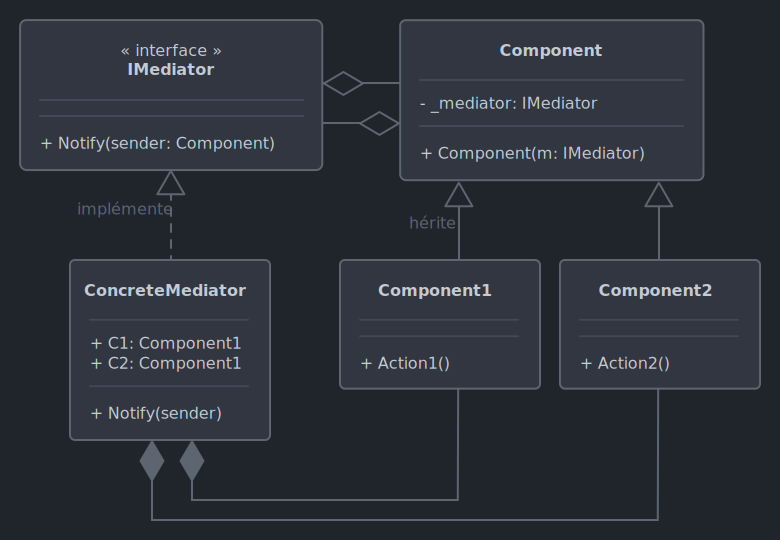

# *Mediator*

Le 08-10-2024

Une entité intermédiaire pour simplifier les échanges lorsque l'application est composée de nombreuses classes.

## Présentation

*Mediator* évite que des entités ne s'appellent ou ne s'appellent explicitement. *Mediator* propose une classe qui est la seule à connaître d'autres entités, ceci afin de simplifier la communication entre toutes les classes du programme, découpler les entités, éviter le chaos des dépendances entre entités. 

La classe de médiation peut être vue comme un *manager* d'objets, un coordinateur. Par exemple, une boîte de dialogue d'authentification est la classe de médiation et elle utilise des éléments graphiques (boutons, champs...) qui communiquent non pas entre eux mais grâce à elle : si la boîte de dialogue reçoit un événement (clic), alors elle redirige la requête (bouton). 

Inconvénient : la classe médiatrice peut grossir au point de devenir un *god object* (elle connaît toutes les entités, elle sait et fait trop de choses), ce qui représente une architecture monolithique difficile à maintenir.



!- Diagramme UML de classe du patron *Mediator* avec deux composants concrets.

## Implémentation C#

Voici un exemple pour programme Console. Deux collègues de travail s'échangent des messages. 

D'abord, on pose une classe abstraite ou une interface pour des classes concrètes de collègues et qui expose des méthodes pour communiquer (envoyer un message, recevoir un message). 

Ensuite, on pense que ces collègues concrets vont embarquer des méthodes de communication ainsi que le sous-programme nécessaire à cette communication. Or, ce serait dépasser la responsabilité d'un collègue. Donc, on pense plutôt une entité de communication, entité autonome, qui serait certes utilisée par les collègues, mais qui permet d'extraire le sous-programme tout en évitant de coupler les collègues ou de les coupler trop fortement.

Posons une interface, concept pour la classe de médiation. Elle expose une méthode de notification prenant en paramètre un message et un collègue cible.

```C#
internal interface IMediator
{
	void Notifier(string message, Collegue collegue);
}
```

Posons maintenant la classe abstraite de collègue. Elle possède un champ accueillant une instance de type `IMediator`, instance qui sera passée par constructeur. 

Cette classe abstraite doit-elle aussi posséder des méthodes de communication (envoyer, recevoir) ? Pour répondre, on peut admettre que tous les collègues n'ont pas nécessairement les mêmes comportements de communication (exemple : l'un ne fait qu'envoyer, l'autre que recevoir). Mais cela impliquerait peut-être dupliquer du code ; à moins de créer des interfaces mais cela compliquerait l'architecture... D'un autre point de vue, on peut admettre que des collègues ne communiquant pas représenteraient un étrange concept de collègue. Posons donc ces méthodes en classe abstraite et autorisons leur réécriture.

```C#
internal abstract class Collegue
{
	protected IMediator _mediateur;
	
	protected Collegue(IMediator mediateur)
	{
		_mediateur = mediateur;
	}
	
	public virtual void Envoyer(string message)
	{
		Console.WriteLine("Message envoyé : " + message);
		_mediateur.Notifier(message, this);
	}
	
	public virtual void Recevoir(string message)
	{
		Console.WriteLine("Message reçu : " + message);
	}
}
```

Maintenant, créons les classes concrètes de collègues.

```C#
internal class Toto : Collegue
{
	public Toto(IMediator mediateur) : base(mediateur)
	{
	}
	
	public override void Envoyer(string message)
	{
		Console.WriteLine("Toto envoie un message.");
		base.Envoyer(message);
	}
	
	public override void Recevoir(string message)
	{
		Console.WriteLine("Toto reçoit un message.");
		base.Recevoir(message);
	}
}
```

```C#
internal class Zaza : Collegue
{
	public Zaza(IMediator mediateur) : base(mediateur)
	{
	}
	
	public override void Envoyer(string message)
	{
		Console.WriteLine("Zaza parle.");
		base.Envoyer(message);
	}
	
	public override void Recevoir(string message)
	{
		Console.WriteLine("Zaza écoute.");
		base.Recevoir(message);
	}
}
```

Il faut à présent mettre en relation les collègues. Pour cela, créons un médiateur concret qui implémente les opérations de redirection de la requête à la bonne cible.

```C#
internal class Mediateur : IMediator
{
	public Collegue Collegue1 { get; set; }
	public Collegue Collegue2 { get; set; }

	public void Notifier(string message, Collegue collegue)
	{
		if(collegue == Collegue1)
		{
			Collegue2.Recevoir(message);
		}
		else
		{
			Collegue1.Recevoir(message);
		}
	}
}
```

Enfin, le code client.

```C#
Mediateur mediateur = new();

Toto toto = new(mediateur);
Zaza zaza = new(mediateur);

mediateur.Collegue1 = toto;
mediateur.Collegue2 = zaza;

toto.Envoyer("Bonjour Zaza !");
/*
	Toto envoie un message.
	Message envoyé : Bonjour Zaza !
	Zaza écoute.
	Message reçu : Bonjour Zaza !
 */
 
zaza.Envoyer("Coucou Toto.");
/*
	Zaza parle.
	Message envoyé : Coucou Toto.
	Toto reçoit un message.
	Message reçu : Coucou Toto.
 */
```

