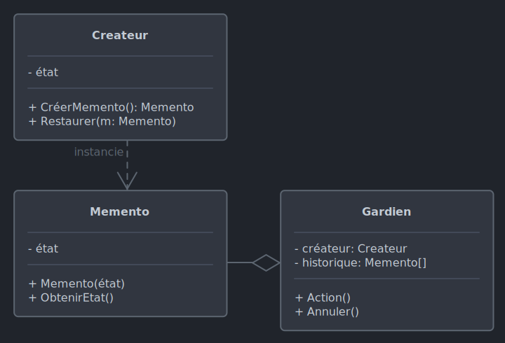

# *Memento*

Le 10-10-2024

Manipuler l'état d'un objet en respectant le principe d'encapsulation.

## Présentation

*Memento* a un double objectif : pouvoir utiliser l'état d'un objet alors que cet état respecte le principe d'encapsulation, pouvoir remettre l'objet dans un état précédant.

Un objet **créateur** ou **origine** ou encore **initiateur** (*originator*) a un état à conserver. Un objet **gardien**  (*caretaker*) manipule le créateur et permet de le remettre à un état précédent : ceci s'effectue en demandant au créateur un objet **mémento** (*memento*). Ce mémento a le rôle d'un instantané, d'une photo à date. L'objet mémento ne peut pas être modifié par le gardien. L'objet mémento ne concerne qu'un seul objet. Il ne doit pas  être exposé (ici faire au mieux car il peut être impossible de sauvegarder l'état du créateur tout en respectant le principe d'encapsulation et un mémento non public).

Le gardien récupère l'instantané du créateur, il peut donc aussi créer une pile d'instantanés pour former un **historique**. Le gardien peut également restaurer l'état de l'objet créateur (principe de la commande Annuler ou *Undo*).

Si le langage de programmation le permet, il faut imbriquer la classe de mémento dans la classe de créateur, pour éviter l'exposition du mémento et respecter l'encapsulation. La classe de mémento doit alors être privée mais ses méthodes publiques.



!- Diagramme UML de classe du patron *Memento*.

## Implémentation C#

Voici un exemple pour programme Console. Nous voulons créer un éditeur de texte avec historique.

Le mémento est spécifique de l'objet, par conséquent il peut ne pas être utile de poser une interface. 

Le mémento pour notre exemple contient un état de type `string`, c'est l'état du texte saisi. Dans d'autres situations, l'état peut être une classe à part entière. L'état est défini par le constructeur et non pas par une méthode spécifique, ceci pour limiter la modification de l'instantané.

```C#
internal class Memento 
{
	private readonly string _etat;
	
	public Memento(string etat)
	{
		_etat = etat;
	}
	
	public string ObtenirEtat()
	{
		return _etat;
	}
}
```

Ensuite, codons le créateur, ici notre éditeur de texte.

```C#
internal class EditeurTexte
{
	public string Contenu { get; set; }
	
	public Memento CreerMemento()
	{
		return new Memento(Contenu);
	}
	
	public void Restaurer(Memento memento)
	{
		Contenu = memento.ObtenirEtat();
	}
}
```

Créons maintenant le gardien, ici l'historique. Gardien et créateur sont étroitement couplés par le mémento, et ce dernier ne devrait pas être exposé outre mesure.

```C#
internal class Historique
{
	private Stack<Memento> _mementos = new();
	private EditeurTexte _editeur;
	
	public Historique(EditeurTexte editeur)
	{
		_editeur = editeur;
	}
	
	public void Sauvegarder()
	{
		_mementos.Push(_editeur.CreerMemento());
	}
	
	public void Annuler()
	{
		if (_mementos.Count == 0)
		{
			Console.WriteLine("Historique vide.");
			return;
		}
		
		_editeur.Restaurer(_mementos.Pop());
	}
	
	public void ContenuActuel()
	{
		Console.WriteLine($"Contenu actuel : {_editeur.Contenu}");
	}
}
```

Enfin, le code client.

```C#
EditeurTexte editeur = new ();
Historique historique = new(editeur);

editeur.Contenu = "Bonjour.";
historique.Sauvegarder();

editeur.Contenu = "Je suis Toto.";
historique.Sauvegarder();

editeur.Contenu = "1 + 1 = 1";

historique.ContenuActuel();
// Contenu actuel : 1 + 1 = 1

historique.Annuler();
historique.ContenuActuel();
// Contenu actuel : Je suis Toto.

historique.Annuler();
historique.ContenuActuel();
// Contenu actuel : Bonjour.

historique.Sauvegarder();

editeur.Contenu = "Je m'appelle Toto.";
historique.Sauvegarder();

editeur.Contenu = "0 + 0 = 0";

historique.ContenuActuel();
// Contenu actuel : 0 + 0 = 0

historique.Annuler();
historique.ContenuActuel();
// Contenu actuel : Je m'appelle Toto.

historique.Annuler();
historique.ContenuActuel();
// Contenu actuel : Bonjour.

historique.Annuler();
// Historique vide.
```

Bravo, tout fonctionne. Mais le code client devrait se trouver dans le gardien. Ceci assurerait une meilleure encapsulation car le gardien est responsable du créateur à deux points de vue : ET de ses états (sauvegarde, restauration) ET de son cycle de vie. Il faut donc modifier l'historique et le code client.

```C#
internal class Historique
{
	private Stack<Memento> _mementos = new();
	private EditeurTexte _editeur = new();
	
	private void Ajouter(string contenu)
	{ 
		_editeur.Contenu = contenu;
	}
	
	private void Sauvegarder()
	{
		_mementos.Push(_editeur.CreerMemento());
	}
	
	private void Annuler()
	{
		if (_mementos.Count == 0)
		{
			Console.WriteLine("Historique vide.");
			return;
		}
		
		_editeur.Restaurer(_mementos.Pop());
	}
	
	private void ContenuActuel()
	{
		Console.WriteLine($"Contenu actuel : {_editeur.Contenu}");
	}
	
	public void Executer()
	{
		Ajouter("Bonjour.");
		Sauvegarder();
		
		Ajouter("Je suis Toto.");
		Sauvegarder();
		
		Ajouter("1 + 1 = 1");
		
		ContenuActuel();
		// Contenu actuel : 1 + 1 = 1
		
		Annuler();
		ContenuActuel();
		// Contenu actuel : Je suis Toto.
		
		Annuler();
		ContenuActuel();
		// Contenu actuel : Bonjour.
		
		Sauvegarder();
		
		Ajouter("Je m'appelle Toto.");
		
		ContenuActuel();
		// Contenu actuel : Je m'appelle Toto.
		
		Annuler();
		ContenuActuel();
		// Contenu actuel : Bonjour.
		
		Annuler();
		// Historique vide.
		
		ContenuActuel();
		// Contenu actuel : Bonjour.
	}
}
```

```C#
new Historique().Executer();
```

## Mémento exposé en C#

Le code précédent est fonctionnel mais le mémento reste exposé au code client. Pour éviter cette exposition, on peut penser à imbriquer les classes, ce qui est possible en C#. Imbriquons donc, au titre de premier essai, le mémento dans le créateur.

```C#
internal class Editeur
{
	private class Memento
	{
		private readonly string _etat;
		
		public Memento(string etat)
		{
			_etat = etat;
		}
		
		public string ObtenirEtat()
		{
			return _etat;
		}
	}
	
	public string Contenu { get; set; }
	
	public Memento CreerMemento() 
	{
		return new Memento(Contenu);
	}
	
	public void Restaurer(Memento memento)
	{
		Contenu = memento.ObtenirEtat();
	}		
}
```

Or, Visual Studio alerte que les méthodes `CreerMemento()` et `Restaurer()` ne peuvent pas utiliser le type `Memento` lorsqu'elles sont `public`. On peut rendre `public` le type `Memento`. Mais cela ne résout pas le problème car `Memento` reste exposé au code client. Inversement, rendre les méthodes non `public` empêcherait d'utiliser l'éditeur. Une autre solution encore serait de tout rendre `private`, ce qui impliquerait alors ne coder qu'une classe pour mémento, créateur et gardien, ce qui représente une architecture monolithique par nature inacceptable. 

Une autre solution, au titre de second essai, est d'imbriquer cette fois le créateur dans le mémento.

```C#
internal class Memento
{
	private readonly string _etat;
	
	public Memento(string etat)
	{
		_etat = etat;
	}
	
	public string ObtenirEtat()
	{
		return _etat;
	}
	
	internal class Editeur
	{
		public string Contenu { get; set; }
		
		public Memento CreerMemento()
		{
			return new Memento(Contenu);
		}
		
		public void Restaurer(Memento memento)
		{
			Contenu = memento.ObtenirEtat();
		}
	}
}
```

Visual Studio accepte cette imbrication. Or, le problème n'est toujours pas résolu puisque `Memento` reste accessible au code client. D'autre part, du point de vue du sens, il apparaît étrange de définir le concept d'éditeur à partir d'un instantané qui n'en capture qu'un état, bien qu'on parle naturellement d'état d'éditeur. Par conséquent, l'imbrication n'est pas la solution. 

Tournons-nous alors vers l'***assembly*** : notre éditeur de texte doit se trouver dans un assemblage spécifique (projet, *DLL*...) où `Memento` et `Editeur` sont posés `internal` (inaccessibles de l'extérieur) et `Historique` représente la seule entité `public`. Ainsi, le principe d'encapsulation serait respecté et les concepts resteraient distincts.
