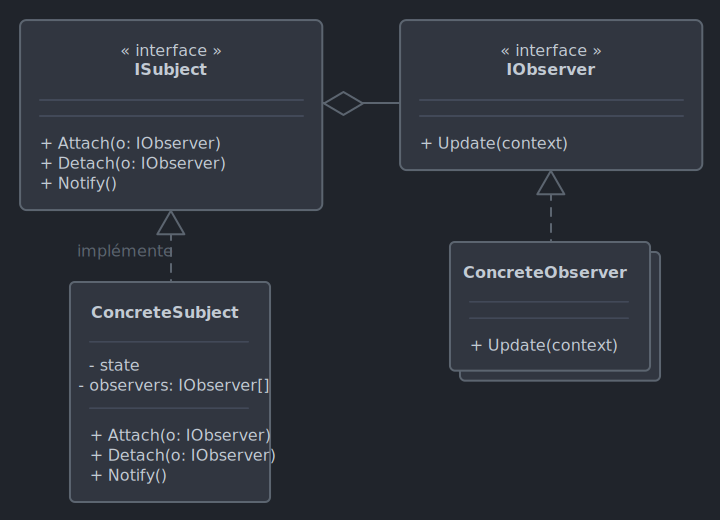
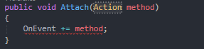

# *Observer*

Le 11-10-2024

Notifier des entités abonnées lorsqu'un événement survient.

## Présentation

*Observer* propose un **sujet** (*subject*) qui envoie une **notification** à des **observateurs** (*observers*) lorsque son état change. Le sujet connaît ses observateurs (collection interne) et fournit des méthodes d'ajout, retrait et notification. La notification peut ou non transporter des données du sujet aux observateurs. Attention, les observateurs ne sont pas nécessairement des classes : ce peut être des méthodes.

*Observer* est une abstraction de la logique événementielle. En effet, en programmation événementielle, les éléments (bouton d'*UI*, capteurs...) sont les sujets (on parle de *publisher*, de source) et les actions à déclencher à la suite d'un événement sont les observateurs (on parle de *listeners*, d'entités abonnées). Exemples :
- logique événementielle : interface utilisateur,
- patron *Observer* : système de *trading*, capteurs en temps réel, transmissions asynchrones réseau.  



!- Diagramme UML de classe du patron *Observer*.

## Implémentation C# à partir de zéro

Voici un exemple pour programme Console. On souhaite implémenter *Observer* sans recourir aux types fournis par .NET C#, pour voir une implémentation de base. Un sujet a un état qui peut changer. Lorsqu'il change, le sujet doit notifier des observateurs. 

Posons les interfaces d'observateur et de sujet.

```C#
internal interface ISubject
{
	void Attach(IObserver observer);
	void Detach(IObserver observer);
	void Notify();
}
```

```C#
internal interface IObserver
{
	void Update();
}
```

Maintenant, créons les types concrets correspondants.

```C#
internal class ConcreteSubject : ISubject
{
	private List<IObserver> _observers = new();
	private string _state;
	
	public string GetState()
	{
		return _state;
	}
	
	public void SetState(string state)
	{
		_state = state;
		Notify();
	}
	
	public void Attach(IObserver observer)
	{
		_observers.Add(observer);
	}
	
	public void Detach(IObserver observer)
	{
		_observers.Remove(observer);
	}
	
	public void Notify()
	{
		foreach(IObserver observer in _observers)
		{
			observer.Update();
		}
	}
}
```

```C#
internal class ConcreteObserver : IObserver
{
	private ConcreteSubject _subject;
	private string _name;

	public ConcreteObserver(string name, ConcreteSubject subject)
	{
		_name = name;
		_subject = subject;
		_subject.Attach(this);
	}

	public void Update()
	{
		Console.WriteLine($"[{_name}] Le sujet a l'état : {_subject.GetState()}");
	}
}
```

Enfin, le code client :

```C#
ConcreteSubject subject = new();

ConcreteObserver toto = new("Toto", subject);
ConcreteObserver zaza = new("Zaza", subject);

subject.SetState("Coucou !");
//[Toto] Le sujet a l'état : Coucou !
//[Zaza] Le sujet a l'état : Coucou !

subject.SetState("...");
//[Toto] Le sujet a l'état : ...
//[Zaza] Le sujet a l'état : ...
```

## Implémentation C# par types intégrés

C# fournit des entités dédiées à *Observer* et qui couvrent des fonctionnalités supplémentaires : informer le sujet qu'une erreur s'est produite, informer que le sujet a terminé l'envoi des notifications, arrêter la réception de notification par les observateurs avant que le sujet ait terminé l'envoi des notifications. Pour tout cela, deux types.
- `IObservable<T>` : le sujet, la source de données, la source des événements.
- `IObserver<T>` : l'observateur.

```C#
public interface IObservable<out T>
{
	IDisposable Subscribe(IObserver<T> observer);
}
```

```C#
public interface IObserver<in T>
{
	void OnCompleted();
	void OnError(Exception error);
	void OnNext(T value);
}
```

Même exemple que précédemment : un sujet a un état qui peut changer, et il notifie des observateurs en cas de changement. 

Posons le sujet. La méthode d'ajout d'un observateur est `Subscribe()`. Cette méthode retourne un type `Unsubscriber` implémentant `IDisposable`. Pourquoi ce type ? Retourner une instance `Unsubscriber` permet aux observateurs d'arrêter de recevoir des notifications avant que `OnCompleted()` ne soit appelée. La classe `Unsubscriber` n'a pas à être `public` dans un *assembly* de type *DLL* car elle ne sert qu'au fonctionnement interne ; elle peut même être imbriquée dans la classe du sujet. 

```C#
internal class Subject : IObservable<string>
{
	private List<IObserver<string>> _observers;
	
	public Subject()
	{
		_observers = new();
	}
	
	public IDisposable Subscribe(IObserver<string> observer)
	{
		if(!_observers.Contains(observer))
		{
			_observers.Add(observer);
		}
		return new Unsubscriber(_observers, observer);
	}
	
	public void SetState(string state)
	{
		foreach(var observer in _observers)
		{
			observer.OnNext(state);
		}
	}
}
```

```C#
internal class Unsubscriber : IDisposable
{
	private List<IObserver<string>> _observers;
	private IObserver<string> _observer;
	
	public Unsubscriber(List<IObserver<string>> observers, IObserver<string> observer)
	{
		_observers = observers;
		_observer = observer;
	}
	
	public void Dispose()
	{
		if(_observers != null && _observers.Contains(_observer))
		{
			_observers.Remove(_observer);
		}
	}
}
```

Créons l'observateur.

```C#
internal class ConcreteObserver : IObserver<string>
{
	private string _name;
	
	public ConcreteObserver(string name)
	{
		_name = name;
	}
	
	public void OnNext(string value)
	{
		Console.WriteLine($"{_name} : OnNext(). Valeur : {value}");
	}
	
	public void OnError(Exception error)
	{
		Console.WriteLine($"{_name} : OnError().");
		Console.WriteLine(error.Message);
	}
	
	public void OnCompleted()
	{
		Console.WriteLine($"{_name} : OnCompleted().");
	}
}
```

Enfin, voici le code client. C# propose une syntaxe confortable pour utiliser plusieurs `using()` lorsqu'il s'agit d'utiliser des observateurs fixés à l'avance.

```C#
Subject subject = new();

ConcreteObserver toto = new("Toto");
ConcreteObserver zaza = new("Zaza");

using(subject.Subscribe(toto))
using(subject.Subscribe(zaza))
{
	subject.SetState("Coucou !");
}
//Toto: OnNext(). Valeur : Coucou!
//Zaza: OnNext(). Valeur : Coucou!

subject.SetState("...");
// Rien ne se produit car aucun abonnement
```

Voici un code client sans `using()` pour illustrer la désinscription successive :

```C#
Subject subject = new();

ConcreteObserver toto = new("Toto");
ConcreteObserver zaza = new("Zaza");

IDisposable totoDisposable = subject.Subscribe(toto);
IDisposable zazaDisposable = subject.Subscribe(zaza);

subject.SetState("Coucou !");
//Toto: OnNext(). Valeur : Coucou!
//Zaza: OnNext(). Valeur : Coucou!

totoDisposable.Dispose();

subject.SetState("...");
//Zaza : OnNext(). Valeur : ...

zazaDisposable.Dispose();

subject.SetState("Test");
// Rien ne se produit car aucun abonnement
```

Voici un code client illustrant le cas d'un nombre inconnu d'observateurs :

```C#
List<string> names = new(){ "Toto", "Zaza", "Lulu" };

Subject subject = new();

List<IDisposable> subscriptions = new();

foreach(string name in names)
{
	ConcreteObserver observer = new(name);
	IDisposable disposable = subject.Subscribe(observer);
	subscriptions.Add(disposable);
}

subject.SetState("Coucou !");
//Toto: OnNext().Valeur : Coucou!
//Zaza: OnNext().Valeur : Coucou!
//Lulu: OnNext().Valeur : Coucou!

foreach(var subscription in subscriptions)
{
	subscription.Dispose();
}

subject.SetState("...");
// Rien ne se produit car aucun abonnement
```

## C# : *event*, *delegate*

En C#, on peut utiliser le mot-clé `event` et le type `delegate` pour programmer des événements. Même exemple que précédemment : un sujet a un état qui peut changer, et il notifie des observateurs en cas de changement. 

Posons d'abord l'interface de l'observateur.

```C#
internal interface IObserver
{
	void Update();
}
```

Maintenant, voyons les types mis à disposition par C#. 

L'`event` remplace la liste d'observateurs de l'exemple précédent. Pour définir un `event`, il faut poser un `delegate` car le premier utilise le second. Le `delegate` pose une **signature de méthode** en tant que type. Qu'est-ce que cela veut dire ? Eh bien, une méthode qui respecte cette signature va être attachée à l'`event` qui utilise le `delegate` définissant cette signature. 

Ce `delegate` peut être déclaré soit dans la classe (seul le sujet l'utilise), soit en dehors de la classe, directement au niveau du *namespace* (plusieurs classes peuvent l'utiliser) ; ici, je choisis de créer un fichier dédié pour illustrer cette dernière possibilité. 

```C#
// Fichier MyEvents.cs
namespace MaSuperApp
{
	public delegate void MyEvent();
}
```

Dans l'exemple d'implémentation à partir de zéro, les méthodes `Attach()`, `Detach()` prenaient en paramètre le type `IObserver`. Dans le présent exemple, on n'utilise plus ce type car `delegate` et `event` impliquent utiliser une méthode ; on n'utilise donc que la méthode `Update()`. Alors, comment attacher une méthode à un `event` ? 

La première réponse concerne la syntaxe : l'opérateur `+=` ajoute un observateur, l'opérateur `-=` le retire. 

La seconde réponse concerne les types. Par défaut, une méthode `void` est de type `Action` et une méthode retournant un type est de type `Func`. Ici, on pourrait penser utiliser le type `Action` et ajouter à notre `event` une méthode *via* ce type. Or, Visual Studio alerte : il est impossible de convertir `Action` en `MyEvent`. Par conséquent, la méthode doit prendre en paramètre un type `MyEvent` (et non pas `Action`). Oui, c'est troublant, car on ne définit pas la méthode `Update()` en tant que `MyEvent`. Ceci est seulement un moyen de résoudre le problème de conversion car le résultat est bien d'ajouter une méthode respectueuse d'une signature. 



!- Visual Studio alerte d'une conversion impossible de `Action` vers `MyEvent`.

Fort de tout cela, posons l'interface du sujet.

```C#
internal interface ISubject
{
	void Attach(MyEvent method);
	void Detach(MyEvent method);
	void Notify();
}
```

Créons maintenant le sujet concret. Il contient l'événement. Cet événement peut être utilisé en `static` si besoin. Ici, je choisis de passer par l'instance.

Pour déclencher l'événement, il existe deux syntaxes que j'indique dans le code (n'en utiliser qu'une seule). La seconde syntaxe est conseillée par Microsoft pour sa concision. Dans les deux cas, le but est de **ne déclencher l'événement que s'il y a des entités abonnées**.

```C#
internal class ConcreteSubject : ISubject
{
	public event MyEvent OnEvent;
	private string _state;
	
	public string GetState()
	{
		return _state;
	}
	
	public void SetState(string state)
	{
		_state = state;
		Notify();
	}
	
	public void Attach(MyEvent method)
	{
		OnEvent += method;
	}
	
	public void Detach(MyEvent method)
	{
		OnEvent -= method;
	}
	
	public void Notify()
	{
		// Syntaxe 1
		if(OnEvent != null)
		{
			OnEvent();
		}
		
		// Syntaxe 2
		OnEvent?.Invoke();
	}
}
```

Maintenant, passons à la classe de l'observateur. L'observateur ajoute sa méthode `Update()` à l'événement ; pour cela, on passe la méthode sans parenthèses en argument de la méthode `ConcreteSubject.Attach()` (référence de méthode et non déclenchement de méthode).

```C#
internal class ConcreteObserver : IObserver
{
	private ConcreteSubject _subject;
	private string _name;
	
	public ConcreteObserver(string name, ConcreteSubject subject)
	{
		_name = name;
		_subject = subject;
		_subject.Attach(Update);
	}
	
	public void Update()
	{
		Console.WriteLine($"[{_name}] Le sujet a l'état : {_subject.GetState()}");
	}
}
```

Enfin, le code client :

```C#
ConcreteSubject subject = new();

ConcreteObserver toto = new("Toto", subject);
ConcreteObserver zaza = new("Zaza", subject);

subject.SetState("Coucou !");
//[Toto] Le sujet a l'état : Coucou !
//[Zaza] Le sujet a l'état : Coucou !

subject.SetState("...");
//[Toto] Le sujet a l'état : ...
//[Zaza] Le sujet a l'état : ...
```

## C# : *event*, *action*

L'exemple précédent montre le fonctionnement de base mais Microsoft conseille de ne plus utiliser directement `delegate`. En effet, les types génériques `Action` et `Func` sont suffisants dans la plupart des cas. Ils s'utilisent en posant le type correspondant à la signature de méthode. Ici, notre exemple repose sur une méthode `void` sans paramètres donc on utilise `Action`.

```C#
internal interface ISubject
{
	void Attach(Action method);
	void Detach(Action method);
	void Notify();
}
```

```C#
internal interface IObserver
{
	void Update();
}
```

```C#
internal class ConcreteSubject : ISubject
{
	public event Action OnEvent;
	private string _state;
	
	public string GetState()
	{
		return _state;
	}
	
	public void SetState(string state)
	{
		_state = state;
		Notify();
	}
	
	public void Attach(Action method)
	{
		OnEvent += method;
	}
	
	public void Detach(Action method)
	{
		OnEvent -= method;
	}
	
	public void Notify()
	{
		OnEvent?.Invoke();
	}
}
```

```C#
internal class ConcreteObserver : IObserver
{
	private ConcreteSubject _subject;
	private string _name;
	
	public ConcreteObserver(string name, ConcreteSubject subject)
	{
		_name = name;
		_subject = subject;
		_subject.Attach(Update);
	}
	
	public void Update()
	{
		Console.WriteLine($"[{_name}] Le sujet a l'état : {_subject.GetState()}");
	}
}
```

Le code client :

```C#
ConcreteSubject subject = new();

ConcreteObserver toto = new("Toto", subject);
ConcreteObserver zaza = new("Zaza", subject);

subject.SetState("Coucou !");
//[Toto] Le sujet a l'état : Coucou !
//[Zaza] Le sujet a l'état : Coucou !

subject.SetState("...");
//[Toto] Le sujet a l'état : ...
//[Zaza] Le sujet a l'état : ...
```

Formidable ! Et si notre méthode `Update()` prenait un paramètre ? Ceci éviterait d'utiliser `GetState()` en passant l'état du sujet par la méthode de notification.

```C#
internal interface ISubject
{
	void Attach(Action<string> method);
	void Detach(Action<string> method);
	void Notify();
}
```

```C#
internal interface IObserver
{
	void Update(string state);
}
```

```C#
internal class ConcreteSubject : ISubject
{
	public event Action<string> OnEvent;
	private string _state;
	
	public void SetState(string state)
	{
		_state = state;
		Notify();
	}
	
	public void Attach(Action<string> method)
	{
		OnEvent += method;
	}
	
	public void Detach(Action<string> method)
	{
		OnEvent -= method;
	}
	
	public void Notify()
	{
		OnEvent?.Invoke(_state);
	}
}
```

```C#
internal class ConcreteObserver : IObserver
{
	private ConcreteSubject _subject;
	private string _name;
	
	public ConcreteObserver(string name, ConcreteSubject subject)
	{
		_name = name;
		_subject = subject;
		_subject.Attach(Update);
	}
	
	public void Update(string state)
	{
		Console.WriteLine($"[{_name}] Le sujet a l'état : {state}");
	}
}
```

Code client :

```C#
ConcreteSubject subject = new();

ConcreteObserver toto = new("Toto", subject);
ConcreteObserver zaza = new("Zaza", subject);

subject.SetState("Coucou !");
//[Toto] Le sujet a l'état : Coucou !
//[Zaza] Le sujet a l'état : Coucou !

subject.SetState("...");
//[Toto] Le sujet a l'état : ...
//[Zaza] Le sujet a l'état : ...
```

## C# : *event*, *func*

Et si `Update()` renvoyait une donnée au sujet, par exemple un type booléen ? Pour cela, utiliser le type générique `Func`. Exemple : `Func<TypeIn, TypeOut>` (le dernier de la liste est le type de retour).

Noter qu'en général, les observateurs ne retournent pas de valeur au sujet car *Observer* ou la programmation événementielle proposent une **communication unidirectionnelle**. D'autre part, même s'il faut renvoyer une valeur, `func` ne suffit pas car il est préférable de passer par un type intermédiaire encapsulant l'état ; ceci est abordé plus loin.

```C#
internal interface ISubject
{
	void Attach(Func<string, bool> method);
	void Detach(Func<string, bool> method);
	void Notify();
}
```

```C#
internal interface IObserver
{
	bool Update(string state);
}
```

```C#
internal class ConcreteSubject : ISubject
{
	public event Func<string, bool> OnEvent;
	private string _state;
	
	public void SetState(string state)
	{
		_state = state;
		Notify();
	}
	
	public void Attach(Func<string, bool> method)
	{
		OnEvent += method;
	}
	
	public void Detach(Func<string, bool> method)
	{
		OnEvent -= method;
	}
	
	public void Notify()
	{
		bool? result = OnEvent?.Invoke(_state);
		
		// Syntaxe 1
		if (result.HasValue)
		{
			Console.WriteLine($"Valeur reçue : {result}");
		}
		else
		{
			Console.WriteLine($"Pas d'entités abonnées, donc événement non déclenché.");
		}
		
		// Syntaxe 2
		if (result == null)
		{
			Console.WriteLine($"Pas d'entités abonnées, donc événement non déclenché.");
			return;
		}
		
		Console.WriteLine($"Valeur reçue : {result}");
	}
}
```

```C#
internal class ConcreteObserver : IObserver
{
	private ConcreteSubject _subject;
	private string _name;
	private bool _returnedValue;
	
	public ConcreteObserver(string name, bool returnValue, ConcreteSubject subject)
	{
		_name = name;
		_returnedValue = returnValue;
		_subject = subject;
		_subject.Attach(Update);
	}
	
	public bool Update(string state)
	{
		Console.WriteLine($"[{_name}] Le sujet a l'état : {state}. Je retourne {_returnedValue}.");
		return _returnedValue;
	}
}
```

Code client :

```C#
ConcreteSubject subject = new();

ConcreteObserver toto = new("Toto", false, subject);
ConcreteObserver zaza = new("Zaza", true, subject);

subject.SetState("Coucou !");
//[Toto] Le sujet a l'état : Coucou !. Je retourne False.
//[Zaza] Le sujet a l'état : Coucou !. Je retourne True.
//Valeur reçue : True

subject.SetState("...");
//[Toto] Le sujet a l'état : .... Je retourne False.
//[Zaza] Le sujet a l'état : .... Je retourne True.
//Valeur reçue : True
```

On constate que la valeur de retour prise en compte par le sujet est la dernière reçue de la pile de méthodes abonnées. Attention, l'ordre de cette pile n'est pas garanti.

## C# : *EventHandler*

C# propose le type `EventHandler<T>`. D'abord, comparons. `Action` est type générique de délégué ; il est général car il n'a pas de contrainte sur les types ou sur la nécessité de déclarer une référence de l'objet envoyeur, émetteur (*sender*). Le type générique `EventHandler<T>` est aussi un délégué et est défini spécifiquement pour les événements. Il gère les cas des méthodes `void` avec ou sans paramètres, comme `Action`. La signature de méthode est imposée : `EventHandler(object sender, EventArgs e)`. Ce délégué est déjà présent par exemple en WPF lorsqu'il s'agit d'ajouter un événement sur un élément d'*UI* (bouton...).

Posons l'interface de l'observateur. 

```C#
internal interface IObserver
{
	void Update(object sender, EventArgs args);
}
```

Maintenant, considérons le sujet. Il expose l'événement. Cet événement est de type `EventHandler<T>`. Il s'agit de poser le type à utiliser, pour notre exemple ce serait `string`, donc : `EventHandler<string>`. Mais Microsoft conseille une autre façon de faire : déclarer une classe de données qui hérite de `EventArgs`. Le but : disposer d'un type dont on peut modifier l'état.

```C#
internal interface ISubject
{
	void Attach(EventHandler<OnEventEventArgs> method);
	void Detach(EventHandler<OnEventEventArgs> method);
	void Notify();
}
```

```C#
internal class OnEventEventArgs : EventArgs
{
	public string State { get; set; }
	public bool ReturnedValue { get; set; }
}
```

Pour le sujet concret, ajoutons un champ de nom défini par constructeur pour identifier l'objet. Ceci permettra d'illustrer l'utilisation du *sender*.

```C#
internal class ConcreteSubject : ISubject
{
	public event EventHandler<OnEventEventArgs> OnEvent;
	private OnEventEventArgs _onEventEventArgs = new();
	private string _name;
	
	public ConcreteSubject(string name)
	{
		_name = name;
	}
	
	public string GetName() => _name;
	
	public void SetState(string state)
	{
		_onEventEventArgs.State = state;
		Notify();
	}
	
	public void Attach(EventHandler<OnEventEventArgs> method)
	{
		OnEvent += method;
	}
	
	public void Detach(EventHandler<OnEventEventArgs> method)
	{
		OnEvent -= method;
	}
	
	public void Notify()
	{
		OnEvent?.Invoke(this, _onEventEventArgs);

		Console.WriteLine($"_onEventEventArgs.State : {_onEventEventArgs.State}. _onEventEventArgs.ReturnedValue : {_onEventEventArgs.ReturnedValue}");
	}
}
```

Ensuite, créons l'observateur concret. On constate que les arguments `sender` et `args` doivent être convertis pour obtenir les types utiles.

```C#
internal class ConcreteObserver : IObserver
{
	private ConcreteSubject _subject;
	private string _name;
	private bool _returnedValue;
	
	public ConcreteObserver(string name, bool returnedValue, ConcreteSubject subject)
	{
		_name = name;
		_subject = subject;
		_returnedValue = returnedValue;
		_subject.Attach(Update);
	}
	
	public void Update(object sender, EventArgs args)
	{
		var onEventArgs = (OnEventEventArgs)args;
		onEventArgs.ReturnedValue = _returnedValue;
		
		var subject = (ConcreteSubject)sender;
		
		Console.WriteLine($"[{_name}] Le sujet {subject.GetName()} a l'état : {onEventArgs.State}. Je retourne {onEventArgs.ReturnedValue}.");
	}
}
```

Enfin, le code client :

```C#
ConcreteSubject subject = new("Descartes");

ConcreteObserver toto = new("Toto", false, subject);
ConcreteObserver zaza = new("Zaza", true, subject);

subject.SetState("Coucou !");
//[Toto] Le sujet Descartes a l'état : Coucou !. Je retourne False.
//[Zaza] Le sujet Descartes a l'état : Coucou !. Je retourne True.
//_onEventEventArgs.State : Coucou !. _onEventEventArgs.ReturnedValue : True

subject.SetState("...");
//[Toto] Le sujet Descartes a l'état : .... Je retourne False.
//[Zaza] Le sujet Descartes a l'état : .... Je retourne True.
//_onEventEventArgs.State : .... _onEventEventArgs.ReturnedValue : True
```

Lorsqu'aucune donnée n'est à envoyer aux observateurs, on peut passer `EventArgs.Empty`.

## C# : simplifier les événements

En programmation événementielle, C# implémentant déjà *Observer* avec le type `event`, alors certaines entités des exemples précédents sont superflues. En effet, on n'a plus besoin de sujet car c'est l'événement ; on n'a plus besoin d'interface `IObserver` puisque l'observateur est une méthode. Cependant, l'événement à déclencher concerne toujours une entité dans le contexte de notre programme. Simplifions donc notre code.

Exemple d'un événement de type `Action<string>`. 

```C#
internal class JustAThing
{
	public event Action<string> OnEvent;
	public string _state;
	
	public void SetState(string state)
	{
		_state = state;
		Notify();
	}
	
	public void Notify()
	{
		OnEvent?.Invoke(_state);
	}
}
```

```C#
internal class ConcreteObserver
{
	private string _name;
	private JustAThing _thing;
	
	public ConcreteObserver(string name, JustAThing thing)
	{
		_name = name;
		_thing = thing;
		_thing.OnEvent += Update;
	}
	
	public void Update(string state)
	{
		Console.WriteLine($"[{_name}] La chose a l'état : " + state);
	}
}
```

```C#
// Code client

JustAThing thing = new();

ConcreteObserver toto = new("Toto", thing);
ConcreteObserver zaza = new("Zaza", thing);

thing.SetState("Coucou !");
//[Toto] La chose a l'état : Coucou !
//[Zaza] La chose a l'état : Coucou !

thing.SetState("...");
//[Toto] La chose a l'état : ...
//[Zaza] La chose a l'état : ...
```

Exemple avec `EventHandler`, cette fois sans aucun paramètre pour montrer ce cas d'usage.

```C#
internal class MyThing
{
	public EventHandler OnEvent;
	private string _name;
	
	public MyThing(string name)
	{
		_name = name;
	}
	
	public string GetName() => _name;
	
	public void Notify()
	{
		OnEvent?.Invoke(this, EventArgs.Empty);
	}
}
```

```C#
internal class ConcreteObserver
{
	private string _name;
	private MyThing _thing;
	
	public ConcreteObserver(string name, MyThing thing)
	{
		_name = name;
		_thing = thing;
		_thing.OnEvent += Update;
	}
	
	public void Update(object sender, EventArgs args)
	{
		var subject = (MyThing)sender;
		
		Console.WriteLine($"Je suis {_name} et je réagis à {subject.GetName()}.");
	}
}
```

```C#
// Code client

MyThing thing = new("Loulou");

ConcreteObserver toto = new("Toto", thing);
ConcreteObserver zaza = new("Zaza", thing);

thing.Notify();
//Je suis Toto et je réagis à Loulou.
//Je suis Zaza et je réagis à Loulou.
```

## Sources

- [Microsoft : *Observer*](https://learn.microsoft.com/fr-fr/dotnet/standard/events/observer-design-pattern _blank)
- [Microsoft : *events overview*](https://learn.microsoft.com/fr-fr/dotnet/csharp/events-overview _blank)
- [Microsoft : *events*](https://learn.microsoft.com/fr-fr/dotnet/standard/events _blank)

