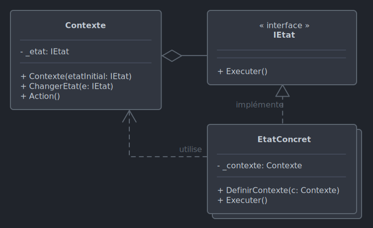

# *State*

Le 16-10-2024

Changer dynamiquement le comportement d'un objet selon son état.

## Présentation

Admettons un objet dont la seule méthode présente des comportements différents ; une approche plutôt traditionnelle consiste à écrire une condition (`if`, `switch`...) où chaque cas de comportement est testé. *State* propose une approche différente : un état est une classe proposant des méthodes spécifiques. Si l'objet change, c'est-à-dire son comportement, son état, alors l'instance, quant à elle, ne change pas.

Deux entités sont proposées. L'**état** est une abstraction définissant les comportements. Le **contexte** gère la relation entre l'implémentation de *State* et le programme. Un état peut garder une référence du contexte pour en obtenir des informations.



!- Diagramme UML de classe du patron *State* dans le cas d'états concrets référençant le contexte.

Exemple : un programme de dessin. Un outil est représenté par une interface ou une classe abstraite (l'état). Cette interface est implémentée pour définir divers outils (les états concrets). Lorsque l'utilisateur (le contexte) change d'outil, une nouvelle instance d'outil concret est générée.

## Implémentation C# : base

Voici un exemple pour programme Console : un logiciel de dessin. L'utilisateur ou l'utilisatrice peut choisir entre deux outils : pinceau et crayon. Selon l'outil sélectionné, le comportement change.

Commençons par la représentation de l'état : l'action, le comportement d'un outil.

```C#
internal interface IOutil
{
	string ObtenirNom();
	void Dessiner();
}
```

Ensuite, créons les états concrets : les outils proprement dits.

```C#
internal class Pinceau : IOutil
{
	private string _nom = "Pinceau";
	
	public string ObtenirNom()
	{
		return _nom;
	}
	
	public void Dessiner()
	{
		Console.WriteLine("Dessin avec le pinceau.");
	}
}
```

```C#
internal class Crayon : IOutil
{
	private string _nom = "Crayon";
	
	public string ObtenirNom()
	{
		return _nom;
	}
	
	public void Dessiner()
	{
		Console.WriteLine("Dessin avec le crayon.");
	}
}
```

Puis, créons le contexte : la toile de dessin, le canevas, où le dessin est réalisé. Un outil est nécessaire dès l'instanciation (pas de canevas sans outil de dessin).

```C#
internal class Canevas
{
	private IOutil _outil;
	
	public Canevas(IOutil outil)
	{
		_outil = outil;
	}
	
	public void ChoisirOutil(IOutil outil)
	{
		_outil = outil;
		Console.WriteLine(outil.ObtenirNom() + " choisi.");
	}
	
	public void Dessiner()
	{
		_outil.Dessiner();
	}
}
```

Enfin, le code source. Noter que l'on crée l'outil dans le contexte, c'est-à-dire le canevas (et non pas avec une variable dans la portée du programme).

```C#
Canevas canevas = new(new Crayon());

canevas.Dessiner();
//Dessin avec le crayon.

canevas.ChoisirOutil(new Pinceau());
//Pinceau choisi.

canevas.Dessiner();
//Dessin avec le pinceau.
```

## Implémentation C# : l'état référence le contexte

Cet exemple est une évolution du précédent : utiliser le pinceau a pour effet de délaver tous les autres dessins sur le canevas, effet cumulé à chaque utilisation. Pour cela, les dessins sur le canevas sont représentés par une liste et le canevas propose une méthode de modification de toutes les formes dessinées. Une méthode d'affichage du dessin est implémentée pour se rendre compte de l'effet.

L'état d'outil.

```C#
internal interface IOutil
{
	string ObtenirNom();
	void Dessiner(string forme);
	void DefinirContexte(Canevas contexte);
}
```

Les états concrets : le crayon n'a pas d'effet sur le contexte, le pinceau délave. 

```C#
internal class Crayon : IOutil
{
	private string _nom = "Crayon";
	private Canevas _contexte;
	
	public string ObtenirNom()
	{
		return _nom;
	}
	
	public void Dessiner(string forme)
	{
		Console.WriteLine("Dessin avec le crayon : " + forme);
	}
	
	public void DefinirContexte(Canevas contexte)
	{
		_contexte = contexte;
	}
}
```

```C#
internal class Pinceau : IOutil
{
	private string _nom = "Pinceau";
	private Canevas _contexte;
	
	public string ObtenirNom()
	{
		return _nom;
	}
	
	public void Dessiner(string forme)
	{
		Console.WriteLine("Dessin avec le pinceau : " + forme);
		Console.WriteLine("\tToile délavée.");
		_contexte.ModifierFormes("forme délavée");
	}
	
	public void DefinirContexte(Canevas contexte)
	{
		_contexte = contexte;
	}
}
```

Le contexte : le canevas.

```C#
internal class Canevas
{
	private IOutil _outil;
	private List<string> _formes = new();
	
	public Canevas(IOutil outil)
	{
		_outil = outil;
	}
	
	public void ChoisirOutil(IOutil outil)
	{
		_outil = outil;
		Console.WriteLine(outil.ObtenirNom() + " choisi.");
		outil.DefinirContexte(this);
	}
	
	public void Dessiner(string forme)
	{
		_outil.Dessiner(forme);
		_formes.Add(forme);
	}
	
	public void ModifierFormes(string nom)
	{
		for (int i = 0; i < _formes.Count; i++)
		{
			_formes[i] += $" ({nom})";
		}
	}
	
	public void AfficherDessin()
	{
		foreach (string s in _formes)
		{
			Console.WriteLine(s);
		}
	}
}
```

Enfin, le code client.

```C#
Canevas canevas = new(new Crayon());

canevas.Dessiner("Patatoïde");
//Dessin avec le crayon : Patatoïde

canevas.Dessiner("Hachures");
//Dessin avec le crayon : Hachures

canevas.ChoisirOutil(new Pinceau());
//Pinceau choisi.

canevas.Dessiner("Pâtés");
//Dessin avec le pinceau : Pâtés
//  Toile délavée.

canevas.AfficherDessin();
//Patatoïde (forme délavée)
//Hachures (forme délavée)
//Pâtés

canevas.Dessiner("Jets");
//Dessin avec le pinceau : Jets
//  Toile délavée.

canevas.AfficherDessin();
//Patatoïde (forme délavée) (forme délavée)
//Hachures (forme délavée) (forme délavée)
//Pâtés (forme délavée)
//Jets
```

