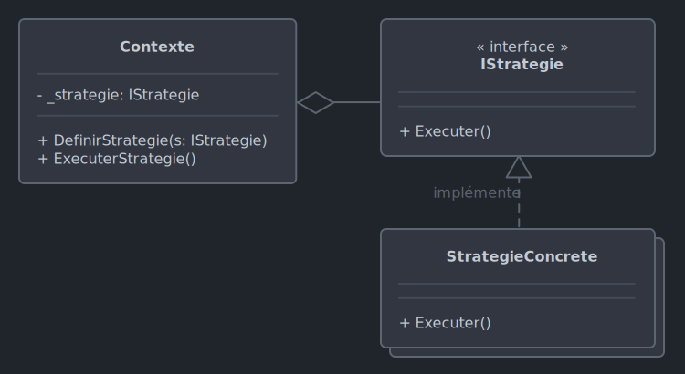

# *Strategy*

Le 21-10-2024

Attribuer dynamiquement un comportement à un objet.

## Présentation

*Strategy* propose des implémentations concrètes d'une abstraction commune de façon à les utiliser, les interchanger à l'exécution dans un objet dit **contexte**. Pour cela, ce contexte présente un attribut du type de l'abstraction, attribut qui accueille l'implémentation concrète attendue. On parle de stratégie par analogie à différents ensembles d'opérations militaires à adopter selon la situation.

Ce patron de conception se fonde sur la composition car le comportement du contexte n'est pas hérité.



!- Diagramme UML de classe du patron *Strategy*.

Exemples : calculer le prix d'un produit selon des plans de réduction (pas de réduction, 10%, 30%...), définir une action selon la météo.

## Implémentation C#

Voici un exemple pour programme Console. Conan peut adopter diverses stratégies selon qu'il attaque un guerrier, un sorcier.

Posons d'abord l'abstraction représentant une stratégie.

```C#
internal interface IStrategieAttaque
{
	void Attaquer();
}
```

Créons ensuite les stratégies concrètes.

```C#
internal class StrategieAttaqueGuerrier : IStrategieAttaque
{
	public void Attaquer()
	{
		Console.WriteLine("Conan frappe de son épée en hurlant le nom de Crom !");
	}
}
```

```C#
internal class StrategieAttaqueSorcier : IStrategieAttaque
{
	public void Attaquer()
	{
		Console.WriteLine("Conan plisse les yeux très fort pour envoyer de fatales pensées !");
	}
}
```

Définissons maintenant Conan comme contexte.

```C#
internal class Conan
{
	private IStrategieAttaque _strategieAttaque;
	
	public Conan(IStrategieAttaque strategieAttaque)
	{
		_strategieAttaque = strategieAttaque;
	}
	
	public void DefinirStrategieAttaque(IStrategieAttaque strategie)
	{
		_strategieAttaque = strategie;
	}
	
	public void Attaquer()
	{
		_strategieAttaque.Attaquer();
	}
}
```

Enfin, le code client.

```C#
Conan conan = new Conan(new StrategieAttaqueGuerrier());

Console.WriteLine("Conan marche dans le désert brûlant de l'acier.");
Console.WriteLine("Tout à coup, un guerrier hirsute surgit de derrière un rocher en levant une hache immense.");

conan.Attaquer();

Console.WriteLine("Le guerrier tombe, roule dans la poussière.");
Console.WriteLine("Soudain, un sorcier aux yeux de feu déchire un nuage et fond sur Conan pour le rôtir.");

conan.DefinirStrategieAttaque(new StrategieAttaqueSorcier());
conan.Attaquer();

Console.WriteLine("Effrayé, le sorcier est pulvérisé dans l'atmosphère.");
Console.WriteLine("Conan reprend sa marche dans le désert. Ces péripéties lui ont donné grand faim.");

/*
	Conan marche dans le désert brûlant de l'acier.
	Tout à coup, un guerrier hirsute surgit de derrière un rocher en levant une hache immense.
	Conan frappe de son épée en hurlant le nom de Crom !
	Le guerrier tombe, roule dans la poussière.
	Soudain, un sorcier aux yeux de feu déchire un nuage et fond sur Conan pour le rôtir.
	Conan plisse les yeux très fort pour envoyer de fatales pensées !
	Effrayé, le sorcier est pulvérisé dans l'atmosphère.
	Conan reprend sa marche dans le désert. Ces péripéties lui ont donné grand faim.
*/
```

