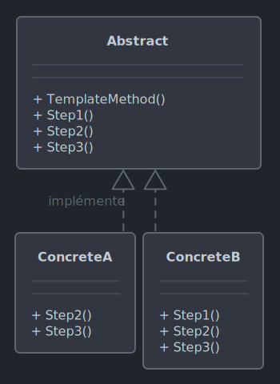

# *Template method*

Le 22-10-2024

Algorithme défini dans une méthode et dont certaines étapes sont définies dans des classes dérivées.

## Présentation

*Template Method* propose une classe abstraite contenant une méthode dite *template* qui définit les étapes générales à effectuer. Ces étapes sont représentées par des méthodes qui peuvent être redéfinies par des classes dérivées. 

Ce patron permet de penser des variations de comportement sur la base d'une seule et même procédure.



!- Diagramme UML de classe du patron *Template Method*.

## Implémentation C#

Voici un exemple pour programme Console. Dans un jeu-vidéo, on souhaite définir un modèle de personnage non joueur pour réaliser un orque et un elfe qui ont une procédure d'interaction.

D'abord, la classe abstraite de PNJ.

```C#
internal abstract class PNJ
{
	public void Interagir()
	{
		Saluer();
		Parler();
		Attaquer();
	}
	
	protected abstract void Saluer();
	protected abstract void Parler();
	protected abstract void Attaquer();
}
```

Ensuite, les classes concrètes d'orque et d'elfe.

```C#
internal class Orque : PNJ
{
	protected override void Saluer()
	{
		Console.WriteLine("Ronf !");
	}
	
	protected override void Parler()
	{
		Console.WriteLine("Rognugnu...");
	}
	
	protected override void Attaquer()
	{
		Console.WriteLine("L'orque frappe de ses énormes poings !");
	}
}
```

```C#
internal class Elfe : PNJ
{
	protected override void Saluer()
	{
		Console.WriteLine("Bonjour, vous.");
	}
	
	protected override void Parler()
	{
		Console.WriteLine("N'est-ce pas un temps magnifique ?");
	}
	
	protected override void Attaquer()
	{
		Console.WriteLine("D'un pas dansant, l'elfe décoche une flèche rapide.");
	}
}
```

Enfin, le code client.

```C#
PNJ orque = new Orque();
PNJ elfe = new Elfe();

orque.Interagir();
//Ronf!
//Rognugnu...
//L'orque frappe de ses énormes poings !

elfe.Interagir();
//Bonjour, vous.
//N'est-ce pas un temps magnifique ?
//D'un pas dansant, l'elfe décoche une flèche rapide.
```

