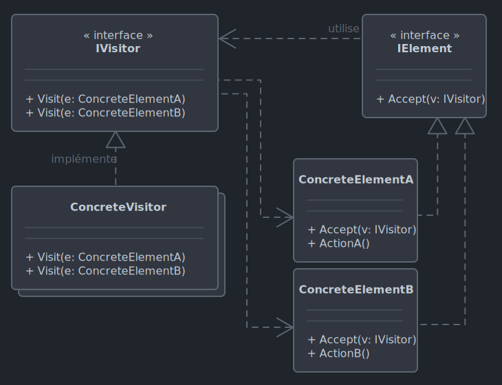

# *Visitor*

Le 22-10-2024

Séparer un algorithme de la structure de données sur laquelle il opère.

## Présentation

*Visitor* propose de séparer un algorithme de la structure de données qu'il utilise, ceci permettant d'ajouter de nouveaux algorithmes sur des structures différentes sans modifier l'existant. 

Entités
- Un **visiteur** exposant une méthode de **visite** d'un élément.
- Des **éléments** exposant une méthode permettant d'**accepter** un visiteur.
- Des visiteurs concrets, des éléments concrets.



!- Diagramme UML de classe du patron *Visitor*.

## Implémentation C#

Voici un exemple pour programme Console. On dispose de fichiers texte et image auxquels on souhaite appliquer deux opérations : afficher les informations, compresser. 

D'abord, posons les interfaces. Le visiteur de fichier expose les méthodes de visite dédiées chacune à un élément concret. Un élément fichier expose une méthode acceptant la visite. Noter que le visiteur utilise des types concrets alors que l'élément utilise le type abstrait de visiteur (et non un visiteur concret).

```C#
internal interface IVisiteur
{
	void Visit(ElementTexte fichier);
	void Visit(ElementImage fichier);
}
```

```C#
internal interface IElement
{
	void Accept(IVisiteur visiteur);
}
```

Ensuite, créons les éléments concrets : fichiers texte et image.

```C#
internal class ElementTexte : IElement
{
	public string Nom { get; set; }
	public string Contenu { get; set; }
	
	public ElementTexte(string nom, string contenu)
	{
		Nom = nom;
		Contenu = contenu;
	}
	
	public void Accept(IVisiteur visiteur)
	{
		visiteur.Visit(this);	
	}
}
```

```C#
internal class ElementImage : IElement
{
	public string Nom { get; set; }
	public int Largeur { get; set; }
	public int Hauteur { get; set; }
	
	public ElementImage(string nom, int largeur, int hauteur)
	{
		Nom = nom;
		Largeur = largeur;
		Hauteur = hauteur;
	}
	
	public void Accept(IVisiteur visiteur)
	{
		visiteur.Visit(this);
	}
}
```

Créons maintenant les visiteurs concrets : informations et compression.

```C#
internal class VisiteurInformation : IVisiteur
{
	public void Visit(ElementTexte fichier)
	{
		Console.WriteLine($"Contenu de {fichier.Nom} : {fichier.Contenu}");
	}

	public void Visit(ElementImage fichier)
	{
		Console.WriteLine($"Image {fichier.Nom}: {fichier.Largeur}x{fichier.Hauteur}");
	}
}
```

```C#
internal class VisiteurCompression : IVisiteur
{
	public void Visit(ElementTexte fichier)
	{
		Console.WriteLine($"Compresser le fichier texte {fichier.Nom}");
	}

	public void Visit(ElementImage fichier)
	{
		Console.WriteLine($"Compresser le fichier image {fichier.Nom}");
	}
}
```

Enfin le code client :

```C#
List<IElement> fichiers = new()
{
	new ElementTexte("toto.txt", "0 + 0 = la tête à Toto !"),
	new ElementImage("image.png", 100, 30),
};

IVisiteur visiteurInformation = new VisiteurInformation();
IVisiteur visiteurCompression = new VisiteurCompression();

foreach (IElement fichier in fichiers)
{
	fichier.Accept(visiteurInformation);
	fichier.Accept(visiteurCompression);
	Console.WriteLine();
}

//Contenu de toto.txt : 0 + 0 = la tête à Toto !
//Compresser le fichier texte toto.txt

//Image image.png: 100x30
//Compresser le fichier image image.png
```

