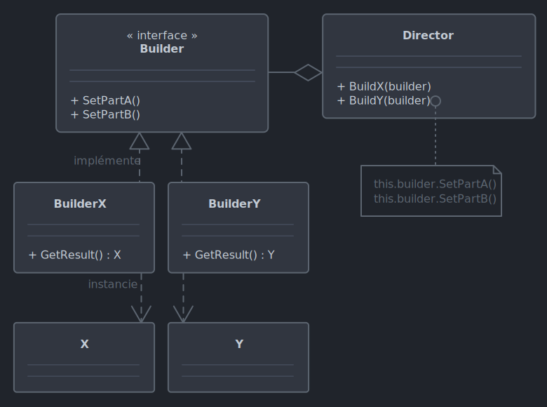
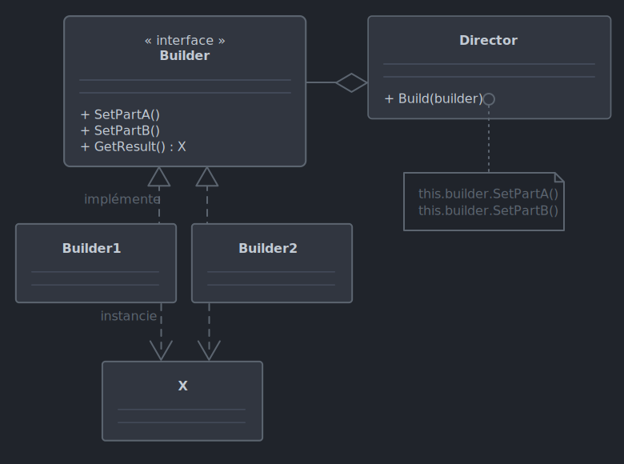

# *Builder*

Le 16-09-2024

Dans un atelier produisant un certain type d'objet, un directeur demande la production d'une variante de cet objet à un service consacré à la production de celle-ci.

## Présentation

*Builder* permet de gérer la création de variations d'un même concept lorsque la complexité est importante. Ce patron sépare la représentation de la construction. Exemples : 
- une voiture et son manuel d'utilisation sont des objets de nature différente mais partagent la même description (couleur, motorisation, numéro de pièces...),
- des recettes de pizza présentent les mêmes étapes avec des ingrédients différents.

Une interface ou classe `abstract` représente la configuration, c'est le *builder*. Autant de classes concrètes utilisent cette entité, ce sont les *concrete builders* (exemple : construire une voiture, un manuel de voiture ; une pizza Hawaï, une pizza Margarita). En plus de tout cela, une classe *director* sert de fabricant de la variation demandée ; le *director* est optionnel car le code client peut manipuler directement les *builders concrets*.

La déclaration des objets à utiliser s'effectue dans le code client (voir exemples ci-après). 



!- Diagramme UML de classe de patron *Builder* dans le cas d'un *builder* de type interface et de deux objets `X` et `Y` construits chacun par un *builder concret* spécifique. Exemple : une voiture et son manuel.



!- Diagramme UML de classe de patron *Builder* dans le cas d'un *builder* de type interface et de création de variations d'un même type `X`. Exemple : pizza Hawaï, pizza Margarita.

Comme les schémas le montrent, la méthode `GetResult()` se trouve dans le *builder* ou dans les *concrete builders* selon que sont concernés un ou plusieurs types d'objets. 

Enfin, les *concrete builders* sont réutilisables. Par conséquent, une méthode de réinitialisation des propriétés peut être nécessaire ; voir exemples suivants.

## Implémentation C# : voiture et manuel

Voici un exemple pour un programme Console.

Posons une voiture et son manuel :

```C#
internal class Voiture
{
	public string Modele { get; set; }
	public int NombreDePortes { get; set; }
	public string Couleur { get; set; }

	public override string ToString() => $"{Modele}, {NombreDePortes} portes, {Couleur}";
}
```

```C#
internal class Manuel
{
	public string Modele { get; set; }
	public string NombreDePortes { get; set; }
	public string Couleur { get; set; }

	public string ObtenirTexte()
	{
		StringBuilder sb = new();
		sb.AppendLine($"Manuel de votre {Modele}");
		sb.AppendLine($"Vous avez choisi une voiture {NombreDePortes} portes.");
		sb.AppendLine($"Sa couleur est : {Couleur}.");
		sb.AppendLine($"Nous vous souhaitons bon voyage !");
		return sb.ToString();
	}
}
```

Ensuite, créons le *builder*, par exemple une interface :

```C#
internal interface IBuilder
{
	void Reinitialiser();
	void SetModele(string modele);
	void SetNombreDePortes(int nombre);
	void SetCouleur(string couleur);
}
```

Créons les *concrete builders*. Ces classes présentent les traitements spécifiques d'une voiture, d'un manuel, à partir de données de configuration qui leur seront fournies par le *director* en suivant la structure du *builder* : 

```C#
internal class BuilderVoiture : IBuilder
{
	private Voiture _voiture;
	
	public BuilderVoiture()
	{
		Reinitialiser();
	}

	public void Reinitialiser()
	{
		_voiture = new();
	}

	public void SetCouleur(string couleur)
	{
		_voiture.Couleur = couleur;
	}

	public void SetModele(string modele)
	{
		_voiture.Modele = modele;
	}

	public void SetNombreDePortes(int nombre)
	{
		_voiture.NombreDePortes = nombre;
	}

	public Voiture GetResult() => _voiture;
}
```

```C#
internal class BuilderManuel : IBuilder
{
	private Manuel _manuel;
	
	public BuilderManuel()
	{
		Reinitialiser();
	}

	public void Reinitialiser()
	{
		_manuel = new();
	}
	
	public void SetCouleur(string couleur)
	{
		_manuel.Couleur = couleur.Split(' ')[0].ToLower();
	}
	
	public void SetModele(string modele)
	{
		_manuel.Modele = modele.Split(' ')[0].ToUpper();
	}
	
	public void SetNombreDePortes(int nombre)
	{
		string nombreLettres = null;
		
		if(nombre == 2)
		{
			nombreLettres = "deux";
		}
		else if(nombre == 4)
		{
			nombreLettres = "quatre";
		}
		else
		{
			throw new NotImplementedException($"Nombre de portes non géré : {nombre}.");
		}
		
		_manuel.NombreDePortes = nombreLettres;
	}
	
	public Manuel GetResult() => _manuel;
}
```

Maintenant, codons le *director* qui génère et configure les objets selon la structure du *builder*.

```C#
internal class Director
{
	public void ConstruireCampagnagna(IBuilder builder)
	{
		builder.Reinitialiser();
		builder.SetModele("Campagnagna 999-X@12");
		builder.SetNombreDePortes(2);
		builder.SetCouleur("Vert #4561");
	}
	
	public void ConstruireMegalo(IBuilder builder)
	{
		builder.Reinitialiser();
		builder.SetModele("Megalo 451/3");
		builder.SetNombreDePortes(4);
		builder.SetCouleur("Rose bonbon v.2");
	}
}
```

Enfin, le code client :

```C#
Director director = new();

BuilderVoiture builderVoiture = new();
BuilderManuel builderManuel = new();

// Construire voiture et manuel de Megalo

director.ConstruireMegalo(builderVoiture);
Voiture maMegalo = builderVoiture.GetResult();
Console.WriteLine(maMegalo);
// Megalo 451/3, 4 portes, Rose bonbon v.2

director.ConstruireMegalo(builderManuel);
Manuel monManuelDeMegalo = builderManuel.GetResult();
Console.WriteLine(monManuelDeMegalo.ObtenirTexte());
/*
	Manuel de votre MEGALO
	Vous avez choisi une voiture quatre portes.
	Sa couleur est : rose.
	Nous vous souhaitons bon voyage !
 */

// Construire voiture et manuel de Campagnagna
// Les *concrete builders* sont réutilisables.

director.ConstruireCampagnagna(builderVoiture);
Voiture maCampagnagna = builderVoiture.GetResult();
Console.WriteLine(maCampagnagna);
// Campagnagna 999-X@12, 2 portes, Vert #4561

director.ConstruireCampagnagna(builderManuel);
Manuel monManuelDeCampagnagna = builderManuel.GetResult();
Console.WriteLine(monManuelDeCampagnagna.ObtenirTexte());
/*
	Manuel de votre CAMPAGNAGNA
	Vous avez choisi une voiture deux portes.
	Sa couleur est : vert.
	Nous vous souhaitons bon voyage !
 */
```

## Implémentation C# : pizzas

Voici un exemple pour un programme Console.

Posons une pizza :

```C#
internal class Pizza
{
	public string Pate { get; set; }
	public string Sauce { get; set; }
	public string Garniture { get; set; }
	public override string ToString() => $"Pâte : {Pate}\nSauce : {Sauce}\nGarniture : {Garniture}";
}
```

Ensuite, créons le *builder*, par exemple une classe `abstract` contenant un champ de type `Pizza` :

```C#
internal abstract class BuilderPizza
{
	protected Pizza _pizza;
	
	public void CreerPizza() => _pizza = new Pizza();
	public abstract void AjouterPate();
	public abstract void AjouterSauce();
	public abstract void AjouterGarniture();
	public Pizza ObtenirResultat() => _pizza;
}
```

Créons les *concrete builders*. Chacune de ces classes crée, configure, renvoie une pizza représentée par le champ privé :

```C#
internal class BuilderPizzaHawai : BuilderPizza
{
	public override void AjouterGarniture() => _pizza.Garniture = "Jambon, ananas";
	public override void AjouterPate() => _pizza.Pate = "Classique sans gluten";
	public override void AjouterSauce() => _pizza.Sauce = "Sauce tomate douce";
}
```

```C#
internal class BuilderPizzaMargarita : BuilderPizza
{
	public override void AjouterGarniture() => _pizza.Garniture = "Tomate, mozarella, olives";
	public override void AjouterPate() => _pizza.Pate = "Classique sans gluten";
	public override void AjouterSauce() => _pizza.Sauce = "Sauce tomate basilic";
}
```

Maintenant, codons le *director* qui génère l'objet selon la structure du *builder*. Par rapport à l'exemple précédent, on voit que cette classe ne fait qu'exécuter la procédure de préparation de pizza sans passage de données car le code de configuration de chaque méthode est délégué aux *concrete builders* ; la préparation de pizza pourrait se trouver directement dans le *builder* mais ce serait alors s'éloigner du patron de conception ici présenté.

```C#
internal class PizzaDirector
{
	public void PreparerPizza(BuilderPizza builder)
	{
		builder.CreerPizza();
		builder.AjouterPate();
		builder.AjouterSauce();
		builder.AjouterGarniture();
	}
}
```

Enfin, le code client :

```C#
PizzaDirector director = new();

BuilderPizzaHawai builderPizzaHawai = new();
BuilderPizzaMargarita builderPizzaMargarita = new();

// Pizza hawaïenne

director.PreparerPizza(builderPizzaHawai);
Pizza pizza1 = builderPizzaHawai.ObtenirResultat();
Console.WriteLine(pizza1);
/*
	Pâte : Classique sans gluten
	Sauce : Sauce tomate douce
	Garniture : Jambon, ananas
 */

// Pizza Margarita

director.PreparerPizza(builderPizzaMargarita);
Pizza pizza2 = builderPizzaMargarita.ObtenirResultat();
Console.WriteLine(pizza2);
/*
	Pâte : Classique sans gluten
	Sauce : Sauce tomate basilic
	Garniture : Tomate, mozarella, olives
 */
```

## Sources

- [Wikipédia](https://en.wikipedia.org/wiki/Builder_pattern _blank)
- [Refactoring Guru](https://refactoring.guru/fr/design-patterns/builder _blank)
