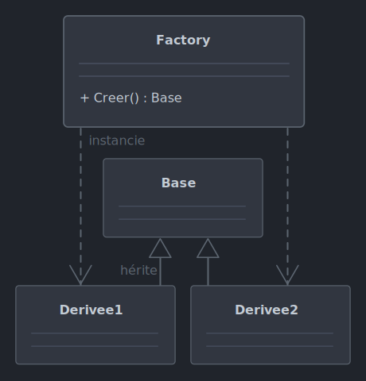

# *Factory*

Le 11-09-2024

Générer un objet et en retourner une abstraction.

## Présentation

*Factory* (fabrique) propose une classe dont une méthode de génération instancie des classes concrètes et qui retourne non pas le type de ces classes concrètes mais un type abstrait : classe de base, interface. Le code client ne connaît donc pas les classes concrètes utilisées par la *factory*. La façon de générer les objets peut être très diverse.



!- Diagramme UML de classe du patron *Factory* dans une implémentation où une *factory* concrète retourne, de classes concrètes, leur type de base `abstract`.

Le code de génération des instances étant encapsulé dans la *factory*, et le type utilisé par le client étant plus abstrait que les types concrets, alors *Factory* autorise des évolutions, maintenance et extensions plus faciles qui si la génération se faisait côté client et à partir des types concrets.

## Implémentation C# 

Cet exemple consiste en une *factory* qui crée des objets représentant des figures géométriques et qui en renvoie leur interface. La méthode de génération prend en paramètre une `enum` permettant de choisir la figure.

L'interface pour une figure géométrique :

```C#
internal interface IFigure
{
	void Dessiner();
}
```

Des classes concrètes de figures géométriques spécifiques implémentant l'interface (avec expressions lambda) :

```C#
internal class Rectangle : IFigure
{
	public string Dessiner() => "Je suis un rectangle.";
}
```

```C#
internal class Cercle : IFigure
{
	public string Dessiner() => "Je suis un cercle.";
}
```

L'`enum` permettant de choisir la figure à générer :

```C#
internal enum FigureType
{
	Rectangle,
	Cercle
}
```

La classe *factory*, ici avec un `switch` :

```C#
internal class FigureFactory
{
	public IFigure ObtenirForme(FigureType figureType)
	{
		switch (figureType)
		{
			case FigureType.Rectangle: return new Rectangle();
			case FigureType.Cercle: return new Cercle();
			default: return null;
		}
	}
}
```

L'utilisation, ici dans une application Console :

```C#
FigureFactory factory = new();

IFigure cercle = factory.ObtenirForme(FigureType.Cercle);
IFigure rectangle = factory.ObtenirForme(FigureType.Rectangle);

Console.WriteLine(cercle.Dessiner()); // Je suis un cercle.
Console.WriteLine(rectangle.Dessiner()); // Je suis un rectangle.
```

## Variante C# avec dictionnaire

La *factory* suivante utilise un dictionnaire dont la clé est l'`enum` et la valeur une fonction anonyme de génération. 

```C#
internal class FigureFactory
{
	private Dictionary<FigureType, Func<IFigure>> _figures = new()
	{
		{ FigureType.Rectangle, () => new Rectangle()},
		{ FigureType.Cercle, () => new Cercle()},
	};
	
	public IFigure ObtenirForme(FigureType figureType)
	{
		return _figures[figureType]();
	}
}
```

## Variante C# avec méthodes dédiées

Ici, l'`enum` est remplacée par des méthodes au nom explicite.

```C#
internal class FigureFactory
{
	public IFigure ObtenirRectangle() => new Rectangle();
	public IFigure ObtenirCercle() => new Cercle();
}
```

```C#
FigureFactory factory = new();

IFigure cercle = factory.ObtenirCercle();
IFigure rectangle = factory.ObtenirRectangle();
```

## Sources

- [Wikipédia](https://fr.wikipedia.org/wiki/Fabrique_(patron_de_conception) _blank)
- [TutorialsPoint](https://www.tutorialspoint.com/design_pattern/factory_pattern.htm _blank)
- [Refactory Guru](https://refactoring.guru/fr/design-patterns/factory-method _blank)
