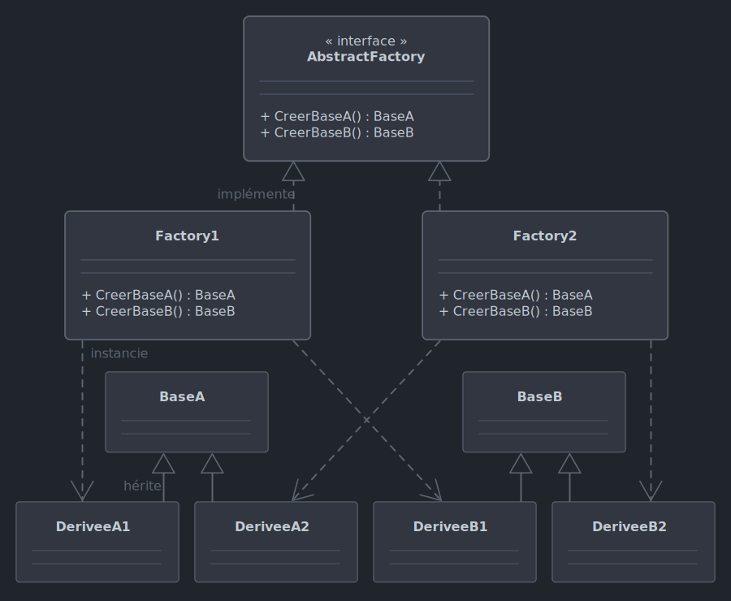

# *Abstract Factory*

Le 11-09-2024

Plusieurs classes *factory* dédiées à une variante d'objets, utilisées à partir de leur abstraction.

## Présentation

L'*Abstract Factory* a pour but de proposer une abstraction pour créer des catégories d'objets sans utiliser leurs classes concrètes. L'abstraction peut être une interface ou un classe de base `abstract`. La génération peut faire l'objet d'une seule méthode ou de plusieurs bien nommées, `static` ou non... voir les exemples de la page *Factory*.



!- Diagramme UML de classe d'un exemple de patron *Abstract Factory*. Les *factory* concrètes implémentent une interface dédiée et retournent chacune le type de base `abstract` correspondant à une catégorie (1 ou 2).

## Implémentation C#

Dans cet exemple d'application Console, on utilise des éléments d'UI de deux systèmes d'exploitation différents : bouton et case à cocher. Ces éléments prennent la forme de deux classes `abstract` (on pourrait très bien utiliser des interfaces) qu'on utilise pour créer des objets pour chaque système.

Voici l'abstraction `Bouton` et ses implémentations. Le bouton possède un titre.

```C#
internal abstract class Bouton
{
	protected string _titre;

	protected Bouton(string titre)
	{
		_titre = titre;
	}
	
	public abstract void Dessiner();
}
```

```C#
internal class BoutonMacOs : Bouton
{
	public BoutonMacOs(string titre) : base(titre)
	{
	}

	public override void Dessiner()
	{
		Console.WriteLine($"Bouton MacOs {this._titre}");
	}
}
```

```C#
internal class BoutonWindows : Bouton
{
	public BoutonWindows(string titre) : base(titre)
	{
	}

	public override void Dessiner()
	{
		Console.WriteLine($"Bouton Windows {this._titre}");
	}
}
```

Voici l'abstraction `CaseACocher` et ses implémentations. Ici, pas de titre, simplement pour changer.

```C#
internal abstract class CaseACocher
{
	public abstract void Dessiner();
}
```

```C#
internal class CaseACocherMacOs : CaseACocher
{
	public override void Dessiner()
	{
		Console.WriteLine($"Case à cocher MacOs");
	}
}
```

```C#
internal class CaseACocherWindows : CaseACocher
{
	public override void Dessiner()
	{
		Console.WriteLine($"Case à cocher Windows");
	}
}
```

Posons maintenant l'abstraction pour la *factory*. Ici, une interface par exemple :

```C#
internal interface IGuiFactory
{
	Bouton CreerBouton(string titre);
	CaseACocher CreerCaseACocher();
}
```

Implémentons cette abstraction dans deux classes de *factory* dédiées chacune à une catégorie de système :

```C#
internal class GuiFactoryMacOs : IGuiFactory
{
	public Bouton CreerBouton(string titre) => new BoutonMacOs(titre);
	public CaseACocher CreerCaseACocher() => new CaseACocherMacOs();
}
```

```C#
internal class GuiFactoryWindows : IGuiFactory
{
	public Bouton CreerBouton(string titre) => new BoutonWindows(titre);
	public CaseACocher CreerCaseACocher() => new CaseACocherWindows();
}
```

Enfin, rédigeons le code client. Ici, un test du système qui exécute le programme permet de créer la *factory* adéquate. 

```C#
IGuiFactory factory = null;
if (RuntimeInformation.IsOSPlatform(OSPlatform.Windows))
{
	factory = new GuiFactoryWindows();
}
else if(RuntimeInformation.IsOSPlatform(OSPlatform.OSX))
{
	factory = new GuiFactoryMacOs();
}
else
{
	throw new NotImplementedException("Système non pris en charge.");
}

Bouton bouton = factory.CreerBouton("Cliquer ici !");
CaseACocher caseACocher = factory.CreerCaseACocher();

bouton.Dessiner(); // Bouton Windows Cliquer ici !
caseACocher.Dessiner(); // Case à cocher Windows
```

## Sources

- [Refactoring Guru](https://refactoring.guru/fr/design-patterns/abstract-factory _blank)
- [Wikipédia EN](https://en.wikipedia.org/wiki/Abstract_factory_pattern _blank)
- [Wikipédia FR](https://fr.wikipedia.org/wiki/Fabrique_abstraite _blank)

