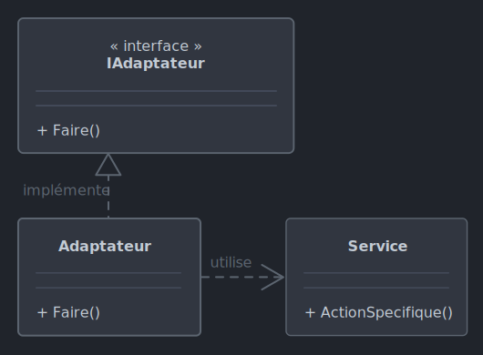

# *Adapter*

Le 23-09-2024

Un passe-plat qui permet à des entités incompatibles de fonctionner ensemble.

## Présentation

Un service présente des fonctionnalités mais la signature des méthodes ne nous convient pas ? Une API doit être adaptée à un environnement mais le code de cette API ne peut pas être réécrit ou modifié ? Deux interfaces ne sont pas compatibles ? *Adapter* fournit une entité intermédiaire entre le service et le programme qui l'utilise.



!- Diagramme UML de classe du patron *Adapter* dans le cas où le service ne repose pas lui-même sur une abstraction (interface ou classe abstraite).

Le service est une entité dite « adaptée » par traduction littérale de l'anglais *adapted*. Le mot « adaptation » a ici pour définition : « joindre un objet à un autre de manière à obtenir un dispositif fonctionnel » ou bien « ajuster » , source [CNRTL](https://www.cnrtl.fr/definition/adapter _blank). Il ne faut pas considérer que l'adaptation consiste à changer la nature du service ; c'est l'usage qui est mis en conformité.

L'entité intermédiaire autorise une **sélection des fonctionnalités**. En effet, elle peut ne présenter qu'une partie des fonctionnalités, à savoir seulement celles que le code client va utiliser.

## Implémentation C#

Voici un exemple pour un programme Console. Posons un service qui est l'entité historique, non adaptée, non conforme, que l'on ne peut pas modifier... mais dont on connaît l'usage. Par exemple, ici, suite à une erreur de conception, il faut toujours utiliser le nombre `3`, le « nom bizarre » est libre, et le résultat doit toujours être précédé de `THX1138 : ` mais le service ne renvoie pas la chaîne complète. Il y a également une  méthode qui s'avère inutile.

```C#
internal class Service
{
	public string ObtenirDonnees(int nombre, string nomBizarre)
	{
		return $"{nombre * 10}. REF={nomBizarre}";
	}
	
	public void Test() => int v = 1 + 1;
}
```

Maintenant, créons une interface dont le concept est d'effectuer l'ajustement entre le service et  l'utilisation attendue côté client. La méthode inutile est laissée de côté.

```C#
internal interface IAdapter
{
	string ObtenirDonnees(string nom);
}
```

Implémentons cette interface dans une entité concrète. Cette entité utilise le service comme attendu.

```C#
internal class Adapter
{
	private Service _service;
	
	public Adapter()
	{
		_service = new Service();
	}
	
	public string ObtenirDonnees(string nom)
	{
		string donnee = _service.ObtenirDonnees(3, nom);
		string resultat = "THX1138 : " + donnee;
		return resultat;
	}
}
```

Enfin le code client :

```C#
IAdapter adaptateur = new Adapter();
string resultat = adaptateur.ObtenirDonnees("Toto");
Console.WriteLine(resultat);
// THX1138 : 30. REF = Toto.
```

Si le service utilisait une abstraction, par exemple une interface, alors notre classe `Adapter` contiendrait un objet concret non pas de type `Service` mais de type `IService` par exemple.
