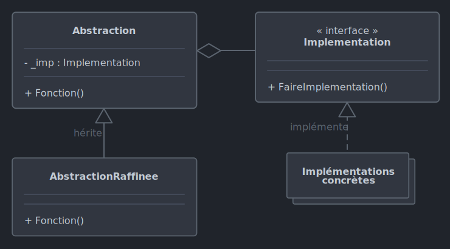

# *Bridge*

Le 19-09-2024

Séparer l'interface et son implémentation.

## Présentation

*Bridge* extrait une ou plusieurs fonctionnalités d'une entité. Au lieu de l'héritage ou de l'implémentation d'interface dans la classe utilisatrice, le patron propose que cette dernière ait recours à l'agrégation simple/faible de façon à ce qu'elle appelle les fonctionnalités de l'implémentation qui est faite de cette interface par une autre entité. 
- La classe utilisatrice fait une agrégation simple/faible d'un objet préexistant.
- Cet objet est l'implémentation d'une interface.
- Cet objet est référencé dans la classe utilisatrice non pas par son type concret mais par l'interface que cet objet implémente.

Les termes utilisés pour désigner les entités de ce patron de conception prêtent à confusion. On dispose d'abord d'une interface qui est à implémenter et qu'on désigne « implémentation » (*sic*). Ensuite, la classe utilisatrice est désignée « abstraction » bien qu'elle puisse ne pas être `abstract`, ne pas être dérivée (*sic*) ; en fait, elle est une abstraction en ce sens où tout ou parties de ses fonctionnalités dépendent de l'objet qu'elle référence et qui implémente... « l'implémentation ».

Ce patron de conception est dit pertinent dans le cas où les entités « abstraction » et les implémentations de « l'implémentation » varient. Son avantage réside dans la **séparation des responsabilités**. Par exemple, une télécommande (abstraction) contrôle une radio ou une télévision (implémentations d'une même interface qui représente un appareil) ; si on ajoute une porte de garage ou une nouvelle télécommande, cet ajout n'affecte en rien l'existant.



!- Diagramme UML de classe du patron *Bridge* dans le cas d'une abstraction raffinée, en relation d'héritage avec une classe abstraite dont elle doit implémenter la méthode abstraite.

## Implémentation C#

Voici un exemple pour un programme Console. Nous voulons dessiner des formes géométriques. Mais, nous rencontrons un problème pour les dessiner car la méthode de dessin de chaque figure dépend par exemple de l'environnement graphique, du système d'exploitation, de la quantité de mémoire, de la puissance de calcul, etc. Il faudrait à première vue coder une fonction de dessin par environnement. Mais au lieu de créer une fonction par environnement dans chacune des formes géométriques, *Bridge* propose de créer une interface, donc dans notre cas une interface pour chaque environnement.

Posons donc d'abord une interface qui représente ce concept de dessiner. Ensuite, cette interface est implémentée dans des classes concrètes qui représentent chacune une API de dessin par environnement. Ici je donne l'exemple de l'environnement Console seul, mais nous pourrions ajouter une autre classe concrète pour WPF ou pour une [version du CLR .NET](https://learn.microsoft.com/en-us/dotnet/api/system.environment.version _blank)...

```C#
internal interface IDessinerAPI
{
	void DessinerCercle(double x, double y, double rayon, string couleur);
}
```

```C#
internal class DessinerAPIPourConsole : IDessinerAPI
{
	public void DessinerCercle(double x, double y, double rayon, string couleur)
	{
		Console.WriteLine($"Cercle {couleur} à la position ({x}:{y}) et de rayon {rayon}.");
	}
}
```

Maintenant, voyons les cercles, triangles, rectangles... Ces formes ont des attributs et comportements communs (couleur, calcul de surface, méthode de dessin...). Donc, nous pouvons poser par exemple une classe abstraite `Figure`. Classe abstraite et non pas une interface car **la figure a un état** (couleur, méthode de dessin) tandis que l'interface est sans état et nous aurait obligé à implémenter la méthode de dessin dans chaque classe dérivée, donc de dupliquer du code.

Cette classe abstraite utilise une implémentation de nos API de dessin. *Bridge* dit de passer par l'agrégation simple/faible. Donc, la classe `Figure` a besoin d'un attribut pour une API de dessin ; grâce au polymorphisme, le type de cet attribut est celui de l'interface (et non pas des entités concrètes qui l'implémentent), ce qui contribue à la séparation des responsabilités. Dans notre exemple, on passe l'objet dans le constructeur.

Notre exemple conduit à penser une classe `Figure` abstraite pour réaliser les cercles, triangles, rectangles... mais cette relation d'héritage entre des figures spécifiques et la figure géométrique en général n'entre pas dans la description de *Bridge*. On pourrait n'avoir qu'une classe concrète `Cercle` si notre programme ne traitait que du cercle et pas d'une forme géométrique en général. 

```C#
internal abstract class Figure
{
	public string Couleur { get; set; }
	protected IDessinerAPI _iDessinerAPI;
	
	protected Figure(string couleur, IDessinerAPI dessinerAPI)
	{
		Couleur = couleur;
		_iDessinerAPI = dessinerAPI;
	}
	
	public abstract void Dessiner();
}
```

Avec cela, nous pouvons créer une classe dérivée `Cercle`. Que coder dans la méthode de dessin ? Eh bien, simplement l'appel de la méthode de dessin fournie par l'API.

Dans notre exemple, cette classe est dite « raffinée » ou « fine ». Pourquoi cette épithète ?
- La classe ne connaît pas le détail de la méthode de dessin qu'elle utilise. 
- Cette classe peut avoir des membres supplémentaires utiles pour d'autres contextes ou opérations.
- Les méthodes sont de catégories distinctes. En effet, calculer la surface serait une méthode dite de **haut niveau** (relative à la figure géométrique qui est une abstraction), tandis que la méthode `Dessiner()` est de **bas niveau** (plus technique, spécifique d'une implémentation).

```C#
internal class Cercle : Figure
{
	public double X { get; set; }
	public double Y { get; set; }
	public double Rayon { get; set; }
	
	public Cercle(double x, double y, double rayon, string couleur, IDessinerAPI dessinerAPI) : base(couleur, dessinerAPI)
	{
		X = x;
		Y = y;
		Rayon = rayon;
	}
	
	public override void Dessiner()
	{
		_iDessinerAPI.DessinerCercle(X, Y, Rayon, Couleur);
	}
}
```

Enfin, le code client :

```C#
IDessinerAPI apiDessin = new DessinerAPIPourConsole();

Figure cercle = new Cercle(x:10, y:20, rayon:3, couleur:"rose", dessinerAPI:apiDessin);
cercle.Dessiner();
// Cercle rose à la position (10:20) et de rayon 3.
```

Nous pourrions approfondir cet exemple en réimplémentant *Bridge* pour la couleur de la forme. En effet, peut-être que la couleur à afficher dépend du type d'écran, de la configuration de l'application quant à la perception visuelle de la personne qui l'utilise, de la complexité du concept de couleur dans le programme, de l'évolution qui peut en être faite, etc.

