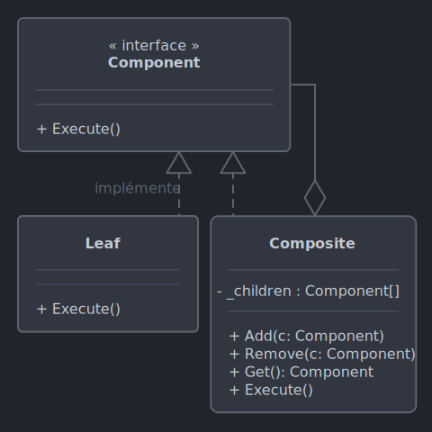

# *Composite*

Le 24-09-2024

Manipuler uniformément des objets individuels et des compositions d'objets, en organisant ces objets en arborescence.

## Présentation

*Composite* permet de traiter plusieurs objets de la même manière qu'une seule instance de leur type. Le but est d'organiser les objets en **arborescence** (exemple : arborescence de dossiers et fichiers). Les objets individuels ou les compositions peuvent être utilisés d'une même manière homogène.

Éléments requis
- Un dénominateur commun : il doit exister au moins un point commun entre tous les objets à manipuler. Par exemple, une méthode. Ceci prend la forme d'une interface (sans état) ou d'une classe abstraite (avec état, donc des attributs), entité nommée « **composant** »
- Une entité concrète réalise l'abstraction précédente. Cette entité est nommée « **feuille** ».
- L'entité « **composite** » réalise également l'abstraction mais contient des fonctionnalités supplémentaires : un ensemble de composants. 



!- Diagramme UML de classe du patron *Composite* dans le cas d'une interface et d'un composite encapsulant un tableau et des méthodes de manipulation.

## Implémentation C#

Voici un exemple pour programme Console.

Nous voulons composer une troupe d'artistes. La troupe est divisée en sous-groupes, chacun avec ses spécialistes. Un métronome se trouve dans la troupe mais dans aucun sous-groupe. Voici à première vue le résultat attendu : 

```
troupe
	danse
		danseur
		danseuse
	musique
		caisse claire
		caisse claire
		grosse caisse
		cimbale
		maracas
	métronome
```

Codons d'abord le composant le dénominateur commun. Ici, je choisis une classe `abstract` car chaque artiste, ainsi que le métronome, vont avoir un nom et un niveau d'indentation. Le nom est passé en paramètre de constructeur.

```C#
internal abstract class Composant
{
	public int Niveau { get; set; }
	public string Nom { get; private set; }

	protected Composant(string nom)
	{
		Nom = nom;
	}
	
	public virtual void Dire()
	{
		Indenter();
	}
	
	private void Indenter()
	{
		for (int i = 0; i < Niveau; i++)
		{
			Console.Write("\t");
		}
	}
}
```

Codons maintenant la feuille qui va représenter une spécialité (danse, musique, métronome). En C#, le constructeur de classe dérivée n'hérite pas automatiquement de celui de la classe de base ; noter `base()` pour expliciter l'appel.

```C#
internal class Feuille : Composant
{
	public Feuille(string nom) : base(nom) { }
	
	public override void Dire()
	{
		base.Dire(); 
		Console.WriteLine($"[Feuille] {Nom}");
	}
}
```

Maintenant, codons le composite. Je déclare deux constructeurs pour illustrer deux usages possibles.
1. Le nom en argument et renseigner directement la collection avec un tableau de feuilles.
2. Le nom et les feuilles en argument.

Noter qu'on utilise non pas le type concret `Feuille` mais son type de base `Composant`.

```C#
internal class Composite : Composant
{
	public IList<Composant> Composants { get; set; }
	
	public Composite(string nom) : base(nom) { }
	
	public Composite(string nom, params Composant[] feuilles) : this(nom)
	{
		// params pour passer (1) un tableau ou bien (2) des objets comme autant d'arguments
		
		Composants = new List<Composant>(feuilles);
	}
	
	public override void Dire()
	{
		base.Dire();
		Console.WriteLine($"[Composite] {Nom}");
		foreach (Composant composant in Composants)
		{
			composant.Niveau = Niveau + 1;
			composant.Dire();
		}
	}
}
```

Enfin, le code client. J'utilise les deux syntaxes évoquées précédemment.

```C#
Composite composite = new("Troupe")
{
	Composants = new Composant[]
	{
		new Composite("Danse", 
			new Feuille("Toto"), 
			new Feuille("Tata")),
		new Composite("Musique")
		{
			Composants = new Composant[]
			{
				new Feuille("Caisse claire 1"),
				new Feuille("Caisse claire 2"),
				new Feuille("Grosse caisse"),
				new Feuille("Cymbale"),
				new Feuille("Maracas"),
			}
		},
		new Feuille("Métronome"),
	}
};

composite.Dire();
/*
[Composite] Troupe
	[Composite] Danse
		[Feuille] Toto
		[Feuille] Tata
	[Composite] Musique
		[Feuille] Caisse claire 1
		[Feuille] Caisse claire 2
		[Feuille] Grosse caisse
		[Feuille] Cymbale
		[Feuille] Maracas
	[Feuille] Métronome
 */
```

