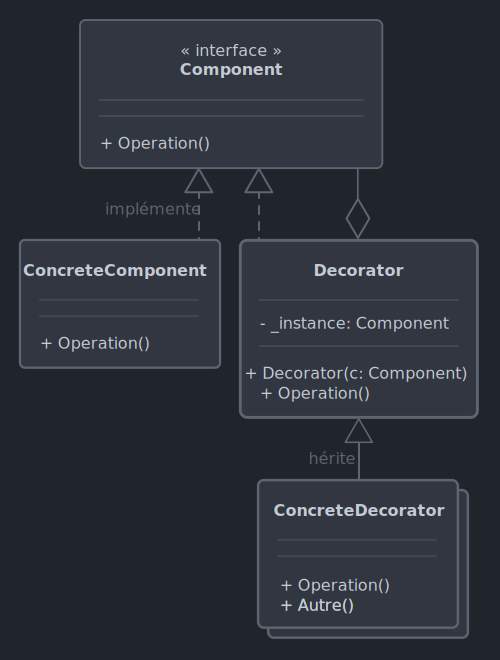

# *Decorator*

Le 28-09-2024

Ajouter à l'exécution des fonctionnalités à un objet.

## Présentation

Le problème de l'héritage est que la hiérarchie peut devenir très importante. D'autre part, l'héritage est fixé et ne peut pas être modifié à l'exécution. Dans ces conditions, il est difficile de garder une architecture simple lorsqu'on souhaite manipuler des objets dont les fonctionnalités doivent augmenter ; par exemple, si c'est la voiture de l'inspecteur Gadget, alors lui ajouter un parachute, un bouclier et autres options selon l'épisode. *Decorator* permet d'ajouter des responsabilités à un objet en contournant ces difficultés. 

Par exemple, imaginons une classe `Window` à laquelle on souhaite ajouter des fonctionnalités de bordure et de *scrolling*. Alors, on crée deux classes décoratrices pour ces fonctionnalités, héritant toutes deux de `Window` : ces classes dérivées stockent une référence de l'objet à décorer, c'est-à-dire une fenêtre. Puisque ces classes décoratrices héritent de `Window`, alors une instance d'une classe décoratrice peut agir sur une instance de `Window` aussi bien qu'une instance de classe décoratrice.



!- Diagramme UML de classe du patron *Decorator* dans le cas d'un composant de type interface et un *decorator* de type classe abstraite.

## Implémentation C#

Voici un exemple pour programme Console. On souhaite créer la voiture de l'inspecteur Gadget et lui ajouter des fonctionnalités pour un épisode : le parachute et le bouclier (il se peut que la voiture ait d'autres options dans un autre épisode). Plus d'infos sur ce fabuleux véhicule chez [Wikipédia](https://fr.wikipedia.org/wiki/Inspecteur_Gadget_(s%C3%A9rie_t%C3%A9l%C3%A9vis%C3%A9e_d'animation%2C_1983) _blank)

Codons le concept de voiture, ici une interface (on pourrait utiliser une classe abstraite).

```C#
internal interface IVoiture
{
	void Dessiner();
	string Decrire();
}
```

Maintenant, créons une classe concrète de voiture.

```C#
internal class Voiture : IVoiture
{
	public string Decrire()
	{
		return "Ceci est une voiture. ";
	}
	
	public void Dessiner()
	{
		Console.WriteLine("Voiture. ");
	}
}
```

Maintenant, créons les classes décoratrices permettant d'ajouter des options à la voiture. 

Il nous faut une entité représentant ce concept de décoration de voiture. La classe décoratrice doit hériter de l'interface. Elle doit encapsuler une référence à l'objet final, que le code client manipule, référence qui est passée en paramètre de constructeur. Puisque l'interface est utilisée, alors ses méthodes doivent être utilisées : elles appelleront les méthodes de la référence, ce qui représente une délégation de responsabilité.

Subtilité : les méthodes implémentées de l'interface vont être modifiées par les classes concrètes qui héritent de cette classe abstraite, donc posons-les `virtual`.

Ici, je code une classe `abstract` car je veux forcer l'utilisation de classes concrètes dérivées. Pour la même raison, le constructeur est `protected` mais les classes dérivées le poseront `public`. 

```C#
internal abstract class VoitureDecorator : IVoiture
{
	private IVoiture _voitureDecoree;
	
	protected VoitureDecorator(IVoiture voitureADecorer)
	{
		_voitureDecoree = voitureADecorer;
	}
	
	public virtual string Decrire()
	{
		return _voitureDecoree.Decrire(); // délégation
	}
	
	public virtual void Dessiner()
	{
		_voitureDecoree.Dessiner(); // délégation
	}
}
```

Créons des classes concrètes héritant de ce concept et qui seront autant d'options à ajouter à la voiture. Ici, le parachute et le bouclier.

En C#, le constructeur de classe dérivée n'hérite pas automatiquement de celui de la classe de base ; noter `base()` pour expliciter l'appel. Les constructeurs de ces classes concrètes sont posés `public`.

```C#
internal class ParachuteDecorator : VoitureDecorator
{
	public ParachuteDecorator(IVoiture voitureADecorer) : base(voitureADecorer)
	{
	}
	
	public override string Decrire()
	{
		return base.Decrire() + "Elle possède un parachute. ";
	}
	
	public override void Dessiner()
	{
		base.Dessiner();
		DessinerParachute();
	}
	
	private void DessinerParachute()
	{
		Console.Write("Parachute. ");
	}
}
```

```C#
internal class BouclierDecorator : VoitureDecorator
{
	public BouclierDecorator(IVoiture voitureADecorer) : base(voitureADecorer)
	{
	}
	
	public override string Decrire()
	{
		return base.Decrire() + "Elle possède un bouclier. ";
	}
	
	public override void Dessiner()
	{
		base.Dessiner();
		DessinerBouclier();
	}
	
	private void DessinerBouclier()
	{
		Console.Write("Bouclier. ");
	}
}
```

Enfin, le code client :

```C#
IVoiture voitureDecoree = new Voiture();
voitureDecoree = new BouclierDecorator(voitureDecoree);
voitureDecoree = new ParachuteDecorator(voitureDecoree);

Console.WriteLine(voitureDecoree.Decrire());
// Ceci est une voiture. Elle possède un bouclier. Elle possède un parachute.

voitureDecoree.Dessiner();
// Voiture. Bouclier. Parachute.
```

## Sources

- [Wikipédia EN](https://en.wikipedia.org/wiki/Decorator_pattern _blank)
- [Wikipédia FR](https://fr.wikipedia.org/wiki/D%C3%A9corateur_(patron_de_conception) _blank)
