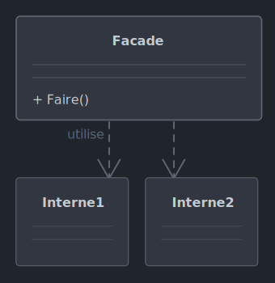

# *Facade*

Le 20-09-2024

Fournir l'essentiel plutôt que la complexité.

## Présentation

*Facade* fournit une **entité intermédiaire de simplification** entre le code client et un ensemble complexe de fonctionnalités. 

Avantages :
- simplifier l'utilisation donc rendre une bibliothèque compréhensible, rendre son code plus accessible,
- réduire les dépendances entre code client (classes utilisatrices) et entités de la bibliothèque (classes internes) car le code client n'utilise que *Facade*,
- réunir différentes API en une seule orientée client, tâches utilisateurs.

*Facade* n'implique pas nécessairement cacher les fonctionnalités. Ainsi, il reste possible côté client d'utiliser les fonctionnalités de l'ensemble complexe. 



!- Diagramme UML de classe d'un exemple du patron *Facade*.

## Implémentation C#

Voici un exemple de programme Console.

Admettons divers sous-systèmes dont le but est de démarrer une automobile : moteur, carburant et électronique. Tout ceci forme un ensemble de fonctionnalités jugé complexe.

```C#
internal class Moteur
{
	public void Demarrer()
	{
		Console.WriteLine("Le moteur démarre.");
	}
	
	public void Arreter()
	{
		Console.WriteLine("Le moteur s'arrête.");
	}
}
```

```C#
internal class Carburant
{
	public void Injecter()
	{
		Console.WriteLine("Injection de carburant.");
	}
}
```

```C#
internal class Electronique
{
	public void Allumer()
	{
		Console.WriteLine("Système électronique activé.");
	}
}
```

Posons une entité intermédiaire qui simplifie cette complexité pour l'utilisateur ou l'utilisatrice.

```C#
internal class VoitureFacade
{
	private Moteur _moteur;
	private Carburant _carburant;
	private Electronique _electronique;
	
	public VoitureFacade()
	{
		_moteur = new Moteur();
		_carburant = new Carburant();
		_electronique = new Electronique();
	}
	
	public void DemarrerVoiture()
	{
		Console.WriteLine("Démarrage de la voiture...");
		_electronique.Allumer();
		_carburant.Injecter();
		_moteur.Demarrer();
		Console.WriteLine("La voiture démarrée.");
	}
	
	public void ArreterVoiture()
	{
		Console.WriteLine("Arrêt de la voiture...");
		_moteur.Arreter();
		Console.WriteLine("La voiture est arrêtée.");
	}
}
```

Le code client :

```C#
VoitureFacade voiture = new();
voiture.DemarrerVoiture();
/*
	Démarrage de la voiture...
	Système électronique activé.
	Injection de carburant.
	Le moteur démarre.
	La voiture est démarrée.
 */
voiture.ArreterVoiture();
/*
	Arrêt de la voiture...
	Le moteur s'arrête.
	La voiture est arrêtée.
 */
```

Le code client peut toujours utiliser les types `Moteur`, `Carburant` et `Electronique` si cela s'avère nécessaire.
