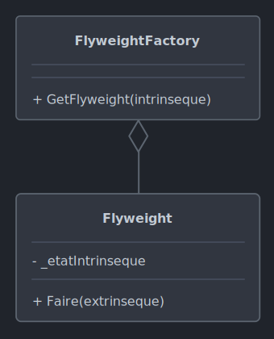

# *Flyweight*

Le 27-09-2024

Réduire le nombre d'objets en extrayant leurs particularités sur des paramètres des méthodes.

## Présentation

*Flyweight* entend réduire l'utilisation de la mémoire avec de nombreux objets. Il s'agit de définir les propriétés communes ou partagées de ces objets et de traiter les spécificités, les particularités, en tant que paramètres de méthodes. 

Les données constantes (formant ce qu'il y a de commun aux entités à considérer), non modifiables de l'extérieur de l'instance, forment « **l'état intrinsèque** ». Toute autre donnée modifiable de l'extérieur forme « **l'état extrinsèque** ». Ce sont ces états extrinsèques qui doivent être extraits, et non plus stockés dans chaque instance. – Ceci indépendamment du fait pour l'extérieur de pouvoir lire ou non des données de l'instance. 
- L'objet ne stockant que l'état intrinsèque est appelé « poids mouche » (*flyweight*). Après initialisation, cet objet est immuable (aucun accesseur/mutateur ou attribut public).
- Quelle entité contient l'état extrinsèque de chaque instance ? L'entité qui en a le plus directement besoin ou bien une entité dédiée, plus technique et moins métier.

Exemple : les caractères d'un traitement de texte. Chaque caractère est représenté par une classe définissant la police, la taille, la couleur... mais la position du caractère à l'écran est posée en dehors de la classe. Ainsi, on dispose d'une instance « caractère » et non pas d'une instance « caractère affiché à l'écran ».



!- Diagramme UML de classe du patron *Flyweight* avec utilisation d'une *factory*.

Si *factory*, alors cette *factory* peut très bien gérer des types qui présentent des variations intrinsèques. Par conséquent, on passera alors par une abstraction (interface ou classe abstraite), de façon à ce que la *factory* renvoie toujours ce type abstrait.

## Implémentation C#

Voici un exemple pour un programme Console. On souhaite manipuler de nombreux cercles similaires. Leur rayon doit être posé une fois pour toutes à l'instanciation et leur couleur définie seulement au moment de dessiner car on souhaite la liberté de colorer l'objet dans le code client. 

Posons une abstraction, ici une interface, pour nos objets poids mouche. On y déclare une méthode qui consiste à dessiner la forme géométrique à l'écran ; cette méthode prend en paramètre une couleur, qui est variable donc un état extrinsèque.

```C#
internal interface IForme
{
	public void Dessiner(string couleur);
}
```

Codons la classe concrète de cercle. Les propriétés de ce cercle sont immuables car concernent tous les cercles de notre programme ; ce sont donc des états intrinsèques. 

L'énoncé nous dit que le rayon « doit être posé une fois pour toutes à l'instanciation », ce qui signifie que la propriété de rayon est d'abord initialisée avec une valeur quelconque puis reste en lecture seule, ce qui prend la forme du mot-clé `readonly` (et non pas `const`). Le rayon est certes déclaré en dehors du cercle (pour pouvoir poser une valeur quelconque) mais il représente un état intrinsèque néanmoins car il est immuable une fois déclaré.

Noter que la couleur est utilisée seulement dans la méthode de dessin car la couleur est un état extrinsèque et donc n'est pas stocké dans l'objet (pas d'attribut).

```C#
internal class Cercle : IForme
{
	private readonly string _forme;
	private readonly int _rayon;
	
	public Cercle(int rayon)
	{
		_forme = "Cercle";
		_rayon = rayon;
	}
	
	public void Dessiner(string couleur)
	{
		Console.WriteLine($"{_forme} {couleur} de rayon {_rayon} (hash code : {this.GetHashCode()})");
	}
}
```

Maintenant, on a besoin de générer nos cercles. Ici, on va réaliser une *Factory* avec collection. Cette collection prend pour clé un rayon et pour valeur une forme (on laisse la porte ouverte à des ajouts ultérieurs de rectangles, carrés...). Si un cercle d'un certain rayon existe déjà, alors il sera retourné, sinon il sera créé ; c'est le principe de l'***object pool***.

```C#
internal class FormeFactory
{
	private readonly Dictionary<int, IForme> _piscineDeFormes = new();
	
	public IForme ObtenirCercle(int rayon)
	{
		// Si aucun cercle avec ce rayon, alors le créer.
		if(_piscineDeFormes.ContainsKey(rayon))
		{
			_piscineDeFormes[rayon] = new Cercle(rayon);
			Console.WriteLine($"Création de cercle de rayon {rayon}");
		}
	
		return _piscineDeFormes[rayon];
	}
}
```

Enfin, le code client s'occupe de la génération et de l'affichage.

```C#
FormeFactory factory = new();

IForme cercle1a = factory.ObtenirCercle(1);
IForme cercle1b = factory.ObtenirCercle(1);
IForme cercle5a = factory.ObtenirCercle(5);
IForme cercle5b = factory.ObtenirCercle(5);
/*
	Création de cercle de rayon 1.
	Création de cercle de rayon 5.
 */

cercle1a.Dessiner("bleu");
cercle1b.Dessiner("rouge");
cercle5a.Dessiner("vert");
cercle5b.Dessiner("jaune");
/*
	Cercle bleu de rayon 1 (hash code : 43942917)
	Cercle rouge de rayon 1 (hash code : 43942917)
	Cercle vert de rayon 5 (hash code : 59941933)
	Cercle jaune de rayon 5 (hash code : 59941933)
 */
```

Ainsi, les cercles de même rayon référencent le même objet créé dans la *factory*, bien qu'il y ait plusieurs cercles à utiliser. La mémoire est économisée.
