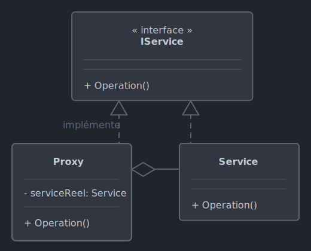

# *Proxy*

Le 26-09-2024

Au lieu d'appeler le service directement, poser un substitut pour en contrôler l'utilisation, proposer des fonctionnalités supplémentaires.

## Présentation

*Proxy* pose une entité intermédiaire dite « procuration » entre le code client et le service à utiliser. Cette procuration utilise le service, contrôle les méthodes de celui-ci, fournit des fonctionnalités supplémentaires (exemple : tester des droits utilisateurs lors de l'accès à une base de données). *Proxy* repose sur le fait que la procuration utilise la même interface que la classe du service, ce qui facilite effectivement la substitution : la procuration peut être passée à n'importe quel code qui attend un objet de type service. 

Quelques exemples
- *Remote proxy* : le service se trouve dans un espace d'adressage différent du programme qui l'utilise.
- *Virtual proxy* : une entité schématique est utilisée à la place de l'objet réel lourd ou complexe, de façon à retarder l'allocation mémoire des ressources jusqu'à l'utilisation réelle.
- *Cache proxy* : stocker des résultats d'opérations qui ont pris du temps pour les partager ensuite à différentes classes utilisatrices.
- *Protection proxy* : fournir une couche de sécurité entre code client et service dans les deux sens.
- *Smart reference proxy* : proposer des fonctionnalités à chaque accès (compteur...).



!- Diagramme UML de classe du patron *Proxy*.

Proxy propose le contrôle d'accès à un service mais il permet aussi de simplifier l'utilisation lorsque le service est jugé complexe.

## Implémentation C#

Voici un exemple pour programme Console.

D'abord, codons l'interface d'un service. Cette interface fournit une méthode à utiliser de façon asynchrone.

```C#
internal interface IService
{
	Task<string> Requete();
}
```

Codons le service proprement dit. La requête prend du temps avant de retourner une donnée.

```C#
internal class Service : IService
{
	public async Task<string> Requete()
	{
		await Task.Delay(3000);
		return "[##X12]Quelle magnifique journée !";
	}
}
```

Maintenant, voyons la classe de procuration. Cette classe encapsule l'objet du service. La méthode proposée est la même que celle du service puisque la classe implémente la même interface ; mais ici, la méthode fournit des traitements supplémentaires (chargement à la demande, contrôle des données).

```C#
internal class ServiceProxy : IService
{
	private Service _service;
	
	public async Task<string> Requete()
	{
		// Instanciation différée, chargement à la demande
		if(_service == null)
		{
			_service = new Service();
		}
		
		Console.WriteLine("-- Appel du service");
		string message = await _service.Requete();
		Console.WriteLine("-- Fin du service");
		
		string messageSeul = Regex.Replace(message, @"\[.*?\]", "");
		string messagePropre = messageSeul.Trim();
		
		return messagePropre;
	}
}
```

Enfin le code client, ici dans un contexte synchrone :

```C#
IService proxy = new ServiceProxy();
string message = proxy.Requete().GetAwaiter().GetResult();
Console.WriteLine("["+message+"]");
/*
	-- Appel du service
	-- Fin du service
	[Quelle magnifique journée !]
 */
```

## Sources

- [Wikipédia](https://fr.wikipedia.org/wiki/Proxy_(patron_de_conception) _blank)

