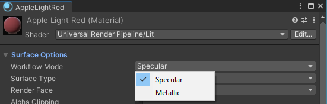
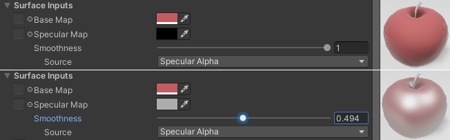
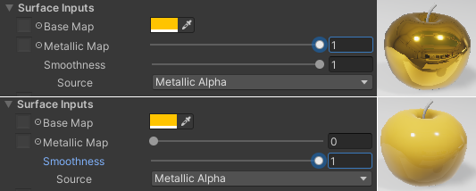

# Matériaux

Le 06-06-2022

Comment calculer les objets 3D de façon à les rendre en 2D à l'écran : le ***shader*** définit comment la surface **peut** apparaître, le **matériau** définit comment la surface apparaît **effectivement**.

## Références

Documentation officielle :
- [*Shaders*](]https://docs.unity3d.com/Manual/Shaders.html "Shaders" _blank),
- [*Rendering modes*](https://docs.unity3d.com/Manual/StandardShaderMaterialParameterRenderingMode.html "Rendering modes" _blank),
- [*Smoothness*](https://docs.unity3d.com/Manual/StandardShaderMaterialParameterSmoothness.html "Smoothness" _blank),
- [*Material charts*](https://docs.unity3d.com/Manual/StandardShaderMaterialCharts.html "Material charts" _blank).

Informations générales :
- [Wikipédia *Graphics pipeline*](https://en.wikipedia.org/wiki/Graphics_pipeline "Wikipédia Graphics pipeline" _blank).

## Présentation

Un ***shader*** est un programme exécuté par le ***GPU (Graphics Processing Unit)*, le processeur graphique**. 

Il existe plusieurs genres de *shaders* : 
- ***common shaders*** : ils font partie du ***pipeline* graphique** et effectuent des calculs déterminant la couleur des pixels à l'écran. Ils dépendent du *render pipeline* choisi. Dans Unity, chacun de ces *shaders* est une **classe** et, pour fonctionner, cette classe fait l'objet d'**instanciation en un *shader object***,
- ***compute shaders*** : ils sont en dehors du *pipeline* graphique, 
- ***raycasting*** : ils effectuent des calculs pour le lancer de rayon.

Un *shader* graphique présente deux opérations principales :
- ***vertex shading*** : positionner les sommets du maillage de façon à déplacer la surface, la transformer.,
- ***fragment shading*** ou ***pixel shading*** : produire la couleur de chaque pixel 2D à partir du maillage 3D.

Le **matériau** (*asset* d'extension `.mat`) est une classe qui contient une **référence au *shader object*** (instance de *shader*). Si le *shader* définit des propriétés de matière, de surface, alors le matériau peut contenir aussi des données comme les couleurs ou les textures.

Un matériau présente des **canaux** (l'*albedo/diffuse* par exemple). Plus un matériau a de canaux, plus il demande de calculs. On peut réaliser des matériaux différents pour un seul *shader* (miroir, plastique...), ceci parce qu'on utilise des canaux différents avec des valeurs différentes selon les besoins (rendu, optimisation).

Il existe une multitude de *shaders* dans Unity ou ailleurs ; on peut aussi en créer soi-même. Dans Unity, un bouton `Edit` de l'*Inspector* sur un matériau permet d'éditer le *shader*.

## Définir un *shader*

Un *shader* peut être créé dans la fenêtre `Project` avec clic droit puis `Create > Shader >`. Cela ajoute un type de *shader* que l'on peut choisir par la suite pour nos matériaux. Les fichiers des *shaders* graphiques sont de deux types dans Unity :
- en script : ***ShaderLab*** pour le *built-in render pipeline*,
- en gestion nodale : ***ShaderGraph*** pour *URP* ou *HDRP*.

## *PBR* et non *PBR*

Le ***Physically Based Rendering (PBR)*** ou rendu physique réaliste est une technique qui simule les interactions physiques et de la lumière dans le monde réel pour effectuer le rendu d'une scène 3D. Ceci est lié au paradigme scientifique actuel et sur la base de la perception humaine en général.

Dans PBR, les propriétés des lumières et des surfaces sont séparées.
- Lumières définies en termes de luminosité, couleur et étendue.
- Surfaces définies via des matériaux, en termes de couleur, réflexion et autres propriétés qui influencent comment la lumière se comportent avec les matériaux.
- Ensuite, le *shader* calcule les **rebonds de lumière** sur les surfaces, ceci principalement en fonction des lumières, des propriétés surfaciques et de la géométrie.

D'un autre côté, les méthodes de calcul non basées sur la physique réelle existent. Ombres, réflexions sont calculées de façon approximative voire ne sont pas rendues. Avec un *shader* non PBR, un matériau apparaît simple, avec une couleur par exemple à plat. Le rendu est moins réaliste qu'avec PBR mais aussi plus stylisé. Par exemple, un *shader* rendant les objets comme un *cartoon* traditionnel est un *shader* non PBR.

Dans le monde réel, la façon dont l'objet est perçu par l'oeil humain dépend de la façon dont l'objet réagit à la lumière. Que peut faire la lumière au contact d'une surface ?
- Elle peur rebondir, c'est la réflexion.
- Elle peut traverser, c'est la transparence.
- Elle peut être absorbée. Absorption et réflexion, c'est la couleur.

## Un peu d'*URP*

Voyons des *shaders* propres à *URP*.
- **2D > Sprite-Lit-Default** : destiné aux objets plats, il rend tout objet 3D en 2D. Calcule  l'éclairage.
- **Particles > Lit, Simple Lit, and Unlit** : pour les effets visuels.
- **Terrain > Lit** : pour l'objet Terrain et ses outils.
- **Baked Lit** : appliqué automatiquement aux *lightmaps*.
- **Complex Lit, Lit, Simple Lit** : variations d'un même usage, PBR prenant en charge l'éclairage. **Lit** est la matériau par défaut d'*URP* et utilise le *shader* **Lit**.
- **Unlit** : rendu à plat sans prise en charge de l'éclairage.

Noter que le matériau par défaut (Lit) **n'est pas un *asset*** du projet mais est généré dynamiquement par Unity. On ne peut donc pas l'éditer.

## Texture

Une **texture** est un fichier image. Elle peut être paramétrée de bien des façons (*sprite* 2D par exemple). Il existe un type « avancé » qui propose quantités d'options n'apparaissant pas nécessairement sous d'autres types. Donc, les paramètres d'importation influencent l'usage de la texture, par exemple dans les matériaux.

Dans les matériaux, une texture est une **carte** (*map*) de données (matrice de nombres). Elle est tout comme le matériau organisée en **canaux** (*channels*), par exemple 1 canal en niveaux de gris, 3 canaux en RGB, 4 en RGBA. Chaque canal de matériau utilise des données de texture spécifiques (exemple : une carte de spécularité) ; de cette manière, la texture permet de calculer des zones de matière spécifique (exemple : ici brillant, là mat).

Le matériau présente des canaux. Certains de ces canaux reçoivent des données en niveaux de gris (1 canal de texture). Mais on peut très bien y placer une texture en RGB, par exemple (3 canaux) ; alors, Unity n'utilise qu'un seul canal de texture, par exemple le canal rouge.

Au niveau du matériau, la texture peut être contrôlée de plusieurs manières :
- en **intensité** : on dispose alors d'un *slider* dont les valeurs extrêmes sont souvent 0 et 1,
- en **décalage** (*offset*) : écart de la texture par rapport à a son point d'origine sur la surface,
- en **répétition** (*tiling*) : nombre d'échantillons par unité de surface du maillage.

## Réflexions : spéculaire et diffuse

La lumière **réfléchit** sur un objet de deux manières.
- **Réflexion spéculaire (*specular*)** : c'est la réflexion directe de la source lumineuse, sa couleur dépend de la couleur de la lumière. Elle prend la forme, en 3D, d'un **éclat** sur les objets brillants (*highlight*).
- **Réflexion diffuse (*diffuse*)** : une partie de la lumière est absorbée par l'objet, elle ne rebondit pas ; cela s'accompagne d'augmentation de chaleur de l'objet (mettre un objet noir sous le soleil d'été). Une autre partie est réfléchie. Ce phénomène de sélection par absorption et réflexion provoque la **couleur** de l'objet lorsque l'objet est perçu par l'oeil humain. Exemple : sur une pomme rouge, les ondes valant pour les couleurs non-rouges sont absorbées et les autres valant pour le rouges sont réfléchies ; l'oeil humain voit (en général) une pomme rouge.

Dans Unity, la réflexion diffuse est représentée par la ***base map***. Cette *base map* peut accueillir une couleur **à plat** (« solide ») avec prise en charge de la transparence, ou une texture. 

On trouve pour *base map* d'autres termes comme **albedo** ou *diffuse map*, bien que ces termes ne signifient pas exactement la même chose. L'albedo décrit la **mesure** de la réflexion diffuse, en général exprimée en valeurs RVB. Ces valeurs peuvent ensuite être converties dans l'ensemble **teinte** (*hue*), **saturation** et **luminosité** (*brightness*). 
- La luminosité de la couleur de l'albédo correspond à la quantité de réflexion diffuse.
- Teinte et saturation correspondent à la qualité de la lumière qui rebondit.

## Métal

La propriété définissant une surface comme **métallique** est la **spécularité** (*specularity*). Cette propriété est en relation avec une autre, le **lissage** (*smoothness* ou *gloss* ou *glossiness*). Par exemple, un objet lisse (donc, non rugueux ; rugosité/*roughness*) peut ne pas avoir de spécularité, un objet métallique a toujours un peu de spécularité mais peut ne pas être lisse (cas du métal brossé).

Le métal peut avoir une couleur. C'est une couleur non pas de réflexion diffuse mais de réflexion spéculaire. Pourquoi ? Parce qu'on voit la réflexion de la lumière sur la surface et c'est cette lumière dans l'objet qui est colorée (sélection par absoption-réflexion). Ce qui revient à dire que les métaux ont peu voire n'ont pas du tout de réflexion diffuse.

Unity propose **deux moyens** nommés *Workflow modes* de définir une surface métallique : ***Specular workflow*** (approche scientifique) et ***Metallic workflow*** (approche simplifiée non scientifique). Ces deux approches permettent d'obtenir la même qualité mais de façon différente. On choisira l'une ou l'autre selon les besoins et préférences.

Dans le ***Specular workflow*** :
- un **métal brillant** a une spécularité élevée et un lissage élevé,
- un **non-métal brillant** a une spécularité faible et non-nulle et un lissage élevé,
- le lissage contrôle la réflexion spéculaire, 
- la *specular map* contrôle la quantité et la couleur de la réflexion spéculaire par couleurs RVB,
- plus la spécularité augmente (vers le blanc), plus la couleur (réflexion diffuse) diminue.

Dans le ***Metallic workflow*** :
- un **métal brillant** a sa *metallic map* élevé et un lissage élevé,
- un **non-métal brillant** a sa *metallic map* faible voir nulle et un lissage élevé,
- le lissage contrôle la réflexion spéculaire,
- la *metallic map* remplace la *specular map* et est définie en niveaux de gris (d'où l'usage d'un *slider*) ; au lieu de spécularité, on parle de **métallicité** (*metalness*),
- la *base map* reste visible même en paramètres métalliques élevés  : **toute** la lumière réflechie (spéculaire **et** diffuse) conserve la couleur.

On retiendra la distinction effectuée par Unity : 
- d'un côté le lissage, 
- de l'autre la métallicité/spécularité selon le *workflow* utilisé.

## Transparence

Un objet est **transparent** lorsque la lumière passe à travers. Les matières **translucides**, elles, **réfractent** la lumière, c'est-à-dire qu'elles en changent la direction.

La transparence est assurée par le **canal alpha** de la *base map* (couleur ou texture). Mais cela n'a d'effet que si le matériau prend en charge la transparence. Par exemple, dans *URP*, la propriété `Surface Type` définit si le matériau est opaque ou transparent et dans ce dernier cas la couche alpha de la *base map* sera pris en charge.

Une fois le `Surface Type` à `Transparent` et la *base map* avec une valeur de transparence, on constate que le matériau est transparent. Un autre paramètre est à prendre en compte : `Render Face`. Elle définit quelle face doit être rendue : face à l'observateur (par défaut), arrière ou les deux. Ce dernier cas cumule les deux calculs précédents, ce qui diminue les performances au profit de la qualité ; afficher les deux côtés de la face annule le ***backface culling*** du maillage (afficher seulement la face selon la direction de sa normale).

La propriété `Alpha Clipping` définit la transparence avec des bords nets entre zones opaques et zones transparentes. Exemple : une feuille d'arbre. Il faut ensuite une texture pour la *base map*. Enfin, on peut paramétrer finement le `Treshold`, seuil de rupture entre opacité et transparence.  

## Relief

[Documentation Normal map](https://docs.unity3d.com/Manual/StandardShaderMaterialParameterNormalMap.html "Normal Map" _blank)

Une texture peut être utilisée pour **simuler un relief** sous l'effet de la lumière, sans complexifier le *mesh*. On parle de ***bump mapping***.

Il existe 2 types de textures pour simuler le relief par *bump mapping*, c'est-à-dire qu'il y a 2 types de *bump maps* : 
- ***height map*** : texture en niveau de gris où chaque pixel représente la quantité de relief de ce point sur la surface. Avec une image RVB, c'est le canal vert qui est utilisé,
- ***normal map*** : image en RVB représentant la direction de la normale pour chaque point sur la surface à l'aide de 3 axes x, y, z représentés par les composantes r, v, b. Chaque pixel représente la différence de direction vers laquelle la surface doit sembler être orientée, par rapport à sa normale de surface 3D non modifiée. Cette texture a tendance à avoir une teinte bleu-violet, en raison de la manière dont le vecteur est stocké dans les valeurs RVB. On la génère en général à partir d'un *mesh* de haute définition (3dSMAX, Maya, Blender) ; on peut aussi la réaliser à la main dans un éditeur photo, ou par code. Voir le `Texture Type` dans les paramètres de la texture importée. 

Le résultat obtenu selon le type de texture choisi est différent. En effet, la *height map* est efficace mais influence le rendu de la *base map* (déformation par étirement), ce qui peut ne pas être souhaité.
 
Côté matériau, la *normal map* peut ne pas être prise en charge. Le matériau ***Bumped diffuse*** présente ce paramètre. L'importance du relief (*bumpiness*) se définit soit dans les paramètres de la texture, soit dans les paramètres du matériau.

Astuce : une *normal map* peut être générée à partir d'une texture utilisée pour le canal *diffuse*/*albedo*.
- Sélectionner la texture.
- La dupliquer avec `CTRL + D`.
- Changer le `Texture Type` à `Normal Map`.
- Cocher la case `Create from Gayscale`. Définir les paramètres `Bumpiness` et `Filtering` selon les besoins.
- Cliquer sur le bouton `Apply`.

Créer des *normal maps* avec [CrasyBump](http://www.crazybump.com "CrasyBump" _blank). Conseil proposé : 
- éditer une *height map* dans un éditeur graphique,
- l'utiliser comme base de travail dans CrazyBump pour générer la *normal map*.

## Carte UV

Une carte UV est un **dépliage 2D** du *mesh*. La carte UV permet à la texture d'être alignée au *mesh*. La carte UV est un ensemble de coordonnées : on utilise U et V plutôt que X et Y pour les distinguer du système de coordonnées spatiales.

L'*UV mapping* consiste à déplier le maillage 3D sur la surface plane d'une texture et à appliquer cette texture sur l'objet. Pour ce faire, le logiciel d'édition (modélisation, texturisation) génère une carte UV.

La carte UV permet de disposer de toutes les informations dans un seul fichier. Plus : la texture peut concerner plusieurs *sub-meshes* (exemple : le personnage Ellen d'Unity a plusieurs sous-objets et pourtant il n'y a qu'une seule texture pour le tout).

Pour l'optimiser : 
- réduire les espaces vides,
- superposer les éléments qui se répètent à l'identique (on n'en dessinera qu'un seul pour tous),
- penser la taille de sortie (plus c'est grand, plus il y a de détails),
- l'espace doit être (0,1),
- les formes doivent être proportionnées exactement comme l'objet final.

## *Occlusion*

L'***occlusion*** désigne le blocage de la lumière par un objet. Par exemple l'ombre entre les doigts serrés d'un poing fermé.  

Pour contrôler comment la lumière doit être bloquée sur l'objet, on peut créer une ***occlusion map*** qui définit en niveaux de gris les zones éclairées et les zones d'ombre.

En général, cette texture est réalisée dans logiciel d'édition 3D. L'effet est souvent subtil et augmente le détail de l'objet.

## Cartes de détail

Unity propose des cartes spécifiques des détails de la surface, en URP sous l'entrée `Detail Inputs` du matériau. On y trouve ici une *base map* (ex : simuler les fils dans un tissu, le grain de la peau sur un visage), une *normal map* (relief), des contrôles de décalage et répétition. 

Le `Mask` définit une découpe entre les options de surface générales et les détails (ex : découpe entre les cheveux et la peau du visage). C'est une image avec canal de transparence. Noter que pour ajuster ce masque, il faut s'en remettre aux contrôles de décalage et répétition non pas du détail mais des options générales.

## Emission de lumière

Le paramètre `Emission map` propose un canal pour émettre de la lumière (texture ou couleur). Unity indique que le canal est HDR (*High Dynamic Range*), c'est-à-dire qu'il contient une donnée de luminosité en plus des données standard de couleur (cette intensité est paramétrable avec un *slider* lors de l'édition de la couleur).

## *Mip map*

La texture prend de la mémoire pour être calculée à l'écran. Or, lorsque la caméra est loin de l'objet, elle n'affiche pas autant de détails que si elle est près de l'objet. Il existe un moyen de réduire ce niveau de détails selon la distance de la caméra à l'objet. Ce sont les ***mip maps***.

Dans les options de la fenêtre `Scene`, on peut afficher les informations de texture et en particulier les *mip maps*. Une texture apparaît en rouge lorsqu'elle est trop grande par rapport à la distance de la caméra (il y a trop d'informations pour cette distance).

## *Displacement map*

Choisir un *shader* `Parallax diffuse`.
- `Heightmap (A)` : carte de hauteur selon le canal de transparence.

On réalise cela aussi avec CrazyBump : créer une *normal map* et une *displacement map*.

Ensuite, dans Unity : 
- importer la *normal map* en tant que `Normal map`, 
- et la *displacement map* en tant que `Texture`. Cocher la case `Alpha from grayscale` de façon à correspondre à ce qui est attendu dans le *shader*.

La *displacement map* produit alors un effet de déformation mais il est relatif à la caméra. Exemple d'utilisation : trou d'impact de missile dans Fallout 4. Limitation : plus la caméra s'aligne sur la surface, plus l'effet est incompréhensible.

## Tesselation

La **tesselation** n'est disponible qu'avec DirectX 11. 
- Cela fait l'objet d'un *package* spécifique à installer : **Tesselation shaders**.
- Unity doit fonctionner aussi en DirectX 11 pour prendre en charge cet effet. Menu `Edit > Project settings... > Player` puis les paramètres PC/Mac/Linux et la propriété `Use Direct3D 11`.

Le *shader* à utiliser est **Bumped specular (dislacement)**. 

Alors, le *mesh* est **automatiquement subdivisé** et déformé. Ceci dépend des paramètres renseignés mais aussi de la **distance de la caméra**.

Pour optimiser :
- diviser l'objet en autant de parties nécessaires pour lesquelles appliquer la tesselation (là où ce n'est pas nécessaire, le calcul n'a pas lieu et le *shader* peut être plus simple),
- penser la carte UV selon la tesselation sinon il peut y avoir des abérations (là où il a des bords dans la carte UV, colorer en noir sinon cela fera des trous dans le *mesh*, le noir signifiant pas de transformation),
- le maillage doit être uniforme (pas de polygones étirés).

## Multi-matériaux

Les matériaux s'utilisent en général dans un `Mesh Renderer`. Et, en général toujours, un `Mesh Renderer` présente un matériau (sinon, Unity affiche l'objet en magenta très agréable pour les yeux).

On peut créer un objet qui possède plusieurs matériaux. Cela est plus lourd qu'un seul, certes, mais présente des avantages. Par exemple, lorsque la caméra est loin de l'objet, la texture qui sera affichée correspondra à la distance séparant la caméra de l'objet (les plus détaillées, c'est-à-dire les plus grandes, feront l'objet de *mip map*).

Donc, il s'agit de créer aussi autant de cartes UV que de « couches » de matériau à utiliser. Exemple : si on veut utiliser 4 matériaux, alors il faut créer 4 cartes UV différentes et le graphiste édite ces textures une par une.

## Matériau réflexif

Il existe un *shader* de type réflexif pour donner à un matériau une certaine réflexion (et pas seulement le *skybox* de la scène). Ceci s'effectue à l'aide d'une *cube map*. Donc :
- créer une *cube map* (clic droit dans `Project`),
- créer le matériau de type réflexif.

Pour créer un matériau réflexif temps réel :
- poser une caméra quelque part,
- créer dans `Project` une **Render texture**,
- dans la caméra, propriété `Target texture`, renseigner la texture précédente,
- créer par exemple un plan et y mettre un matériau de type réflexif (ou présentant un paramètre de réflexion) et dans le paramètre de réflexion lui renseigner cette *render texture*.

## Incompatibilité

Des problèmes de compatibilité peuvent se poser lorsqu'un *asset* est importé dans un projet *URP*/*HDRP*. En effet, les matériaux peuvent ne pas correspondre aux paramètres d'Unity. 

Dans ce cas, les matériaux (et donc les objets les utilisant) apparaissent en aplat de couleur magenta toujours agréable pour les yeux.

Exemple : le matériau **Standard** du *Built-in Render Pipeline* dans un projet *URP*.

Pour changer cela, sélectionner le matériau et suivre deux methodes :
- **automatique** : sélectionner le matériau, puis menu `Edit > Render pipeline > Upgrade Selected Materials to High Definition Materials`. Mais cela peut ne pas fonctionner alors on passera en...
- **manuel** : sélectionner le matériau et sélectionner un `Shader` de type *URP* ou *HDRP*. Alors, certaines références de textures (par exemple dans `Albedo` ou `Base map`) peuvent avoir été supprimées et il faut alors les réassigner.
